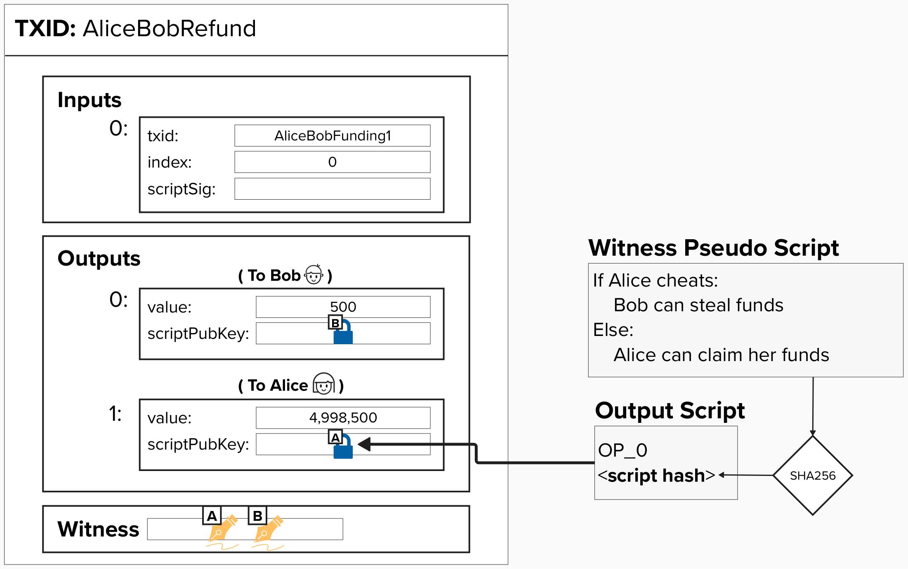
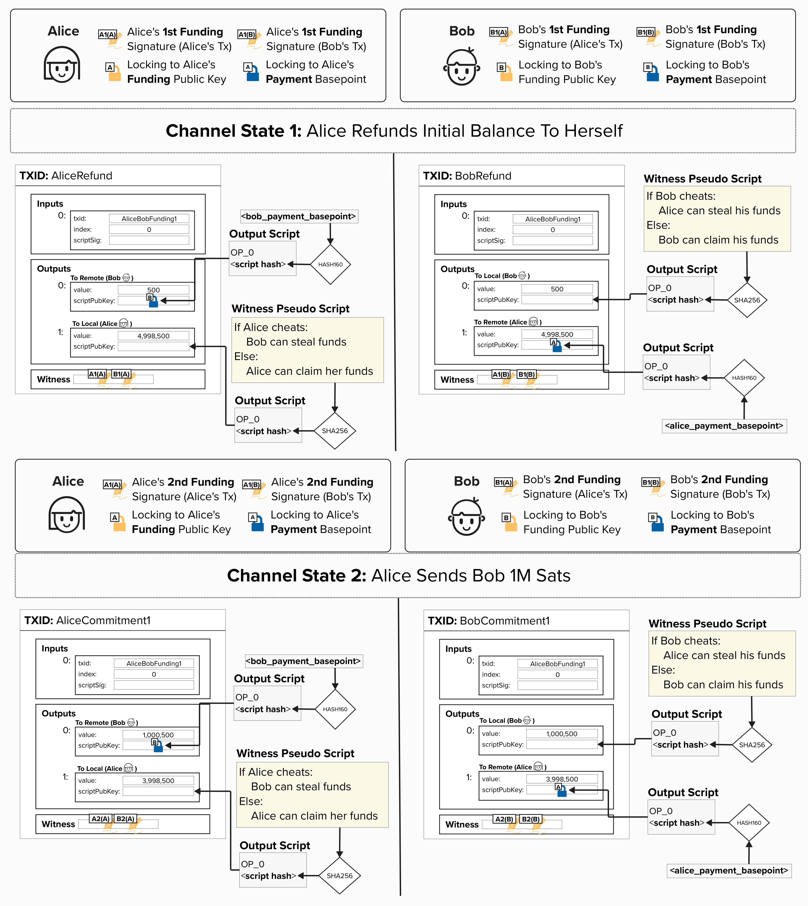
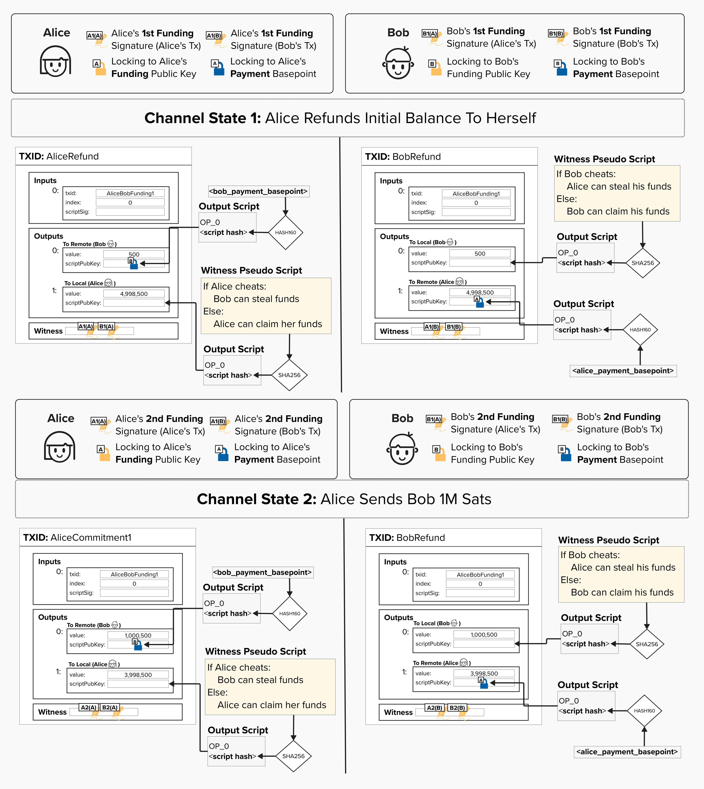

# Adding A Penalty Mechanism For Cheating

A **penalty mechanism** is a rule or process designed to deter undesirable behavior. Think back to our fairness protocol example from earlier. If Alice attempted to "cheat" Bob when cutting the cake, Bob could "punish" Alice by taking the plate with more cake. Things were so simple back then!

The above **penalty mechanism** works because it imposes negative consequences on people who violate the rules, disincentivizing them from doing so.

#### Can you think of a rule or mechanism we can implement in our channel to allow one party to punish the other if they attempt to cheat? You don't have to think of the exact technical implementation just yet - a simple intuition is fine for now.

  
Answer

Within the context of commitment transactions, we can incentivize good behavior by adding the following penalty mechanism:

> ### If you publish an old channel state (attempt to steal from your counterparty), your counterparty is allowed to claim all of your funds.

To enforce this rule, we can add an additional spending path to the output such that, if Alice attempts to cheat by publishing an old channel state, Bob can claim all of her funds.

  

Implementing this rule is going to require some fun, but slightly advanced, cryptographic skillz. Read below to see how it's done!

# Asymmetric Commitment Transactions

You're probably itching to dig into advanced cryptography and punish some cheaters, but it will make our lives much easier if we introduce the concept of **asymmetric commitment transactions** first.

To build out our robust penalty mechanism, we'll need to update our payment channel construction so that *each party has their own version of* ***each*** *commitment transaction*. They are mirror images of each other, but their output scripts are slightly different. As we'll see, **asymmetric commitment transactions provide us with a way to punish the cheating party**.

In the below example, you can see that both Alice and Bob's versions reflect the same distribution of funds. **However, Alice's version of the transaction has a special locking script for her output, and Bob's version of the transaction has a special locking script for his output**.

  

  
The concept of "asymmetric commitment transactions" is very important if you want to understand how Lightning works. To help make sure this makes sense, click here and try to validate the following...

As we mentioned above, both Alice and Bob will have their own commitment transaction **for each channel state**. Take a moment and see if you can verify the following, using the picture below. You will probably have to zoom in!

- For Channel State 1, Alice's `to_local` has the same amount as Bob's `to_remote`. Both of these represent funds that Alice owns.
- For Channel State 1, both of the `to_local` outputs contain a spending path that allows the counterparty to punish the broadcaster ***if the broadcaster cheats***. Remember, "cheating" means publishing an old channel state. In other words, if Alice publishes an old transaction, her output has a spending path for Bob to steal her funds. If Bob publishes an old transaction, his output has a spending path for Alice to steal his funds.
- For Channel State 1, Alice produces two distinct signatures: one for her version and one for Bob's. This is required since Alice and Bob's versions are technically different, so they will each have a unique signature.
- For Channel State 2, once Alice sends 1,000,000 sats to Bob, all outputs for Alice and Bob are updated to reflect this payment. From this diagram, it should be clear that each party possesses their own unique copy of the commitment transaction, with these versions being asymmetric to one another.
- For Channel State 2, once again, Alice and Bob both generate unique signatures for each version of the commitment transactions.

  

  
Why do we need asymmetric commitment transactions?

The Lightning Network fairness protocol is set up in such a way that **you protect your counterparty** from ***you*** cheating. This is why the output that has ***your*** balance (on ***your version of the transaction***) contains the penalty mechanism, while the output with your counterparty's balance is a simple **P2WPKH**.

Remember, the way to cheat in Lightning is by publishing an old commitment state. Since all of ***your*** commitment transactions lock ***your*** bitcoin balance to a special locking script with a penalty mechanism, your counterparty will be able to claim your output if you publish an old state.

<checkpoint id="asymmetric-commits"></checkpoint>
