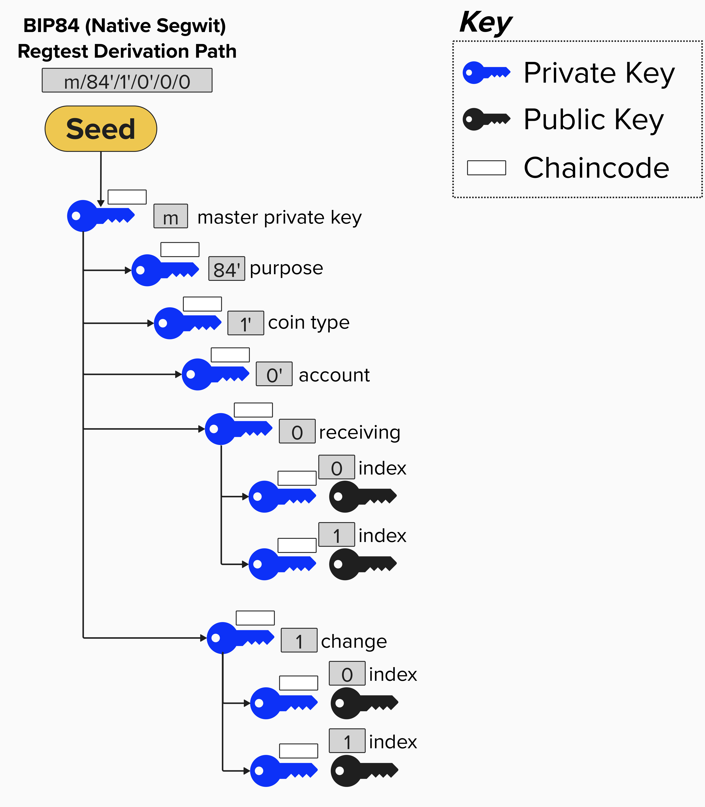
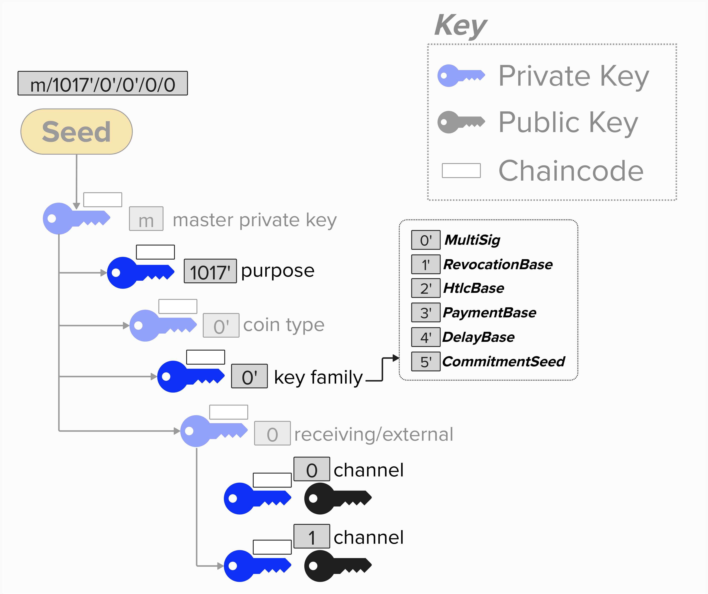

# Lightning Off-Chain Wallet Strucure
At this point, we have a general idea of *which* keys we'll need to use in our Lightning implementation. That said, we don't yet know what they will be used for, but that will come in due time! Let's set the scene by briefly reviewing **Bitcoin Improvement Proposal (BIP) 32**. For those of you who would like a deeper dive, once again, you're encouraged to check out [**learn me a bitcoin**](https://learnmeabitcoin.com/technical/keys/hd-wallets/derivation-paths/).

BIP 32  describes a **hierarchical deterministic** (**HD**) wallet structure and introduces the following characteristics for key management:
- **Single Source**: All public and private keys can be derived from a single seed. As long as you have access to the seed, you can re-derive the entire wallet.
- **Hierarchical**: All keys are organized into a tree structure.
- **Deterministic**: Each time you restore you wallet from your seed, you'll get the exact same result.

### Derivation Paths
A few important BIPs, such as [BIP 43](https://bips.dev/43/) and [BIP 44](https://bips.dev/44/), build on BIP 32 and describe the following derivation scheme that can be used to organize keys.
```
m / purpose' / coin_type' / account' / change / address_index
```

<p align="center" style="width: 50%; max-width: 300px;">
  
</p>

Here is how to interpret the above scheme:
- `m`: This is the master extended key for the wallet.
- `/`: Whenever you see this, we are deriving a new child key.
- `purpose'`: The purpose specifies the wallet structure. The value in this field reflects the BIP that describes the wallet scheme for a specific output type. For example, `m/84'` means that this wallet structure follows the derivation scheme described in [BIP 84](https://bips.dev/84/) and uses Pay-To-Witness-Public-Key-Hash (P2WPKH) serialization format. Since there is a `'`, we know this path is [hardened](https://learnmeabitcoin.com/technical/keys/hd-wallets/extended-keys/#extended-private-key-hardened).
- `coin_type'`: This represents the cryptocurrency that we're deriving keys for. A coin type path was included in the BIP so that hardware wallets can support multiple cryptocurrencies using a single seed. For example, `0` is Bitcoin, `1` is also Bitcoin (not mainnet, so testnet, regtest, etc.), `2` is Litecoin. You can see the list [here](https://github.com/satoshilabs/slips/blob/master/slip-0044.md).
- `account'`: This allows wallet users to create separate "accounts" to separate their funds.
- `receiving/change`: This field separates into a **receiving** (`0`) index and **change** (`1`) index such that users can generate separate addresses, depending on if they are receiving payments or generating change addresses. NOTE: these are **normal children**, meaning they will have corresponding **extended public keys** which can derive child public keys without needing to know the private key.
- `index`: The index field specifies the actual keys used to generate addresses and receive bitcoin. The above levels in the HD wallet provide the structure that ultimately points to one of these keys, enabling efficient and deterministic organization.

### Implementing Our Wallet
We'll leverage the HD wallet structure to build our Lightning wallet, as this will enable us to derive all of the keys we need from a single seed. Below is an image depicting our wallet architecture.

> Fun Fact: The below key derivation scheme is actually very similar to how the [Lightning Network Deamon (LND)](https://github.com/lightningnetwork/lnd) derives Lightning keys.

<p align="center" style="width: 50%; max-width: 300px;">
  
</p>

Here is how to interpret the above scheme:
- `m`: This is the master extended key for the wallet, derived from our wallet's seed.
- `purpose'`: We'll use `1017'` for the purpose. This is the value that LND uses. Since our key derivation scheme is LND-inspired, we'll use it too! That said, it's an arbitrary choice and not specified in any Bitcoin or Lightning protocol specification. We're simply using it as a unique value to plug into the derivation scheme.
- `coin_type'`: Since we're ultimately testing our Lightning implementation against the BOLT Test Vectors, we'll use `0` for this course. Remember, `0` is mainnet bitcoin.
- `account'`: This is where the magic happens. We'll specify a specific **key family** for each `account`. This will enable us to deterministically derive unique public and private keys for each channel our Lightning node opens.
- `receiving`: We won't be generating any change addresses with this field, so we'll keep `0` (receiving) as a default value here.
- `index`: The index will be unique for each channel we open.

By leveraging this architecture, we can create all of the public key, private key, and seed information that we'll need to operate our Lightning channel! Remember, at this point, you don't need to understand what these keys are used for yet. What's important is that you understand *how* we derive our keys.

<checkpoint id="bip32-derivation"></checkpoint>

Now that we understand the derivation path structure, let's put it to use in the next section by building our `ChannelKeyManager` class, which will derive all of the channel keys we need for a Lightning channel.
