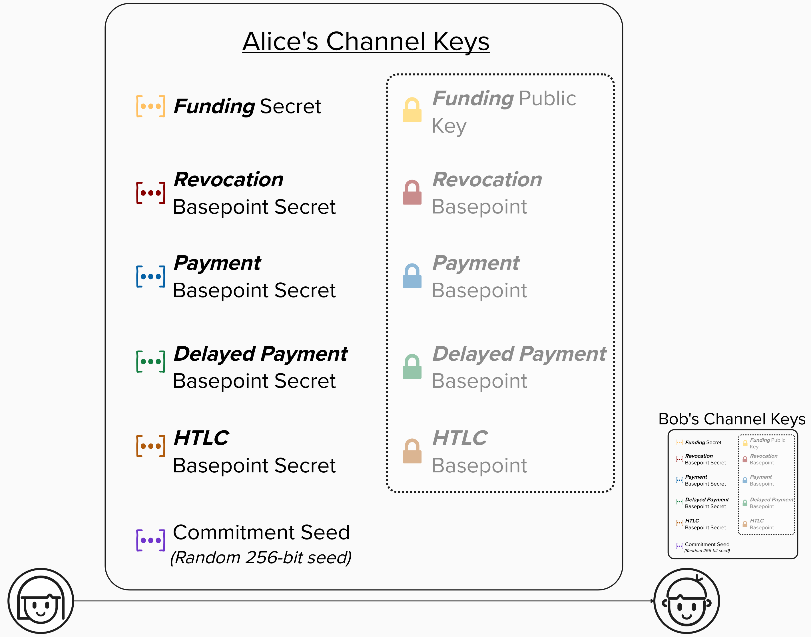
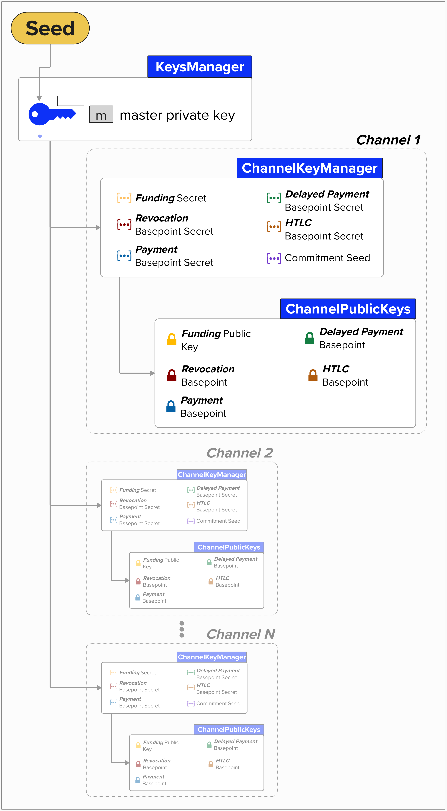

# ⚡️ Derive Channel Keys
Great work! We're well on our way to building a wallet that can power our Lightning implementation. Let's continue our journey by creating a function that generates all of the keys and cryptographic material we'll need during the rest of this course.

To complete this exercise, you'll need to implement the `derive_channel_keys` function in the code editor below. It takes a `seed` and a `channel_id_index` (which defaults to 0), representing a unique index for each Lightning channel that we open, and uses the `derive_ln_key` function we implemented in the prior exercise to derive each key family.

The function returns a Python dictionary that maps each key family name to its private key and corresponding public key.

The result dictionary maps each key family name (like `'funding'`, `'revocation_base'`, etc.) to a sub-dictionary containing `'privkey'` (32 bytes) and `'pubkey'` (33-byte compressed public key). This gives us everything we need for a **single Lightning channel**.

Remember, at this point, it's not vital that you know what each key is used for. We're purposefully holding that information until later. Each key will be introduced when we need it, which will hopefully make for a more intuitive and fruitful learning experience.

  
💡 Hint 💡

To complete this exercise, you'll need to call the `derive_ln_key` function we implemented in the prior exercise for each key family. Here's the mapping between dictionary keys and family numbers:

| Dictionary Key | Family Number |
|-------|-----------|
| `'funding'` | `0` (MultiSig) |
| `'revocation_base'` | `1` (RevocationBase) |
| `'htlc_base'` | `2` (HtlcBase) |
| `'payment_base'` | `3` (PaymentBase) |
| `'delayed_payment_base'` | `4` (DelayBase) |
| `'per_commitment'` | `5` (CommitmentSeed) |

For each family, derive the private key using `derive_ln_key(seed, family_number, index)`, then compute the compressed public key using `privkey_to_pubkey(privkey)`. Store both in the result dictionary.

A `KEY_FAMILIES` dictionary is already provided in the starter code to make iteration easy!

  
Step 1: Iterate and Derive Private Keys

Okay, you've clicked on the step-by-step instructions... let's dig into it!

Let's start by iterating over our `KEY_FAMILIES` dictionary. For each family, we'll call `derive_ln_key(seed, family_number, index)` to get the 32-byte private key.

  
Step 2: Compute Public Keys

For each key family, after deriving the private key, we compute the public key using `privkey_to_pubkey(privkey)` and store both in our result dictionary.

  
Step 3: The Per-Commitment Family

The `per_commitment` family works exactly the same as the others. While we call it a "seed" conceptually, it's derived the same way. The private key bytes will later be used as a seed for generating per-commitment secrets.

  
Step 4: Return the Dictionary

Finally, return the dictionary! Each entry maps a family name to `{'privkey': bytes(32), 'pubkey': bytes(33)}`.

# Channel Keys
Nice, we're making solid progress! At this point, we've implemented the functionality to create the below cryptographic material. Most of these are private keys called **basepoint secrets**, which will be combined with other cryptographic material to create new private keys for each Lightning transaction. We also have a **commitment seed**, which is a random 256-bit number. We'll see how this is used shortly!
- **Funding Secret**: Secret Key
- **Revocation Basepoint Secret**: Secret Key
- **Payment Basepoint Secret**: Secret Key
- **Delayed Payment Secret**: Secret Key
- **HTLC Basepoint Secret**: Secret Key
- **Commitment Seed**: A 256-bit scalar used to generate a series of secrets **for each Lightning state**.

> **Note:** All of the above secrets are defined in [BOLT #3: Bitcoin Transaction and Script Formats](https://github.com/lightning/bolts/blob/master/03-transactions.md) *except* for the "funding" private key. We included it in our `KeyFamily`, but it doesn't have to be. For example, LDK - a popular API-driven Lightning implementation - allows developers to bring their own on-chain wallet and, therefore, their own "funding" keys. This will become more clear when we open our Lightning channel.

Next, we'll need the public keys associated with each private key. As we mentioned earlier, these public keys are not embedded directly within transaction outputs. Instead, they're combined with other cryptographic material to derive the actual public keys used in each output. Note that Alice, Bob, and every node on the Lightning network will have their own set of these keys. In other words, each node will have their own version of the wallet we're creating right now!

  

In our Python implementation, we derive both the private keys and their corresponding public keys in the same `derive_channel_keys` function, using the `privkey_to_pubkey` helper. This keeps things simple and gives us everything we need in one step!

## Checkpoint
Okay, let's do a quick review of what we've implemented so far!

First, we completed `create_keys_manager`, which takes a **seed** and returns a dictionary containing the master key and chain code for our HD Lightning wallet.

Next, we implemented `bip32_ckd_priv` and `derive_ln_key`, which we can use to derive a new private key for **any** key family and channel index. This is very powerful, and we'll use it throughout the rest of the course!

Finally, we completed `derive_channel_keys`, which creates a dictionary of all six key families for a given channel index. Each entry contains both the private key and its corresponding compressed public key.

  

<code-intro heading="Coding Exercise: Channel Keys" exercises="ln-exercise-channel-keys"></code-intro>

<code-outro text="With our keys ready, we can now build the funding transaction that opens a channel."></code-outro>
