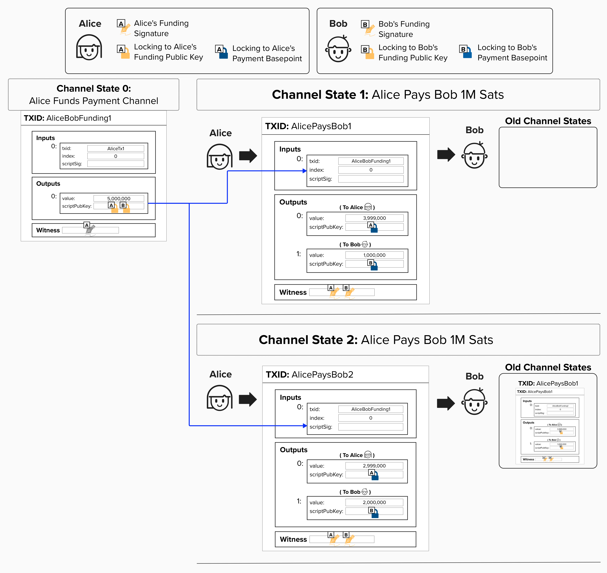
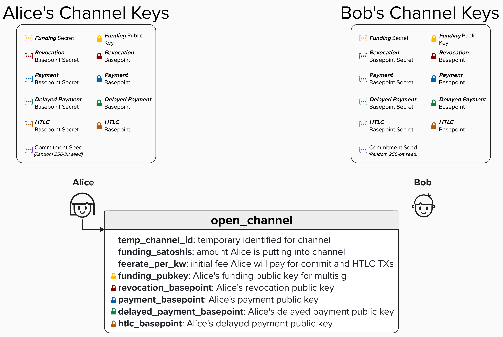
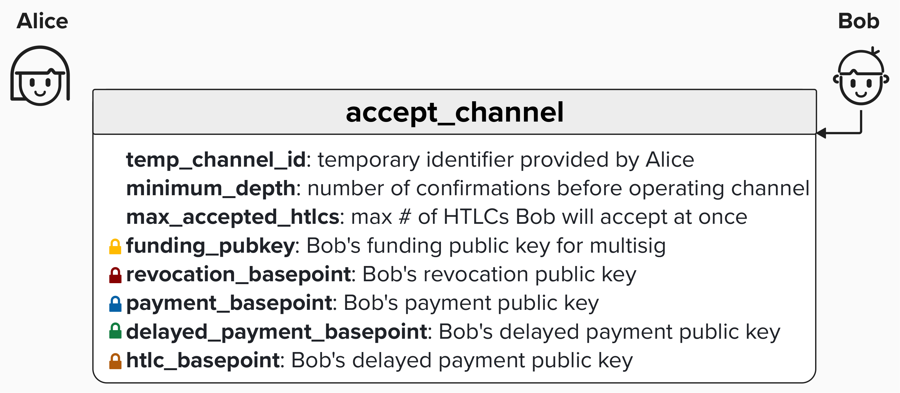
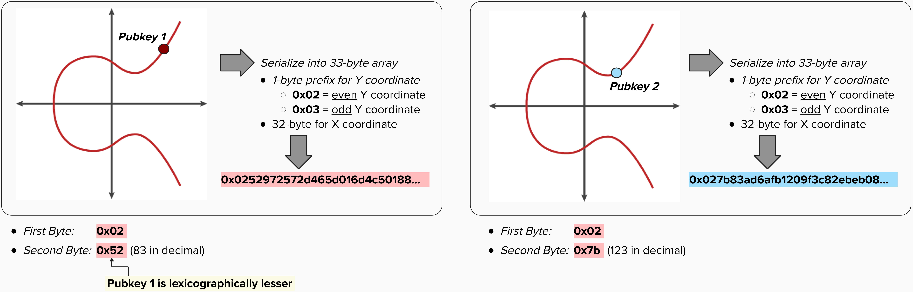

# Locking Funds In Our Payment Channel

A crucial part of operating a Lightning channel is ensuring that one party cannot **unilaterally** steal from their channel partner. In other words, Alice should not be able to show up to Bob's bar, give him an off-chain transaction in exchange for a glass of wine, and then spend the same UTXO referenced in that transaction, rendering Bob's transaction invalid and useless.

To protect against this, we'll begin our payment channel by locking funds in a **Pay-to-Witness-Script-Hash (P2WSH) 2-of-2 multisig output**, where Alice and Bob each provide one public key. We call this our **"Funding Transaction"** because it, quite literally, provides the funds needed to operate our payment channel. To move bitcoin out of this UTXO (effectively closing the channel), Alice and Bob must *agree* by both providing valid signatures.

The diagram below connects our new payment channel construction back to the keys we derived earlier. You'll see that Alice and Bob begin their channel by locking funds in a **2-of-2 multisig output** using **Alice's Funding Public Key** and **Bob's Funding Public Key**. Since Alice is opening the channel, she puts *her* funds in this output. You can think of this like Alice setting up a bar tab at Bob's bar.

When Alice makes payments to Bob, she creates new transactions that lock Bob's funds in an output only he can spend, using **Bob's Payment Basepoint**, which is a public key. **Each new transaction spends the 2-of-2 multisig output that Alice and Bob created together**. This ensures that Alice cannot double-spend Bob!

You'll also notice that Alice and Bob provide their signatures for each new transaction. This is required, since, to spend from the 2-of-2 Funding UTXO, Alice and Bob both need to provide a signature.

> ⚠️ **NOTE:** In the diagram below, Alice locks *her* balance to *her* **Payment Basepoint**. This is *only* for educational purposes, since we haven't yet introduced how Lightning channels work in their entirety. This is NOT actually how Lightning works. However, for now, it's sufficient to use this construction. We'll fix things as we continue to introduce more Lightning concepts.

<p align="center" style="width: 50%; max-width: 300px;">
  
</p>

## BOLT 2: Peer Protocol for Channel Management

You're probably wondering how Alice and Bob exchange all the necessary information to operate a payment channel. Now that we're moving beyond our "bar" example, let's look at how Lightning nodes actually communicate to open a channel. Since Lightning is a decentralized protocol accessible to anyone, there's a standardized specification for exchanging information, ensuring that all participants on the network *speak the same language*.

[BOLT 2](https://github.com/lightning/bolts/blob/master/02-peer-protocol.md) defines the **channel management** portion of Lightning's shared language. Channel management is broken into three phases:

1. **Channel Establishment**: These messages define how peers communicate their intent to open a channel and what information should be exchanged as part of this process.
2. **Normal Operation**: Once the channel is open, peers can begin sending payments to each other (or routing payments *through* each other).
3. **Closing**: As we'll learn later, there are multiple ways to close a channel. BOLT 2 defines the "happy path," where both parties agree and work together to close their channel cooperatively.

It's worth noting that another important part of the shared language, which is not thoroughly covered in this course, is [BOLT 7: P2P Node and Channel Discovery](https://github.com/lightning/bolts/blob/master/07-routing-gossip.md), which describes how nodes on the network communicate their presence and other important information.

### BOLT 2: Channel Establishment
When one party wants to open a channel with another, they will begin the **"Channel Establishment"** process by sending an [`open_channel`](https://github.com/lightning/bolts/blob/master/02-peer-protocol.md#the-open_channel-message) message to their counterparty. In this case, Alice will begin the process of **creating the Funding Transaction** and opening a channel to Bob by sending an `open_channel` message to Bob. Some of the fields in the `open_channel` message have been left out at the moment for simplicity. However, you should be able to recognize most of the ones in the image below. Many of them are the public keys we created in an earlier exercise! Remember, Alice and Bob each have their own set of these keys. Alice will begin the process of opening a new channel by sending these keys to Bob. We'll see why shortly!

Upon receiving an `open_channel` message, the recipient will decide if they would like to accept the incoming channel. There are a variety of things to consider as part of this process. For those who already have an intuition for how Lightning works, you may recognize `feerate_per_kw` as the feerate that Alice is proposing to pay for the commitment transaction. If Bob thinks these fees are either too high or too low, he can reject Alice's channel open. If this doesn't make sense yet, don't worry! We'll cover all of this in due time.

<p align="center" style="width: 50%; max-width: 300px;">
  
</p>

### BOLT 2: Accept Channel
If Bob accepts Alice's channel proposal, he can send back an [`accept_channel`](https://github.com/lightning/bolts/blob/master/02-peer-protocol.md#the-accept_channel-message) message, including a few of his own channel requirements. For example, Bob will specify the `minimum_depth`, which defines the number of block confirmations (on the Funding Transaction) that Bob requires before he and Alice can send payments. Also, he will specify the maximum number of active HTLCs he will accept. Again, if these things don't make sense just yet - don't worry!

Finally, Bob will send his public keys to Alice as well!

Similar to the `open_channel` message above, note that this is also a simplified version of the `accept_channel` message. Some of the fields have been left out of the visual below, since their purpose would not yet be clear to us at this time.

<p align="center" style="width: 50%; max-width: 300px;">
  
</p>

## Building Our Funding Transaction

Since Alice is opening a channel to Bob, she will initially provide the funds for this payment channel. Note, this is also known as **Channel Establishment V1**, whereby **only the channel opener can fund the channel**. **Channel Establishment V2** is a little more complicated and is not covered in this course. However, it's worth noting that V2 allows for "dual-funded" channels whereby **both parties contribute UTXOs to fund the payment channel**.

Since we're covering V1 Channel Establishment, Alice will provide the input to this **"Funding Transaction"**. Remember, you can think of this as Alice showing up to Bob's bar and opening a tab with a specific amount.

Now that Alice has Bob's **Funding Public Key**, which he provided in the `accept_channel` message, Alice can build the Funding Transaction by locking the funds in a 2-of-2 multisig where Alice and Bob each provide one public key. Since Alice cannot spend this UTXO without a signature from Bob, Bob can safely accept payments from Alice!

<p align="center" style="width: 50%; max-width: 300px;">
  
</p>

#### Question: You'll see in the above diagram that Funding Transaction UTXO is for 5,000,000 sats. Why is this amount important for our payment channel?
<details>
  <summary>Answer</summary>

The amount in this UTXO is going to be channel balance for this payment channel. Therefore, neither channel party will be able to send the other channel party **more than this amount** of sats.

There are ways to increase this amount while the channel is active, called "splicing", but that is outside the scope of this course.

</details>

<checkpoint id="funding-multisig"></checkpoint>

<checkpoint id="pubkey-sorting"></checkpoint>

<details>
  <summary>Click to learn what sorting a compressed public key lexicographically means</summary>

In the context of Bitcoin, a public key is a point on the secp256k1 elliptic curve. Like all points on 2-dimensional curves, the public key can be represented as an X, Y coordinate.

Furthermore, instead of representing each X and Y coordinate as 256-bit numbers, we can represent them as 32-byte hexadecimal values. Since the elliptic curve is symmetrical around the X axis, we can actually get rid of the Y coordinate and, instead, use a single byte **prefix**. `0x02` represents an even Y coordinate and `0x03` represents an odd Y coordinate. By using hexadecimal values and prefixes, we create a **compressed** version of our public key, communicating all of the necessary information but taking up less space than an X, Y coordinate of 256-bit numbers in decimal format.

To determine which public key is lexicographically smaller, we can compare their byte arrays sequentially from left to right: at the first differing byte, the one with the lower value is considered smaller.

<p align="center" style="width: 50%; max-width: 300px;">
  
</p>

</details>

## Build Our 2-of-2 Funding Script

Alright, enough reading, let's code! For this exercise, we'll complete the `create_funding_script` function in the code editor below. This function takes two **Funding** public keys (one from Alice, one from Bob) as 33-byte compressed public key `bytes` and creates a 2-of-2 multisig script.

We'll use the `CScript` class from the [`python-bitcoinlib`](https://github.com/petertodd/python-bitcoinlib) library to build our script. `CScript` takes a list of opcodes and data elements and assembles them into a valid Bitcoin script, handling all the push-data encoding for you. For example, a simple Pay-to-PubKey script would look like:

```python
CScript([pubkey, OP_CHECKSIG])
```

For this function to pass (and to be compatible with BOLT 3), you must sort the public keys so that the lexicographically lesser key comes first. Python's `sorted()` function works on lists of `bytes` objects and compares them byte-by-byte from left to right, which is exactly lexicographic ordering.

Give it a try, and remember you can use the step-by-step dropdowns for help.

<code-intro heading="Coding Exercise: Funding Script" exercises="ln-exercise-funding-script"></code-intro>

<code-outro text="Next, let's build the full funding transaction."></code-outro>
