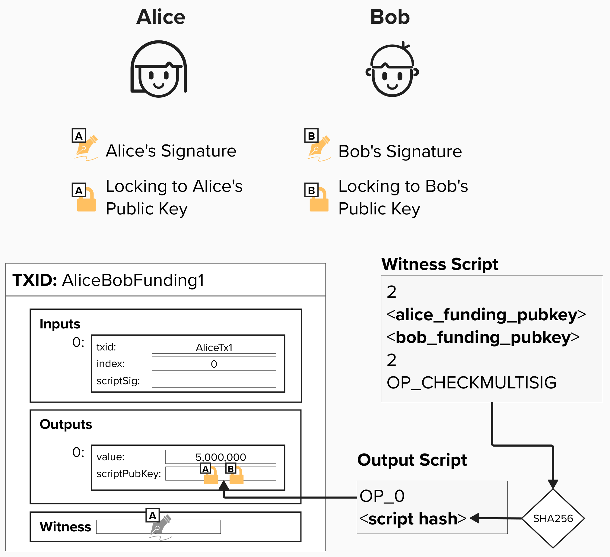

# Build Our Funding Transaction
Now that we have our funding script, let's create our Funding Transaction so we can open our payment channel! Once created, we'll broadcast the transaction in our local Regtest environment to simulate operating a Lightning channel. It'll be fun!

For this exercise, we'll build our very own Funding Transaction using Python. The function takes the following inputs:
- `input_txid`: The TxID of the previous transaction containing the UTXO we're spending. In our ongoing example, this UTXO belongs to Alice, who is opening (and funding) the channel.
- `input_vout`: The output index of the UTXO we're using as an *input* to the Funding Transaction. Remember, each input references a previous output, so we need both the TxID *and* the output index to identify which UTXO we're spending.
- `funding_amount_sat`: The amount we'd like to lock in our 2-of-2 multisig script.
- `local_funding_pubkey`: The public key of the channel opener (Alice, in this case), which will be included in the 2-of-2 multisig.
- `remote_funding_pubkey`: The public key of the channel acceptor (Bob, in this case), which will be included in the 2-of-2 multisig.

To successfully complete this exercise, you'll need to return a hex-encoded Funding Transaction. For this exercise, we'll keep things simple and won't worry about adding any signature data to the witness, though we will dig into these details shortly!

> ⚠️ It's worth noting that you do ***not*** need to follow the instructions exactly. All that matters is that you pass the tests and your function returns the correct result. If you want to build a different solution than what is provided, that is totally okay!

> ⚠️ It's also worth noting that, for this exercise, we'll omit fees and change outputs. This will allow us to simplify things a little and focus on building a transaction that locks our channel funds in a 2-of-2 multisig. In a "real world" Lightning implementation, the funding input would likely exceed the channel size, so you'd want to create a **change output** to refund the excess funds to your wallet - minus the fees that would be set aside for miners.

<details>
  <summary>Click to see the Transaction Format</summary>

A Bitcoin transaction is serialized as a sequence of bytes with the following structure:

1. **`version`** (4 bytes, little-endian): The transaction version number. Version 2 enables BIP 68 (relative lock times).

2. **`input count`** (varint): The number of transaction inputs.

3. **`inputs`**: Each input references a previous transaction output (UTXO). For our Funding Transaction, Alice will provide an input that spends one of her existing UTXOs to fund the channel.

4. **`output count`** (varint): The number of transaction outputs.

5. **`outputs`**: Each output specifies an amount of bitcoin and a script that defines how those funds can be spent. For our Funding Transaction, we'll create an output locked in a 2-of-2 multisig script!

6. **`locktime`** (4 bytes, little-endian): Specifies the earliest time or block height when this transaction can be mined.

</details>


## Decoded Funding Transaction

Below is an example of what a decoded Funding Transaction looks like. See if you can map the fields back to the diagram above. Most of these fields will not map directly, but the following are represented in the diagram:
- vin: txid
- vin: vout
- vin: scriptSig
- vin: txinwitness
- vout: value
- vout: scriptPubKey

> ⚠️ Remember, for this exercise, we simplified our Funding Transaction and did not create a **change output**, so the only output is for our Lightning channel's 2-of-2 multisig. In reality, we'd likely have excess funds from our input, which would require adding a P2WPKH change output to return those funds to a public key we control.


```
{
  "txid": "b43eee65237aaba00e7d2a2b442635d0e973b03515413b4be14f669e7bf09f1f",
  "hash": "81b475238dbf1d0ecee44ec82cf21c803e0314336df32c1f684909943243c749",
  "version": 2,
  "size": 203,
  "vsize": 122,
  "weight": 485,
  "locktime": 0,
  "vin": [
    {
      "txid": "f5e9c01a663dd228485fdf07fb4ae95d46f3ee71ba93a0c2d77fa8998b57c44a",
      "vout": 1,
      "scriptSig": {
        "asm": "",
        "hex": ""
      },
      "txinwitness": [
        "30440220783ff032365771673328b10c7516622eb95337b80a9b781cccec6d7d61e39a2702205174d10e39e667cf32f4ad951f266e1070789010f22b9ad50eb70478164de92401",
        "02d865e012869cc63aafcbcd17561ec971a0ebefdf90d2be191708efe50652a641"
      ],
      "sequence": 4294967295
    }
  ],
  "vout": [
    {
      "value": 0.05000000,
      "n": 0,
      "scriptPubKey": {
        "asm": "0 657760ca015175e42ff5b4470563b23adcf0d2973a0506a176a5569690d64437",
        "desc": "addr(bcrt1qv4mkpjsp2967gtl4k3rs2caj8tw0p55h8gzsdgtk54tfdyxkgsmsvc0c37)#xfhwt3ez",
        "hex": "0020657760ca015175e42ff5b4470563b23adcf0d2973a0506a176a5569690d64437",
        "address": "bcrt1qv4mkpjsp2967gtl4k3rs2caj8tw0p55h8gzsdgtk54tfdyxkgsmsvc0c37",
        "type": "witness_v0_scripthash"
      }
    }
  ]
}
```

## Problem: Potential Loss of Funds

Take another look at the Funding Transaction output below. Do you notice a security flaw?

<p align="center" style="width: 50%; max-width: 300px;">
  
</p>

#### Question: How can Alice lose all of her funds in this setup?
<details>
  <summary>Answer</summary>

If Bob stops responding or refuses to cooperate, then there's no way for Alice to retrieve her funds from this payment channel! This is because, to spend from a 2-of-2 multisig, you need signatures from *both* parties.
</details>


#### Question: How can we fix this security flaw?

<details>
  <summary>Answer</summary>

There are a few different ways to go about this, but the general solution is that we will need to create a way for Alice to receive a "refund" or unilateral exit from the channel. Can you think of how we can implement this?

</details>

<code-intro heading="Coding Exercise: Funding Transaction" exercises="ln-exercise-funding-tx"></code-intro>

<code-outro text="Before the funding transaction can be broadcast, it needs to be signed."></code-outro>
