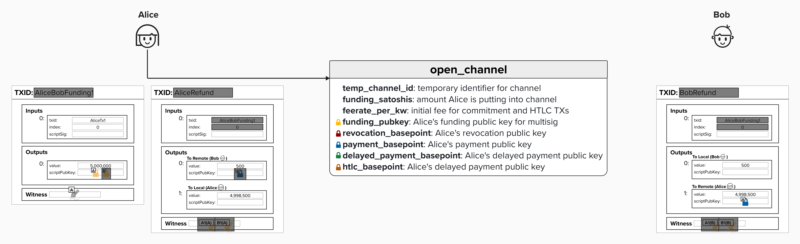
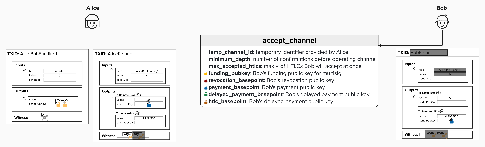
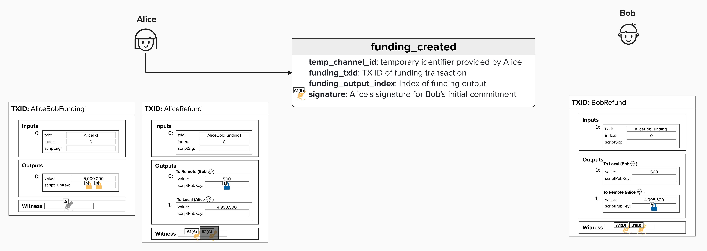
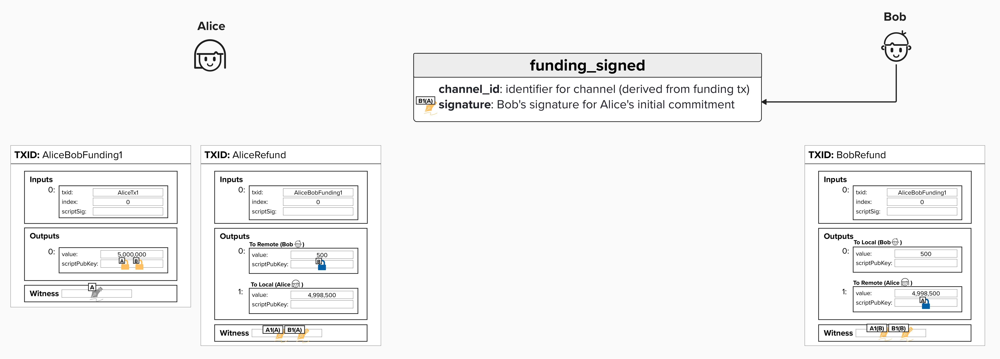

# Exchanging Signatures

As the podcasters say, let's "double-click" into the process of exchanging signatures. To do this, we'll return to BOLT 2 and the protocol messages exchanged as part of the **Channel Establishment** process. Now that we've identified that we need a Refund Transaction (which is really just the first Commitment Transaction), we can review the rest of the protocol messages and see how the information included in each message contributes to our asymmetric commitments!

> Note: The visuals and educational approach for this section were inspired by Elle Mouton's blog post [here](https://ellemouton.com/posts/open_channel_pre_taproot/). If you'd like another resource on opening a Lightning channel, I encourage you to check it out!

### Open Channel

We already reviewed the open channel message, so we won't discuss this in much depth. However, what we will draw attention to is the shaded area in the diagrams below. If an area is shaded, it means that the **"holder"** of that transaction does not yet know that information. For example, during the channel open process, Alice does not yet have **Bob's Funding Public Key** or any of the other cryptographic material needed to operate their payment channel. Therefore, she cannot construct the full 2-of-2 multisig witness script yet, which also means she does not yet know the transaction ID for the Funding Transaction. Additionally, she doesn't yet know **Bob's Payment Basepoint**, and she doesn't have his signature for the first commitment transaction.

On the other hand, once Bob receives Alice's `open_channel` message, he now has **Alice's Payment Basepoint** so he can construct the Pay-To-Witness-Public-Key-Hash (P2WPKH) output for her. That said, he still doesn't have her signature, nor does he have much information about the Funding Transaction, so he can't add the input to his version of the first commitment transaction yet.

  

### Accept Channel

As we learned earlier, if Bob accepts the channel, he will send an `accept_channel` message to Alice. In this message, he will provide, among other things, the public keys that Alice needs to complete the Funding Transaction and her version of the first Commitment Transaction, which we're calling the Refund Transaction. We haven't dug into the details regarding how each commitment state is updated yet, but it's worth noting that Bob also provides Alice with the information needed to derive the new public keys for each new commitment state.

Once Alice receives this information, she is able to add **Bob's Funding Public Key** to the 2-of-2 multisig and complete the Funding Transaction, which now means Alice has the Funding TX ID and output information.

  

### Funding Created

This is where we start building on the protocol messages we learned about earlier! Once Alice receives the `accept_channel` message, she'll want to communicate the Funding Transaction information to Bob so that he can build his version of the First Commitment Transaction, which we're calling the "Refund Transaction". Therefore, she will send him a `funding_created` message, which includes the TX ID, funding output index, and **her signature for Bob's initial commitment**.

At this point, Bob now has a version of the commitment transaction that is fully signed. However, Alice has not broadcast the Funding Transaction yet, so Bob's Refund Transaction would be rejected by the network if he tried to publish it, as the UTXO it's spending from does not yet exist.

> 💡 **REMINDER:** The signature that Alice gives Bob in this message is NOT the same signature that she uses on her version of the commitment transaction! Since the commitment transactions are asymmetrical but not exactly the same, Alice and Bob will be "signing" different transactions, resulting in different signatures. This is actually a *crucial* piece of the security model. While Bob will have **Alice's signature** for **his version** of the initial commitment transaction, Bob will never give Alice **his signature** for **his** version of the Commitment Transaction. Therefore, Alice will never be able to publish Bob's version of the commitment! This is also true in reverse: Bob will never be able to publish Alice's version of the Commitment Transaction.

  

### Funding Signed

Finally, once Bob receives the `funding_created` message from Alice, he will respond with a `funding_signed` message. This message will include **Bob's signature** for **Alice's version of the first Commitment Transaction** (Alice's version of the Refund Transaction). It's also worth noting that, at this point, we can finally calculate a durable (not temporary) `channel_id`. According to BOLT 2, the `channel_id` is "derived from the Funding Transaction by combining the `funding_txid` and the `funding_output_index`, using big-endian exclusive-OR".

  

### Summary
Hopefully, the following points are now clear:
1) Lightning leverages asymmetric commitment transactions, whereby each channel party has their own version of each commitment state.
2) Signatures are exchanged such that each party can only ever broadcast **their own version** of a commitment transaction.

## Generate A Signature

Now that we've reviewed how signatures are exchanged over the Lightning Protocol, let's implement a method so that we can generate one of those signatures ourselves! As we'll see later, this will be central to our implementation, and we'll reuse it to sign commitment transactions and HTLC transactions later in the course.

For this exercise, we'll implement `sign_input` as a method on the `ChannelKeyManager` class we started building in the keys section. This single method handles both computing the BIP143 sighash and producing the ECDSA signature.

The `sign_input` method takes the following parameters:

- `self`: The `ChannelKeyManager` instance.
- `tx_bytes`: The raw transaction bytes.
- `input_index`: The index of the input we're signing.
- `script`: The witness script (e.g., the 2-of-2 multisig witness script for funding inputs).
- `amount`: The satoshi value of the UTXO being spent.
- `secret_key`: The 32-byte private key to sign with.

The method should:
1. Deserialize `tx_bytes` into a `CTransaction`.
2. Compute the BIP143 sighash using `SignatureHash()` with `SIGVERSION_WITNESS_V0`.
3. Sign the sighash with ECDSA using the `secret_key` parameter. Use `sigencode_der_canonize` for canonical (low-S) signatures.
4. Append the `SIGHASH_ALL` byte (0x01) and return the result.

**Crucially, the `SIGHASH_ALL` flag indicates that the signature covers all of the inputs and outputs. This is the default in many wallet software implementations, as it ensures that the signature is only valid if the transaction is not changed.**

<code-intro heading="Coding Exercise: Transaction Signing" exercises="ln-exercise-sign-input"></code-intro>

<code-outro text="With signing complete, our funding transaction is ready. Now let's build the commitment transaction structure that makes channels secure."></code-outro>
