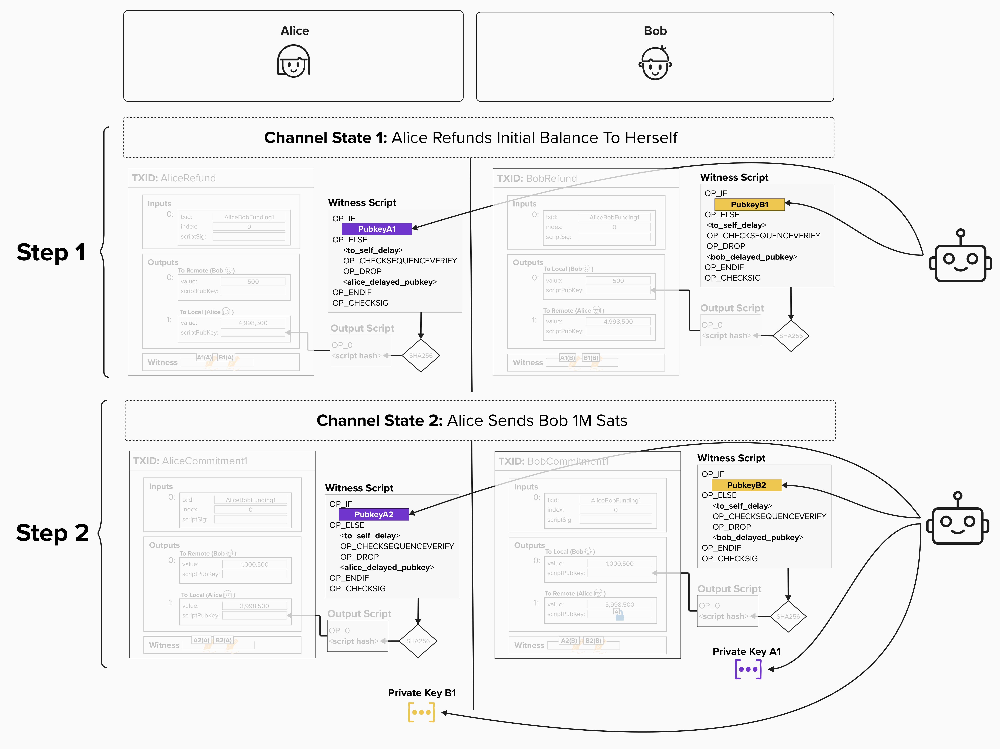
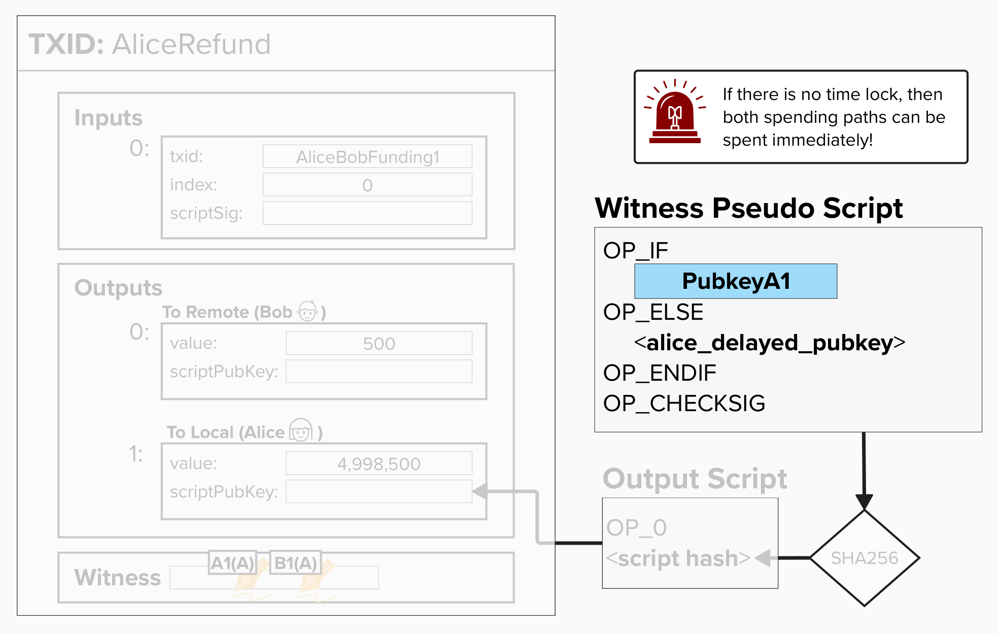
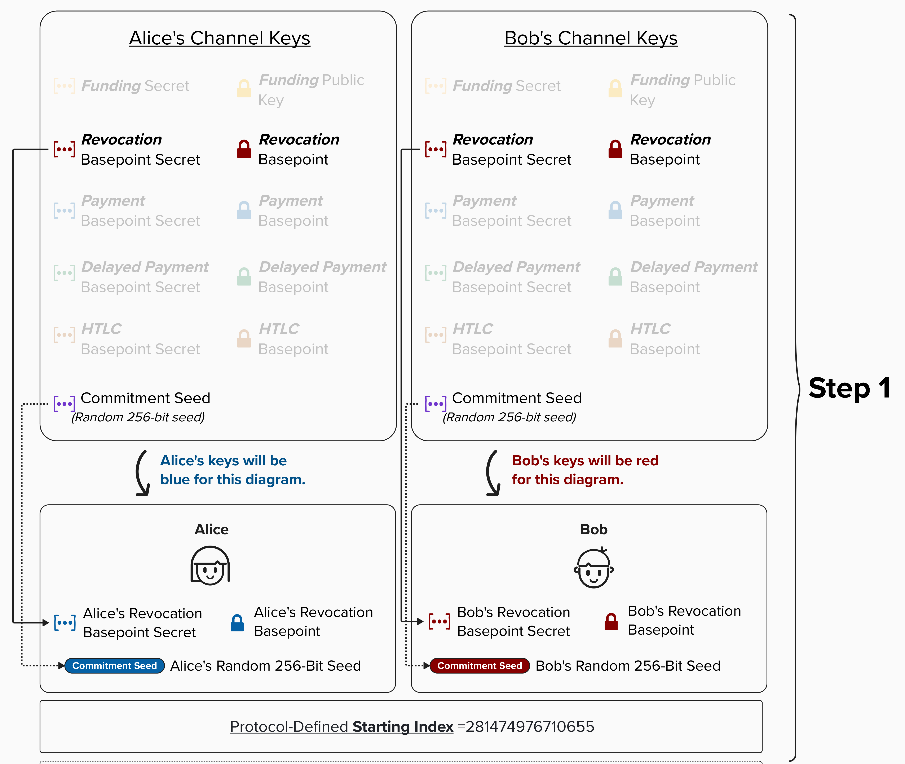
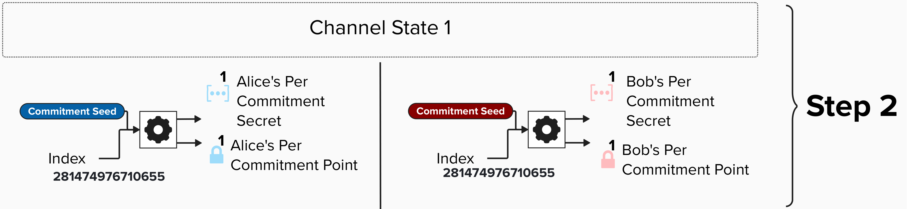
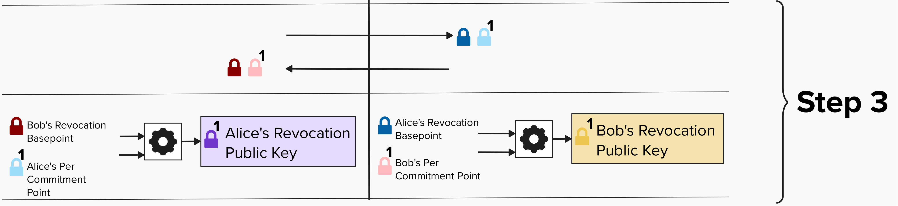
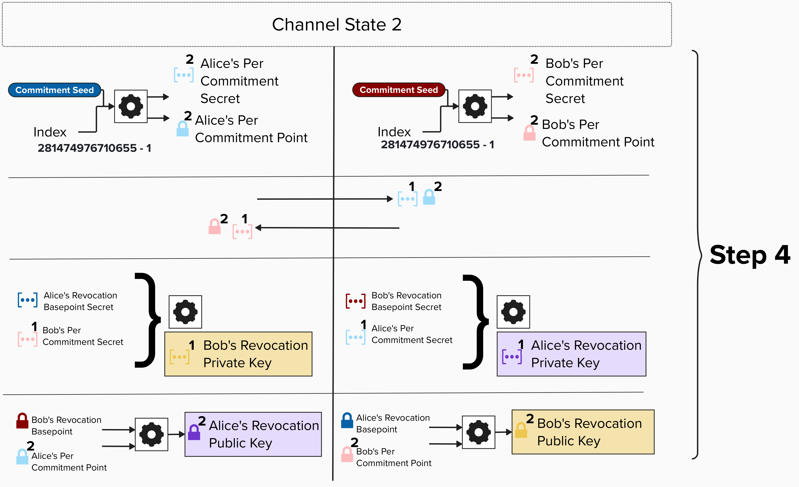
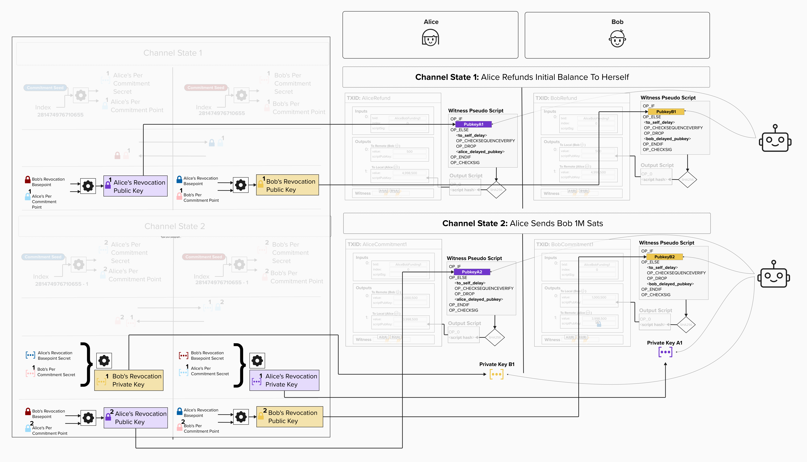

# Developing Our Penalty Mechanism

## Introducing Our Penalty Mechanism (Gently)

Now that we have a foundational understanding of asymmetric commitment transactions, we can begin to implement our penalty mechanism. Before digging into cryptography and getting in the weeds, let's review how things work at a higher level. To do this, we'll temporarily break a core tenet of Bitcoin and introduce a trusted third party. Don't worry, this trusted third party is ***only*** for educational purposes, as it will make it much easier to conceptually grasp how Lightning's penalty mechanism works. Once we have an intuitive understanding of what's going on, we'll replace the trusted third party with a series of cryptographic operations, making everything trustless again!

<p align="center" style="width: 50%; max-width: 300px;">
  
</p>

### Step 1

Imagine that, for each commitment transaction, a trusted third party generates a unique public key for Alice and a unique public key for Bob. **Alice and Bob take their respective public keys and add them to the output scripts on their own version of the commitment transaction that pays themselves** (also known as the `to_local` outputs). In other words, Alice adds this public key to the output that represents her side of the channel balance. Bob similarly adds his public key to the output on his version of the commitment transaction that pays himself. You can see this visually in the image above. Specifically, you'll notice that:

- Alice's `to_local` output has the following two spending paths:
  - One is locked to the new public key provided by the third party. We'll call this the **"Revocation Path"**.
  - The second is locked to Alice's **Delayed Payment Public Key**. It's called the Delayed Payment Public Key because, as you can see, Alice cannot spend from this path until `to_self_delay` blocks have been mined. This delay is specified as a relative timelock, which starts once Alice's version of the commitment transaction is confirmed.

The reason for adding the delay will become clear, if it's not already!

> ❗**NOTE:** At this point, neither Alice nor Bob know the private keys to either of the public keys that the trusted third party provided. This is a ***very*** important property because it means that, if either party attempts to broadcast a transaction from the **current state**, neither would know the private key to spend from the "revocation path". This makes it safe to publish the *current* state. Since your counterparty doesn't have the private key to spend from the revocation path, the only possible spending path would be via the **Delayed Payment Public Key**, which only you have the private key to! For example, if Alice published her version of the commitment transaction from Channel State 1 ***before*** moving on to Channel State 2, then neither Alice nor Bob can spend from the "revocation path". Therefore, Alice's funds are safe because only she can generate a signature to spend from her Delayed Payment Path!

### Step 2

When Alice and Bob decide to move to a new channel state, the trusted third party will do the following:

1. Provide a new public key for both Alice and Bob to use in their new commitment transactions (Channel State 2). As in Step 1, these public keys will go in their respective "Revocation Paths".
2. Provide Alice and Bob with the private keys to spend from **their counterparty's revocation path in the old channel state**. For example, when moving from Channel State 1 to Channel State 2, Alice receives the private key to **Bob's Channel State 1 Revocation Path**, and Bob receives the private key to **Alice's State Channel 1 Revocation Path**. Crucially, **neither party ever receives the private key to spend from their own revocation path in any state**.


### Step 3 (If someone cheats)

If Alice or Bob cheats, that, **by definition**, means they published an old commitment state. For example, let's say we're in **Commitment State 2**, but Alice publishes **her** commitment transaction from **Commitment State 1**. She is attempting to steal 1M sats back from Bob by publishing an old transaction that does not have these sats on Bob's side of the channel. Since our trusted third party gave Bob the private key to spend from **Alice's revocation path**, Bob can generate a signature to claim Alice's `to_local` output. Remember, Alice does not have the private key for this spending path, so she cannot claim her output via the **Revocation Path**.

The above mechanism ensures that old commitment states are effectively revoked, because publishing old commitment states risks losing all of your funds in the channel. Cool, eh?

#### Question: Why is the delayed payment spending path delayed with a relative timelock? Why do we need a timelock at all?

<details>
  <summary>Answer</summary>

The timelock is a crucial part of Lightning's security model. To see why, let's imagine there was no timelock and Alice cheats by publishing an old commitment state. In this scenario, there is nothing stopping Alice from spending her output immediately! Therefore, even though Bob has the private key to spend from the "Revocation Path", he wouldn't have sufficient time to act, so it's effectively worthless. Furthermore, you could imagine a scenario where Alice submits the transaction directly to a miner, so Bob will never even see the old commitment transaction in his mempool! He'll only see it after it's mined. 😞

<p align="center" style="width: 50%; max-width: 300px;">
  
</p>

By adding a relative timelock, **which doesn't start until the transaction is mined**, we guarantee that Bob has sufficient time to spot the transaction if it's mined. For example, if the delay is 2016 blocks (~2 weeks), then Alice cannot reclaim her funds until 2 weeks *after* the transaction has been mined. This gives Bob plenty of time to spend from the Revocation Path, if he has the private key.

If you've ever heard that Lightning has a "liveness" requirement, this is it! In other words, to safely operate on the Lightning Network, you need to be regularly online and monitoring the blockchain so you can spot if your counterparty attempts to cheat you. NOTE: you don't need to be "live" 24/7 to operate safely. As we saw in the above example, you just need to come online and check the blocks during the 2-week window to spot if your counterparty cheated. That said, it's still best practice to be consistently connected and monitoring the blockchain.

</details>

<checkpoint id="revocation-purpose"></checkpoint>

## Introducing Revocation Keys

Okay, now that we've reviewed the gist of how our penalty mechanism works, let's inch our way towards the actual protocol implementation by removing the third party and replacing them with cryptography. Remember, our end goal is to:

1. Create public keys, which we'll call **Revocation Public Keys**, that Alice or Bob can spend from if their counterparty attempts to cheat.
2. Ensure that neither Alice nor Bob knows the private key to their own **Revocation Public Key**.
3. When advancing to a new channel state, enable Alice and Bob to obtain (or, more specifically, calculate) the private key to **their counterparty's Revocation Public Key**.

This way, each party provides a way for their counterparty to claim their funds ***if and only if*** they cheat and publish an old transaction.

### Calculating A Revocation Public Key And Private Key

Below is a diagram showing, roughly, how Alice and Bob can exchange public and private key information in such a way that they satisfy the properties listed above. When viewing the diagram, also take note of how the keys tie back to the public and private keys that we created at the beginning of the course.

When you see a gear icon (see below for example), it means we're performing some type of algorithm or cryptographic operation. During our first pass, we'll explain what the algorithm *produces*, but we won't review how it works just yet. After we discuss the overall flow, we'll dig into the actual equations and, of course, implement them ourselves in code!

<p align="center" style="width: 50%; max-width: 300px;">
  
</p>

Let's get to it!

<p align="center" style="width: 50%; max-width: 300px;">
  
</p>


⚠️ **DISCLAIMER: The "Steps" outlined below (and in the diagram above) are not strictly meant to convey protocol steps. For example, "Step 4" is not meant to signal that all of the operations outlined in Step 4 happen, more or less, sequentially and as part of one atomic operation. Instead, the "Steps" are meant to help us break up each part of the process into an orderly sequence.**

### Step 1
By now, Alice and Bob's set of "Channel Keys" should look pretty familiar! For the revocation process, the following secrets and keys are going to be used:
- **Revocation Basepoint and Revocation Basepoint Secret**: This is a public/private key pair that is constant across the entire length of our payment channel.
- **Commitment Seed**: This is a random 256-bit secret. As we'll soon see, **we'll use this seed to create a unique public key for each commitment state**.
  - **Protocol-Defined Starting Index**: BOLT 3 describes how to create a new secret for each commitment state by combining our **commitment seed** with an always-decreasing index, which starts at 281,474,976,710,655.

NOTE: For simplicity, we'll break from the prior color scheme and represent Alice's/Bob's secrets and keys using the following colors:
- **Alice's** Revocation Basepoint & Basepoint Secret: **Blue**
- **Alice's** Per Commitment Point and Per Commitment Secret: **Light Blue**
- **Alice's** Revocation Secret and Revocation Public Key: **Purple**
- **Bob's** Revocation Basepoint & Basepoint Secret: **Red**
- **Bob's** Per Commitment Point and Per Commitment Secret: **Light Red**
- **Bob's** Revocation Secret and Revocation Public Key: **Gold**

<p align="center" style="width: 50%; max-width: 300px;">
  
</p>

### Step 2
When Alice and Bob open a channel, they will create a unique public/private key pair for each commitment transaction, known as the **Per-Commitment Point** and **Per-Commitment Secret**. We'll review the actual key derivation process shortly, but, for now, it's sufficient to understand that each public/private key pair is created by running your **commitment seed** and **index** through an algorithm. Per BOLT 3, all channels start with an index of 281,474,976,710,655, and this index is decremented by 1 for each new state.

<p align="center" style="width: 50%; max-width: 300px;">
  
</p>

### Step 3
Once Alice and Bob create their respective **Per-Commitment Points** and **Per-Commitment Secrets** for channel state 1, they will exchange the following keys...
- Alice will give Bob her:
  - **Revocation Basepoint**
  - **Per-Commitment Point** for Channel State 1.
- Bob will give Alice his:
  - **Revocation Basepoint**
  - **Per-Commitment Point** for Channel State 1.

Remember, the **Revocation Basepoint** does not change during the entire duration of channel operation! We'll see why this is useful in just a moment.

Once exchanged, each party can combine **their partner's Revocation Basepoint** with **their Per-Commitment Point**, creating a new public key **that neither of them know the secret key to**. This is what they will use in the revocation spending path of their `to_local` output!

<p align="center" style="width: 50%; max-width: 300px;">
  
</p>

### Step 4
When Alice and Bob decide to advance to a new channel state, they will exchange the following keys:
- **The Current State's Per-Commitment Secret**
- **The Next State's Per-Commitment Point**: To calculate the next Per Commitment Point, each channel party will first calculate the next state's Per Commitment Secret by running their **commitment seed** and **the new channel state index** through the [bit-flipping algorithm described in BOLT 3](https://github.com/lightning/bolts/blob/master/03-transactions.md#per-commitment-secret-requirements) (we'll review this shortly). Once they get the Per Commitment Secret, they can simply multiply that by the generator point, *G*, to get the Per Commitment Point.

By exchanging this information, each party provides **their counterparty** with the necessary information (the prior state's per-commitment secret) to calculate the **their Revocation Public Key**. In other words, Alice gives Bob the information needed for Bob to calculate Alice's **Revocation private key** from their prior state. Therefore, Bob can spend from Alice's revocation path if she ever publishes the associated commitment transaction, which is now considered old since they are moving to a new state.

To make this more explicit, note that the revocation key that Alice uses in her version of the transaction is created using **Bob's Revocation Basepoint** and **Alice's Per Commitment Point**. Since Bob will NEVER reveal his **Revocation Basepoint Secret** to Alice, she will never be able to calculate the private key to the public key in her spending path. However, once Bob receives **Alice's Per Commitment Point**, he can calculate the private key to the **Revocation Public Key** in **Alice's** transaction because he, of course, knows **his Revocation Basepoint Secret**.

<p align="center" style="width: 50%; max-width: 300px;">
  
</p>

<details>
  <summary>Click to see how the above diagram relates to the "gentle" introduction</summary>

Honestly, this diagram might be an absolute mess and make little sense. If that's the case, I apologize in advance and please ignore it. Otherwise, I hope it's useful and makes it a little more clear how all of the cryptographic material connects back to the "gentle" introduction we just reviewed.

Oh, and don't forget to zoom in!

<p align="center" style="width: 50%; max-width: 300px;">
  
</p>

</details>

## Deriving Revocation Keys

Okay, you've been patient! It's now (finally) time to dig into the cryptographic weeds and derive some **Revocation Public Keys** and **Revocation Private Keys** ourselves. As we work through the equations, feel free to review the diagram below to help contextualize how everything fits together.

<p align="center" style="width: 50%; max-width: 300px;">
  
</p>

## Deriving Revocation Public Keys

Since we're playing the part of Alice, we'll need to calculate **both** the **Revocation Public Key** that will go in our `to_local` **and** the **Revocation Public Key** that will go into Bob's `to_local` output? Why? Because we'll need to generate a signature for *Bob's* version of every commitment state, so we need to be able to build an unsigned version of his transactions as well. To do this, we'll need to build a function that implements these steps from the diagram above:

<p align="center" style="width: 50%; max-width: 300px;">
  
</p>

Let's start by converting the above diagram into an equation that we can actually implement. To make things more focused, we'll represent the diagram in terms of calculating our (Alice's) **Revocation Public Key**.

<p align="center" style="width: 50%; max-width: 300px;">
  
</p>

This will get a little mathy, but don't worry! We'll step through it together. Below is the general equation for calculating a revocation public key.

<p align="center" style="width: 50%; max-width: 300px;">
  
</p>

<p align="center" style="width: 50%; max-width: 300px;">
  
</p>


<details>
  <summary>Click for a visual overview of the equation</summary>

Recall that **`R`**, **Bob's Revocation Basepoint**, and **`P`**, **Alice's Per Commitment Point**. are just points on the **secp256k1 curve**.

> NOTE: the below images are just visual representations of the secp256k1 curve and public key. The actual curve looks more like a scatter plot. Additionally, **`h1`** and **`h2`** are just the SHA256 hash of both public keys (in serialized format). The **`||`** symbol means "concatenate".

REMEMBER, you can zoom in to see the visuals better!

<p align="center" style="width: 50%; max-width: 300px;">
  
</p>

Once we have **`R`**, **`P`**, **`h1`**, and **`h2`**, we can calculate a new set of public keys by multiplying the public keys (**`R`** and **`P`**) by their respective scalars (**`h1`** and **`h2`**). Remember, to do this, we essentially add the public key to itself many times. For example, we add **`R`** to itself **`h1`** times.

<p align="center" style="width: 50%; max-width: 300px;">
  
</p>

The result of **`R · h1`** and **`P · h2`** will both be new public keys on the secp256k1 curve. Visually, adding two public keys involves the below steps, and the result is a new public key.
- Drawing a line between the two points.
- Finding the point on the curve that intersects the line.
- Finding the reflection of this point across the x-axis.

The resulting public key is our **Revocation Public Key**!

<p align="center" style="width: 50%; max-width: 300px;">
  
</p>


</details>

Here's a quick breakdown of the mathematical operations being performed in this equation:
1) **SHA256 Hashing**: The serialized public keys **`R`** and **`P`** are concatenated together and hashed. These hashes (**`h1`** and **`h2`**) are treated as very large numbers (scalars) in subsequent operations.
2) **Elliptic Curve Multiplication (Tweaking)**: The public keys **`R`** and **`P`** are multiplied by the scalar representation of their respective hashes (i.e., the large numbers derived from hashing). This operation essentially adds the public key (**`R`** or **`P`**) to itself **`h1`** or **`h2`** times. This process is commonly referred to as **"tweaking"** a public key, as it modifies the original public key to produce a new one that depends on the scalar.
3) **Elliptic Curve Addition**: Finally, the tweaked public keys (**`R ⋅ h1 `** and **`P  ⋅ h2`**) are added together using elliptic curve point addition. The result is a new public key that is a unique combination of the original public keys and the hashes. This new key is cryptographically tied to both inputs and cannot be reverse-engineered.

## Derive A Revocation Public Key

Great, now that we have an intuitive understanding of how **Revocation Keys** work, let's write a function to calculate one ourselves! For this exercise, we'll implement the `derive_revocation_pubkey` function in the code editor below. This function takes the following inputs:
- `revocation_basepoint`: A 33-byte compressed Revocation Basepoint
- `per_commitment_point`: A 33-byte compressed Per-Commitment Point

As we learned, the **Revocation Public Key** is derived by combining two public keys: the **Revocation Basepoint** (which remains constant for the channel) and the **Per-Commitment Point** (which is unique to each commitment state).

To successfully complete this function, you'll need to calculate the **Revocation Public Key** using the formula we reviewed above (also provided below), which is provided in [BOLT 3](https://github.com/lightning/bolts/blob/master/03-transactions.md#revocationpubkey-derivation).

```
revocationpubkey = revocation_basepoint * SHA256(revocation_basepoint || per_commitment_point) +
                   per_commitment_point * SHA256(per_commitment_point || revocation_basepoint)
```

<details>
  <summary>Hint</summary>

The Revocation Public Key formula has two components that get added together.

> Notice the order of inputs to SHA256 is different for each component!

**Component 1:** `revocation_basepoint * SHA256(revocation_basepoint || per_commitment_point)`

**Component 2:** `per_commitment_point * SHA256(per_commitment_point || revocation_basepoint)`

To implement this in Python, you'll need to:

1. Compute the SHA256 hashes of the concatenated public keys.
   - Use `hashlib.sha256(revocation_basepoint + per_commitment_point).digest()`
   - Convert the hash to an integer: `int.from_bytes(hash_bytes, 'big') % ORDER`

2. Decompress the input public keys to EC points.
   - Use the `decompress_pubkey()` helper function provided in the starter code

3. Multiply each point by its corresponding hash scalar.
   - In the `ecdsa` library, you can multiply a `Point` by an integer directly: `point * scalar`

4. Add the two resulting points together.
   - Use elliptic curve point addition: `point1 + point2`

5. Compress and return the resulting point.
   - Use the `compress_point()` helper function provided in the starter code

</details>

<details>
  <summary>Step 1: Calculate the first hash</summary>

First, let's compute `SHA256(revocation_basepoint || per_commitment_point)`. We concatenate the two compressed public key byte strings and hash them with `hashlib.sha256()`.

</details>

<details>
  <summary>Step 2: Convert the hash to a scalar and compute the first component</summary>

Next, convert the hash to an integer modulo the curve order, and decompress the revocation basepoint. Then multiply: `R_point * factor_1`.

</details>

<details>
  <summary>Step 3: Calculate the second hash</summary>

Now compute `SHA256(per_commitment_point || revocation_basepoint)`. Notice the order is reversed!

</details>

<details>
  <summary>Step 4: Convert the hash to a scalar and compute the second component</summary>

Same as before, but multiply the per_commitment_point by the second factor: `P_point * factor_2`.

</details>

<details>
  <summary>Step 5: Combine the two components</summary>

Finally, add the two elliptic curve points together and compress the result: `compress_point(R_tweaked + P_tweaked)`.

</details>

## Deriving Revocation Private Keys

Next up, let's review deriving **Revocation Private Keys**. If you look at the diagram above, we'll be building a function that implements this step:

<p align="center" style="width: 50%; max-width: 300px;">
  
</p>

Just like we did in the previous exercise, we'll need get convert the above diagram into an equation that we can actually implement.

<p align="center" style="width: 50%; max-width: 300px;">
  
</p>

<p align="center" style="width: 50%; max-width: 300px;">
  
</p>

> **NOTE**: The function `generate_revocation_privkey` only takes two variables as inputs. This may seem confusing at first, since the above diagram shows four inputs. However, remember that we can calculate a public key by multiplying the secp256k1 generator point by our private key! So, we really only need two variables, `per_commitment_secret` and `revocation_basepoint_secret` to complete this function.

<details>
  <summary>Click for a visual overview of the equation</summary>

To spend from the "Revocation Path", Alice will need to calculate the private key to **Bob's Revocation Public Key**. Since this public key was derived using **Alice's Revocation Basepoint** and **Bob's 1st Per-Commitment Point**, Alice just needs **Bob's 1st Per-Commitment Secret** to be able to derive this key.

<p align="center" style="width: 50%; max-width: 300px;">
  
</p>

To see why Alice can derive the Revocation Private Key using **Bob's 1st Per-Commitment Secret**, let's take a closer look at the formula for deriving the **Revocation Public Key**.

Since every public key can be represented as a scalar (very large number) multiplied by the secp256k1 curve's generator point, `G`. We can rewrite the equation as follows...

<p align="center" style="width: 50%; max-width: 300px;">
  
</p>

We can then factor out `G`, and we'll get the following...

<p align="center" style="width: 50%; max-width: 300px;">
  
</p>

This gives us the **Revocation Private Key** formula.

<p align="center" style="width: 50%; max-width: 300px;">
  
</p

Alice can use her **Revocation Basepoint Secret** with **Bob's 1st Per-Commitment Secret**, which he will provide when they move to a new channel state, to calculate the **Revocation Private Key**.

<p align="center" style="width: 50%; max-width: 300px;">
  
</p>

</details>


## Derive A Revocation Private Key
Let's continue digging in the cryptographic mud! For this exercise, we'll implement a function that derives a **Revocation Private Key** for a previous channel state. Remember, this is only possible when we have *both* secrets: the **Revocation Basepoint Secret** and the **Per-Commitment Secret**.

In our payment channel, this situation only occurs when our counterparty reveals their **Per-Commitment Secret** as part of advancing to a new channel state. Once we have their secret, combined with our own **Revocation Basepoint Secret**, we can compute the private key needed to spend from their Revocation Path if they cheat by publishing an old state.

The formula for the revocation private key mirrors the public key formula, as defined in [BOLT 3](https://github.com/lightning/bolts/blob/master/03-transactions.md#revocationprivkey-derivation):
```
revocationprivkey =
  revocation_basepoint_secret * SHA256(revocation_basepoint || per_commitment_point)
  +
  per_commitment_secret * SHA256(per_commitment_point || revocation_basepoint)
```

To complete this exercise, implement the `derive_revocation_private_key` function that takes:

- `revocation_basepoint_secret`: Our Revocation Basepoint Secret
- `per_commitment_secret`: Our counterparty's Per-Commitment Secret from a prior state

The function should return the derived **Revocation Private Key**.

<details>
  <summary>Hint</summary>

This is very similar to the previous exercise. The notable difference is that we'll operate on secrets (scalars) instead of public keys (points).

**Component 1:** `revocation_basepoint_secret * SHA256(revocation_basepoint || per_commitment_point)`

**Component 2:** `per_commitment_secret * SHA256(per_commitment_point || revocation_basepoint)`

> Notice that we still need the *public keys* to compute the hashes!

1. Derive the public keys from the secrets.
   - Use the `privkey_to_pubkey()` helper function

2. Compute the SHA256 hashes (same as in the public key exercise).
   - `hashlib.sha256(rev_pub + per_pub).digest()` and `hashlib.sha256(per_pub + rev_pub).digest()`

3. Convert everything to integers and compute the result.
   - `result = (rev_secret_int * f1 + per_secret_int * f2) % ORDER`

4. Return the result as 32 bytes.
   - `result.to_bytes(32, 'big')`

</details>

<details>
  <summary>Step 1: Derive the public keys from the secrets</summary>

Even though we're computing a private key, we need the corresponding public keys to calculate the hashes. Use `privkey_to_pubkey()` to derive both public keys.

</details>

<details>
  <summary>Step 2: Calculate the first hash and tweak the revocation basepoint secret</summary>

Compute `SHA256(revocation_basepoint || per_commitment_point)`, convert to integer mod ORDER, and multiply by the revocation basepoint secret integer.

</details>

<details>
  <summary>Step 3: Calculate the second hash and tweak the per-commitment secret</summary>

Compute `SHA256(per_commitment_point || revocation_basepoint)` (reversed order!), convert to integer mod ORDER, and multiply by the per-commitment secret integer.

</details>

<details>
  <summary>Step 4: Add the two tweaked secrets together</summary>

Add the two products together modulo ORDER and convert to 32 bytes: `(result).to_bytes(32, 'big')`.

</details>

<code-intro heading="Coding Exercises: Revocation Keys" exercises="ln-exercise-revocation-pubkey,ln-exercise-revocation-privkey"></code-intro>

<code-outro text="Now let's look at how per-commitment secrets are generated."></code-outro>
