# Deriving Revocation Keys

Okay, you've been patient! It's now (finally) time to dig into the cryptographic weeds and derive some **Revocation Public Keys** and **Revocation Private Keys** ourselves. As we work through the equations, feel free to review the diagram below to help contextualize how everything fits together.

<p align="center" style="width: 50%; max-width: 300px;">
  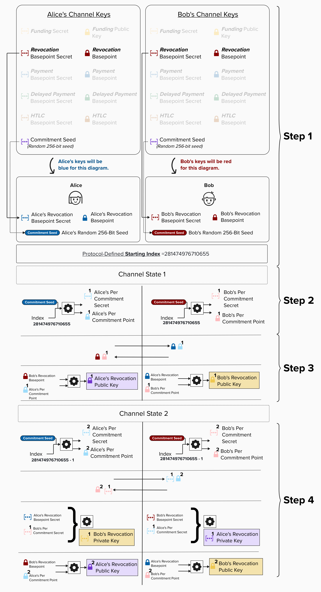
</p>

## Deriving Revocation Public Keys

Since we're playing the part of Alice, we'll need to calculate **both** the **Revocation Public Key** that will go in our `to_local` **and** the **Revocation Public Key** that will go into Bob's `to_local` output. Why? Because we'll need to generate a signature for *Bob's* version of every commitment state, so we need to be able to build an unsigned version of his transactions as well. To do this, we'll need to build a function that implements these steps from the diagram above:

<p align="center" style="width: 50%; max-width: 300px;">
  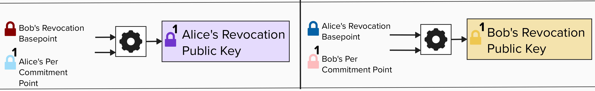
</p>

Let's start by converting the above diagram into an equation that we can actually implement. To make things more focused, we'll represent the diagram in terms of calculating our (Alice's) **Revocation Public Key**.

<p align="center" style="width: 50%; max-width: 300px;">
  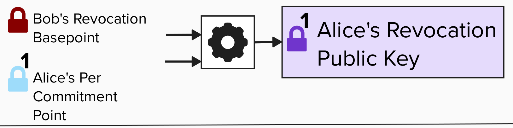
</p>

This will get a little mathy, but don't worry! We'll step through it together. Below is the general equation for calculating a revocation public key.

<p align="center" style="width: 50%; max-width: 300px;">
  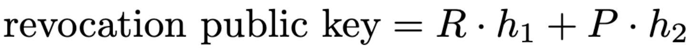
</p>

<p align="center" style="width: 50%; max-width: 300px;">
  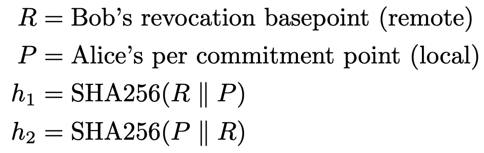
</p>


<details>
  <summary>Click for a visual overview of the equation</summary>

Recall that **`R`**, **Bob's Revocation Basepoint**, and **`P`**, **Alice's Per Commitment Point**, are just points on the **secp256k1 curve**.

> **Note:** The below images are just visual representations of the secp256k1 curve and public key. The actual curve looks more like a scatter plot. Additionally, **`h1`** and **`h2`** are just the SHA256 hash of both public keys (in serialized format). The **`||`** symbol means "concatenate".

REMEMBER, you can zoom in to see the visuals better!

<p align="center" style="width: 50%; max-width: 300px;">
  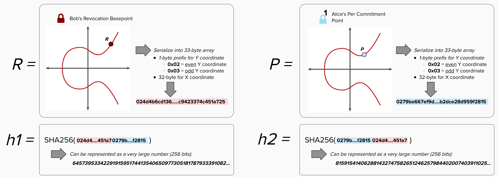
</p>

Once we have **`R`**, **`P`**, **`h1`**, and **`h2`**, we can calculate a new set of public keys by multiplying the public keys (**`R`** and **`P`**) by their respective scalars (**`h1`** and **`h2`**). Remember, to do this, we essentially add the public key to itself many times. For example, we add **`R`** to itself **`h1`** times.

<p align="center" style="width: 50%; max-width: 300px;">
  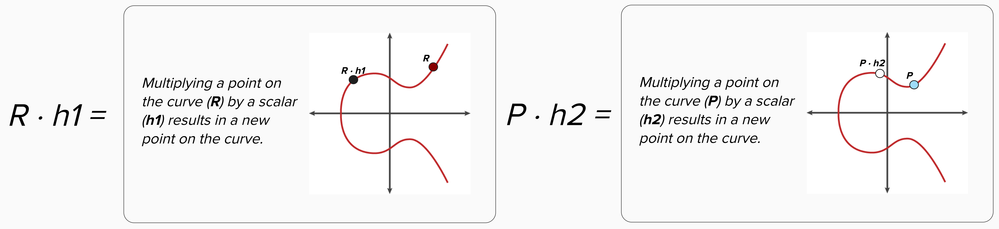
</p>

The result of **`R · h1`** and **`P · h2`** will both be new public keys on the secp256k1 curve. Visually, adding two public keys involves the below steps, and the result is a new public key.
- Drawing a line between the two points.
- Finding the point on the curve that intersects the line.
- Finding the reflection of this point across the x-axis.

The resulting public key is our **Revocation Public Key**!

<p align="center" style="width: 50%; max-width: 300px;">
  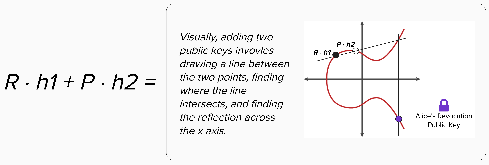
</p>


</details>

Here's a quick breakdown of the mathematical operations being performed in this equation:
1) **SHA256 Hashing**: The serialized public keys **`R`** and **`P`** are concatenated together and hashed. These hashes (**`h1`** and **`h2`**) are treated as very large numbers (scalars) in subsequent operations.
2) **Elliptic Curve Multiplication (Tweaking)**: The public keys **`R`** and **`P`** are multiplied by the scalar representation of their respective hashes (i.e., the large numbers derived from hashing). This operation essentially adds the public key (**`R`** or **`P`**) to itself **`h1`** or **`h2`** times. This process is commonly referred to as **"tweaking"** a public key, as it modifies the original public key to produce a new one that depends on the scalar.
3) **Elliptic Curve Addition**: Finally, the tweaked public keys (**`R ⋅ h1 `** and **`P  ⋅ h2`**) are added together using elliptic curve point addition. The result is a new public key that is a unique combination of the original public keys and the hashes. This new key is cryptographically tied to both inputs and cannot be reverse-engineered.

## Derive A Revocation Public Key

Great, now that we have an intuitive understanding of how **Revocation Keys** work, let's write a function to calculate one ourselves! For this exercise, we'll implement the `derive_revocation_pubkey` function in the code editor below. This function takes the following inputs:
- `revocation_basepoint`: A 33-byte compressed Revocation Basepoint
- `per_commitment_point`: A 33-byte compressed Per-Commitment Point

> **Tip:** This exercise uses helpers like `pubkey_to_point`, `point_to_pubkey`, and the EC constants `CURVE`, `G`, and `ORDER`. You can view their definitions by clicking **Files** in the exercise toolbar or **browse all files** in the code editor and selecting `ln.py`.

As we learned, the **Revocation Public Key** is derived by combining two public keys: the **Revocation Basepoint** (which remains constant for the channel) and the **Per-Commitment Point** (which is unique to each commitment state).

To successfully complete this function, you'll need to calculate the **Revocation Public Key** using the formula we reviewed above (also provided below), which is provided in [BOLT 3](https://github.com/lightning/bolts/blob/master/03-transactions.md#revocationpubkey-derivation).

```
revocationpubkey =
    revocation_basepoint * SHA256(revocation_basepoint || per_commitment_point)
  + per_commitment_point * SHA256(per_commitment_point || revocation_basepoint)
```

<code-intro heading="Coding Exercise: Derive Revocation Public Key" exercises="ln-exercise-revocation-pubkey"></code-intro>

## Deriving Revocation Private Keys

Next up, let's review deriving **Revocation Private Keys**. If you look at the diagram above, we'll be building a function that implements this step:

<p align="center" style="width: 50%; max-width: 300px;">
  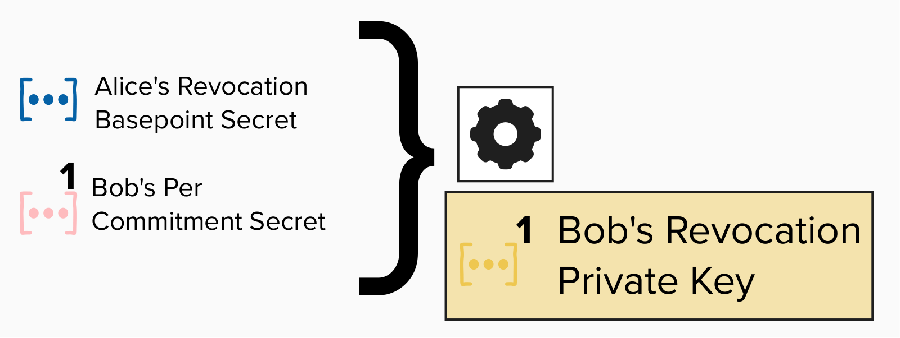
</p>

Just like we did in the previous exercise, we'll need to convert the above diagram into an equation that we can actually implement.

<p align="center" style="width: 50%; max-width: 300px;">
  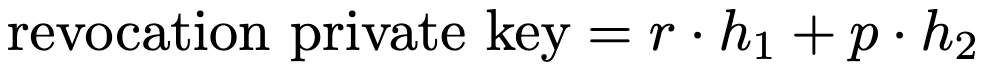
</p>

<p align="center" style="width: 50%; max-width: 300px;">
  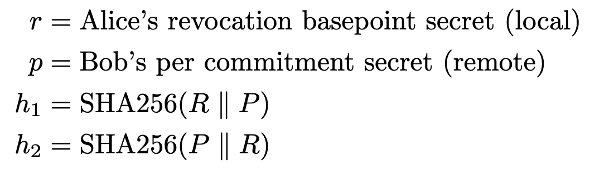
</p>

> **Note:** The function `generate_revocation_privkey` only takes two variables as inputs. This may seem confusing at first, since the above diagram shows four inputs. However, remember that we can calculate a public key by multiplying the secp256k1 generator point by our private key! So, we really only need two variables, `per_commitment_secret` and `revocation_basepoint_secret` to complete this function.

<details>
  <summary>Click for a visual overview of the equation</summary>

To spend from the "Revocation Path", Alice will need to calculate the private key to **Bob's Revocation Public Key**. Since this public key was derived using **Alice's Revocation Basepoint** and **Bob's 1st Per-Commitment Point**, Alice just needs **Bob's 1st Per-Commitment Secret** to be able to derive this key.

<p align="center" style="width: 50%; max-width: 300px;">
  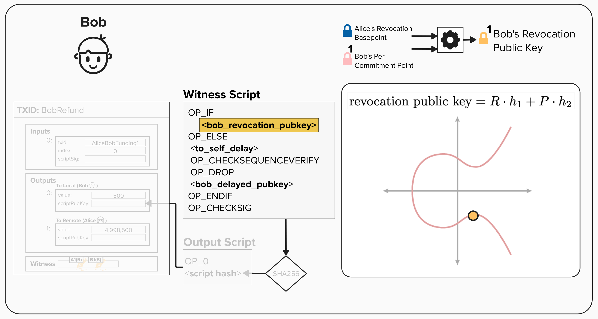
</p>

To see why Alice can derive the Revocation Private Key using **Bob's 1st Per-Commitment Secret**, let's take a closer look at the formula for deriving the **Revocation Public Key**.

Since every public key can be represented as a scalar (very large number) multiplied by the secp256k1 curve's generator point, `G`. We can rewrite the equation as follows...

<p align="center" style="width: 50%; max-width: 300px;">
  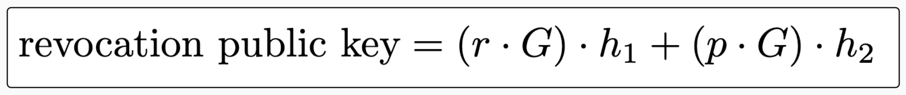
</p>

We can then factor out `G`, and we'll get the following...

<p align="center" style="width: 50%; max-width: 300px;">
  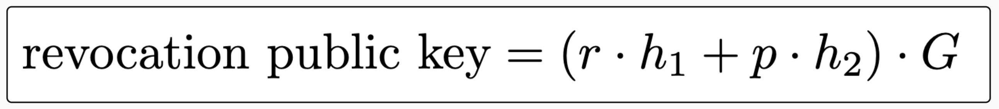
</p>

This gives us the **Revocation Private Key** formula.

<p align="center" style="width: 50%; max-width: 300px;">
  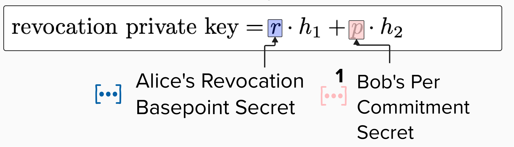
</p>

Alice can use her **Revocation Basepoint Secret** with **Bob's 1st Per-Commitment Secret**, which he will provide when they move to a new channel state, to calculate the **Revocation Private Key**.

<p align="center" style="width: 50%; max-width: 300px;">
  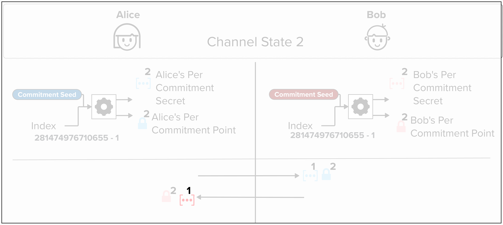
</p>

</details>


## Derive A Revocation Private Key
Let's continue digging in the cryptographic mud! For this exercise, we'll implement a function that derives a **Revocation Private Key** for a previous channel state. Remember, this is only possible when we have *both* secrets: the **Revocation Basepoint Secret** and the **Per-Commitment Secret**.

In our payment channel, this situation only occurs when our counterparty reveals their **Per-Commitment Secret** as part of advancing to a new channel state. Once we have their secret, combined with our own **Revocation Basepoint Secret**, we can compute the private key needed to spend from their Revocation Path if they cheat by publishing an old state.

The formula for the revocation private key mirrors the public key formula, as defined in [BOLT 3](https://github.com/lightning/bolts/blob/master/03-transactions.md#revocationprivkey-derivation):
```
revocationprivkey =
  revocation_basepoint_secret * SHA256(revocation_basepoint || per_commitment_point)
  +
  per_commitment_secret * SHA256(per_commitment_point || revocation_basepoint)
```

To complete this exercise, implement the `derive_revocation_private_key` function that takes:

- `revocation_basepoint_secret`: Our Revocation Basepoint Secret
- `per_commitment_secret`: Our counterparty's Per-Commitment Secret from a prior state

The function should return the derived **Revocation Private Key**.

<code-intro heading="Coding Exercise: Derive Revocation Private Key" exercises="ln-exercise-revocation-privkey"></code-intro>

<code-outro text="Now let's look at how per-commitment secrets are generated."></code-outro>
