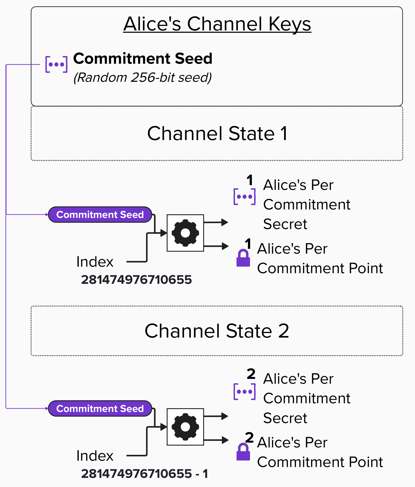

# Changing Our Public Keys For Each Commitment State

## Per-Commitment Secrets & Points

Alright, things are heating up fast. Hold on, we still have a lot to cover!

In the last exercise, we learned that Alice and Bob will each generate a series of **Per-Commitment Secrets** (private keys) and **Per-Commitment Points** (public keys) for each channel state. As we saw, these points are then used to create *unique* **Revocation Public Keys** for each channel state. Below is an image depicting this process from Alice's point of view. All she needs is a **Commitment Seed**, which she created when she opened the channel with Bob, and the **channel state index**.

> **NOTE:** In the picture below, the colors for Alice's keys have been changed back to match the colors from when we first created all of our Channel Keys.

<p align="center" style="width: 50%; max-width: 300px;">
  
</p>

So, at this point, the outstanding question on *everyone's* mind is: **"How do we create the Per-Commitment Secret from the Commitment Seed?!"** In other words, what does the gear icon actually mean?

Well, let's dig into that now.

## Deriving A Per-Commitment Secret

BOLT 3, in the [Per-commitment Secret Requirements](https://github.com/lightning/bolts/blob/master/03-transactions.md#per-commitment-secret-requirements) section, provides a specific algorithm for generating the secret for any given channel state. The algorithm, listed below, has the following two parameters:

- **seed**: The Commitment Seed for the channel
- **I**: The index. Per BOLT 3, the index starts at 281,474,976,710,655 for the first channel state, and is decremented by 1 for each new state

As you can see below, the algorithm will iterate over each bit in the index of 47 to 0 (remember, we can generate 2^48 secrets or indexes). If the bit is set to 1, it will flip the bit at the corresponding index in **P** (the current value) and then hash the result. The result becomes the new **P** for the next iteration. **P** starts as the seed and evolves through each hash operation.

```
generate_from_seed(seed, I):
    P = seed
    for B in 47 down to 0:
        if B set in I:
            flip(B) in P
            P = SHA256(P)
    return P
```

### Why This Algorithm Matters

You might be wondering: why go through all this trouble with bit-flipping and hashing? Why not just generate a random secret for each state?

The answer comes down to **storage**. Remember, every time Alice and Bob move to a new channel state, they exchange their old **Per-Commitment Secret** so their counterparty can build the revocation key for the previous state. A long-lived Lightning channel could go through **millions** of state updates. If Bob had to store every single secret Alice ever sent him, that list would grow and grow, eventually consuming a lot of memory.

The bit-flipping algorithm is cleverly designed so that secrets have a **tree-like relationship** to each other. Because of this structure, Bob doesn't need to keep every secret individually. Instead, he can store just a small handful of secrets (at most 48, regardless of how many state updates have occurred) and **re-derive any previous secret** from them whenever he needs it. This compact storage structure is called a **shachain**.

In practical terms, this means Bob's storage stays roughly the same size whether the channel has had 100 state updates or 100 million. That's a big deal for nodes running on limited hardware!

<checkpoint id="commitment-secret-algorithm"></checkpoint>

### Build Per-Commitment Secret

Now that we've reviewed how the formula works, let's implement `build_commitment_secret` as a method on our `ChannelKeyManager` class in the code editor below.

Since this is a method on `ChannelKeyManager`, it uses `self.commitment_seed` (which we set up in the constructor) instead of taking a seed parameter. The method takes a `commitment_number` (int) and produces a **Per-Commitment Secret** (returned as 32 bytes) in accordance with the specifications outlined in BOLT 3.

<code-intro heading="Coding Exercise: Build Commitment Secret" exercises="ln-exercise-commitment-secret"></code-intro>

### Build Per-Commitment Point

Now that we have the ability to generate a **Per-Commitment Secret**, let's build the functionality to turn that into a **Per-Commitment Point**. We'll implement `derive_per_commitment_point` as another method on our `ChannelKeyManager` class in the code editor below.

This method takes a `commitment_number` and calls `self.build_commitment_secret()` (the method we just created) to get the 32-byte secret. We'll then convert those bytes into a public key using the `privkey_to_pubkey` helper and return it!

<code-intro heading="Coding Exercise: Build Per-Commitment Point" exercises="ln-exercise-per-commitment-point"></code-intro>

<code-outro text="With secrets and points ready, let's derive the per-commitment keys used in scripts."></code-outro>
