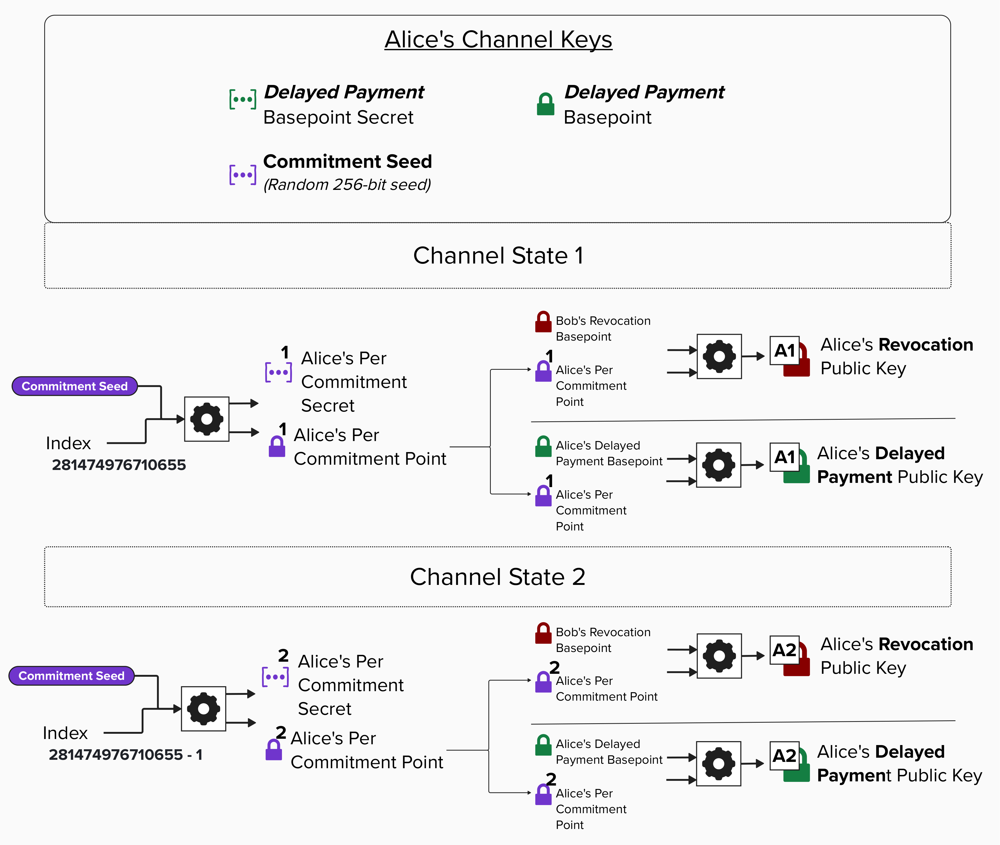
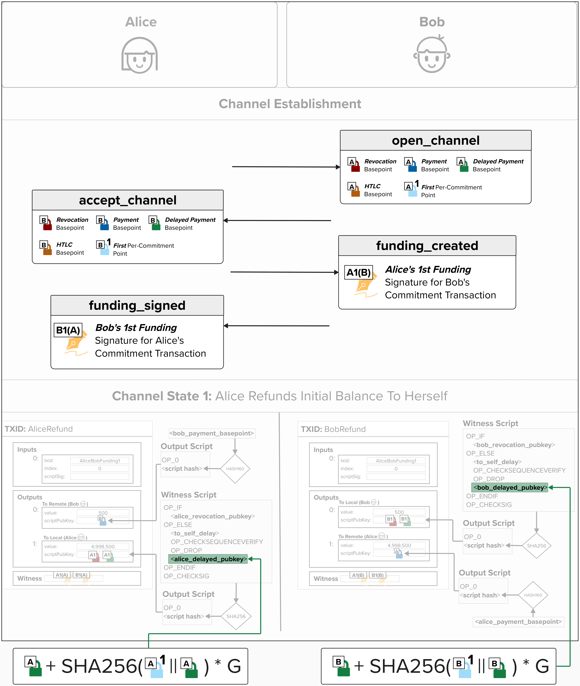
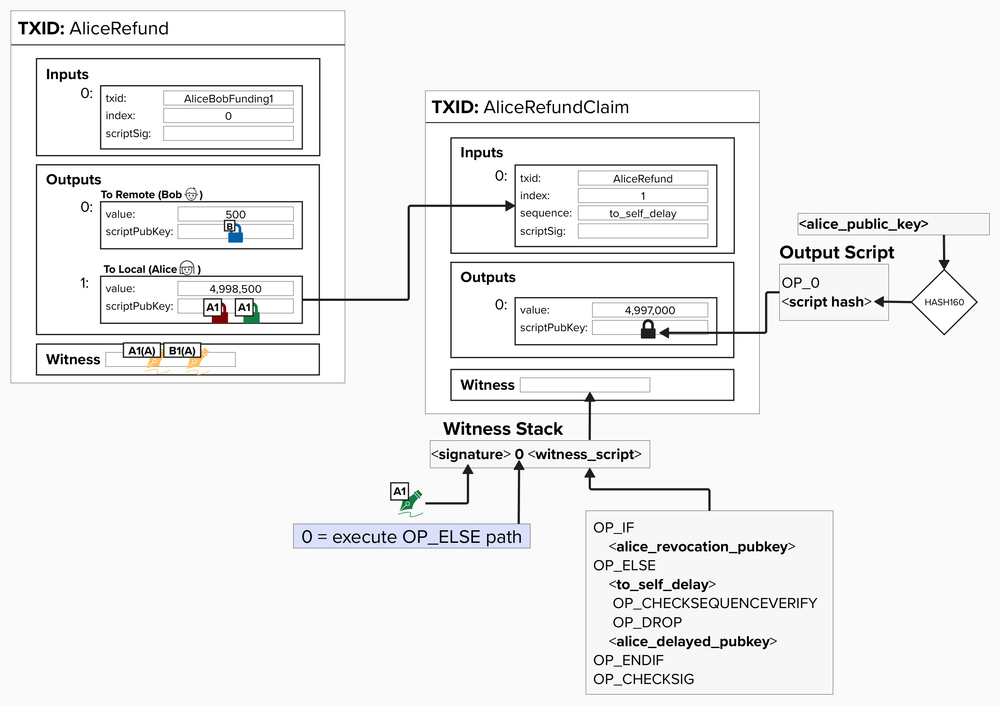

# Lightning Key Derivation

At this point, we should have a good intuition for how we can derive new **Revocation Public Keys** for each commitment state. However, the fun doesn't stop just yet! In Lightning, we actually derive **new, unique** public keys for most of the keys used in each commitment transaction.

For example, remember how we introduced a **Delayed Payment Public Key**, which is used in the delayed spending path (after the `to_self_delay` relative timelock)? Well, like the Revocation Public Key, this public key is derived by combining the **Delayed Payment Basepoint** with a given state's **Per-Commitment Point**.

Take a look at the visual below. You can see that we use each state's **Per-Commitment Point** and combine it with a **Basepoint** to produce a new public key, which we place in the locking script.

<p align="center" style="width: 50%; max-width: 300px;">
  
</p>

However, the crucial difference here is that the **Delayed Payment Public Key** is ***not*** derived the same way as the **Revocation Public Key**. Instead, it uses the *local party's* **Delayed Payment Basepoint**. For example, Alice will use her **Delayed Payment Basepoint** and combine it with *her* **Per-Commitment Point**. She'll use the equation below to calculate the **Delayed Payment Public Key**, which she will put in *her* delayed spending path. She *won't* use Bob's Basepoint because this path is only ever meant to be spent by Alice, so it's important that she can derive the private key to spend from this path at any time.
```
pubkey = basepoint + SHA256(per_commitment_point || basepoint) * G
```

## Delayed Public Keys in Locking Scripts

Now that we know how to derive the **Delayed Payment Public Key** for a given transaction, let's review the overall flow one more time to make sure everything makes sense! Then, we'll code it up!

The diagram below shows the **Channel Establishment** message flow that we reviewed earlier. You can see all of the **Basepoints** that Alice and Bob send to each other in the `open_channel` and `accept_channel` messages. If you've been paying close attention, you may notice that we've now included the **First Per-Commitment Points** in the `open_channel` and `accept_channel` messages! Per the [BOLT 2 specification](https://github.com/lightning/bolts/blob/master/02-peer-protocol.md#the-open_channel-message), the **First Per-Commitment Points** are actually included in these messages, but we left them out earlier because we hadn't yet introduced them!

At the bottom of the diagram, you can see how we calculate Alice's **Delayed Payment Public Key** for her version of the commitment transaction by plugging *her* **Delayed Payment Basepoint** and *her* **First Per-Commitment Point** into the formula provided in the BOLT 3 specification. On the other hand, we use *Bob's* **Delayed Payment Basepoint** and *Bob's* **First Per-Commitment Point** when calculating *his* **Delayed Payment Public Key**.

<p align="center" style="width: 50%; max-width: 300px;">
  
</p>

#### Question: Why does Alice need Bob's Delayed Payment Basepoint? It looks like she only uses her Delayed Payment Basepoint to create the Delayed Payment Public Key that goes into her `to_local` witness script...

<details>
  <summary>Answer</summary>

Remember, each new transaction that Alice and Bob create spends from the 2-of-2 funding output! Since Alice and Bob each have their own version of the commitment transaction, they each require a unique signature from the other to ensure their commitment transactions are valid.

Therefore, Alice needs to recreate *Bob's* version of the commitment transaction locally so she can generate a signature for it and send that signature to Bob! Bob does the same for Alice.

To ensure that Alice and Bob can create each other's commitment transactions locally, they share their Basepoints when opening their channel.

</details>

## Deriving Public Keys

Alright, let's get our hands dirty by implementing `derive_public_key`, a function that takes a **Basepoint** (33-byte compressed public key) and **Per-Commitment Point** (33-byte compressed public key) and returns a derived public key for a specific commitment transaction.

In case you're wondering, the function definition doesn't specify which basepoint for a few reasons. First, we can use this function to derive a **Delayed Payment Public Key** for our counterparty, which uses *their* **Delayed Payment Basepoint** and their **Per-Commitment Point**. Additionally, as we'll see later, there are other public keys that we'll derive using different **Basepoints**!

To successfully complete this exercise, you'll need to implement the formula as defined in [BOLT 3](https://github.com/lightning/bolts/blob/master/03-transactions.md#localpubkey-local_htlcpubkey-remote_htlcpubkey-local_delayedpubkey-and-remote_delayedpubkey-derivation):
```
pubkey = basepoint + SHA256(per_commitment_point || basepoint) * G
```

<code-intro heading="Coding Exercise: Derive Public Key" exercises="ln-exercise-derive-pubkey"></code-intro>

## Deriving Private Keys

Okay, so we have our public keys ready to go! But how do we generate the private keys so that we can spend from any given commitment state? For example, the diagram below depicts a situation where Alice needs to claim her funds from the first commitment state, which we've been calling the "Refund" transaction. To do this, she needs to spend from the **Delayed Payment Public Key**, which is unique to this commitment state.

<p align="center" style="width: 50%; max-width: 300px;">
  
</p>

We created the **Delayed Payment Public Key** by combining the **Delayed Payment Basepoint** with a **Per-Commitment Point**. Therefore, to generate the corresponding private key, we need to apply the same tweak to the **Delayed Payment Basepoint Secret**. BOLT 3 provides us with the equation to do just this:
```
privkey = basepoint_secret + SHA256(per_commitment_point || basepoint)
```

#### Question: Take a look at the newly added sequence field in the "input" section of Alice's refund claim transaction. What is `to_self_delay` here?

<details>
  <summary>Answer</summary>

Recall how we added a delay so that Alice had to wait `to_self_delay` (e.g., 2016 blocks or ~2 weeks) before she could claim her funds from this output, if it's mined? This was to give Bob time to claim these funds first if Alice was cheating by broadcasting this transaction *after* they had already agreed to move to a new channel state.

Well, in this example, we're assuming that Alice is playing nice and is fairly claiming these funds back. To do this, she will have to set the `sequence` field in the input, which specifies the output she's spending, to the `to_self_delay` value that was embedded in the script. If you're interested in reading the details, you can read the OP_CHECKSEQUENCEVERIFY BIP [here](https://github.com/bitcoin/bips/blob/master/bip-0112.mediawiki).

If you're busy (or intimidated by the BIP - they can be scary), here is the TLDR: The `sequence` field specifies a relative timelock on the input, meaning that a transaction cannot be mined until that number of blocks (or amount of time) has passed **since the output being spent was confirmed**. `OP_CHECKSEQUENCEVERIFY`, when evaluated on the stack, checks if the provided delay (`to_self_delay`, in our case) is less than or equal to the value in the `sequence` field. By doing this, we can restrict the delayed spending path such that Alice cannot spend from it until the relative timelock has expired. Neat, eh?

</details>

### Derive Private Keys

For this exercise, we'll implement `derive_private_key`, a function that takes a `basepoint_secret` (like our `delayed_payment_basepoint_secret`), a `per_commitment_point`, and returns the derived private key we can use to sign for that specific commitment.

To successfully complete this exercise, you'll need to implement the formula as defined in [BOLT 3](https://github.com/lightning/bolts/blob/master/03-transactions.md#localpubkey-local_htlcpubkey-remote_htlcpubkey-local_delayedpubkey-and-remote_delayedpubkey-derivation):

```
privkey = basepoint_secret + SHA256(per_commitment_point || basepoint)
```

<code-intro heading="Coding Exercise: Derive Private Key" exercises="ln-exercise-derive-privkey"></code-intro>

### Assembling Commitment Keys

Now that we have all our key derivation functions, let's tie everything together. In a real Lightning node, when you need to create a new commitment transaction, you need to derive ALL five per-commitment keys at once: the revocation key, the local delayed payment key, the local HTLC key, the remote HTLC key, and the per-commitment point itself.

We'll implement `get_commitment_keys` as a method on our `ChannelKeyManager` class. This method takes a commitment number and the remote party's basepoints, derives all five keys, and returns them bundled in a `CommitmentKeys` object. This is the bridge between our key management system and the transaction-building code we'll write next.

> **Tip:** The `CommitmentKeys` class is a simple data container provided for you. You can view its constructor and expected inputs by clicking the **Conceptual** hint in the exercise below, or by clicking **browse all files** in the code editor and selecting `ln.py`.

The method should:
1. Derive the **per-commitment point** from the commitment number (using `self.derive_per_commitment_point()`)
2. Derive the **revocation key** from the remote party's revocation basepoint and the per-commitment point (using `derive_revocation_pubkey()`)
3. Derive the **local delayed payment key** from `self.delayed_payment_basepoint` and the per-commitment point (using `derive_pubkey()`)
4. Derive the **local HTLC key** from `self.htlc_basepoint` and the per-commitment point (using `derive_pubkey()`)
5. Derive the **remote HTLC key** from the remote party's HTLC basepoint and the per-commitment point (using `derive_pubkey()`)
6. Return a `CommitmentKeys` object containing all five values

<code-intro heading="Coding Exercise: Assemble Commitment Keys" exercises="ln-exercise-get-commitment-keys"></code-intro>

<code-outro text="Excellent! We now have a complete key derivation pipeline. Our ChannelKeyManager can derive all the keys needed for any commitment state. Let's build the commitment transaction scripts."></code-outro>
