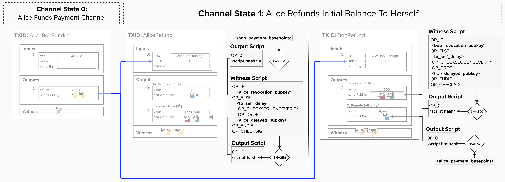

# Commitment Transaction Structure

Alright, let's take a break from cryptography for a moment. Now that we understand how to derive the keys needed for Lightning, let's return to our scripts and implement them!

Remember, Alice and Bob have asymmetric versions of the commitment transactions, meaning that Alice has a special locking script on her `to_local` output and Bob has a special locking script on his `to_local` output. As we just learned, this is how Alice and Bob protect each other from future cheating.

<p align="center" style="width: 50%; max-width: 300px;">
  
</p>

### Create To Remote Script

In the code editor below, you'll find two functions: one to create the `to_remote` script and one to create the `to_local` script. Both functions will return **script bytes** (a `bytes` object representing a Bitcoin script).

Let's start with implementing `create_to_remote_script`, which takes the remote party's `remote_pubkey`. If you recall, this is simply the remote party's **Payment Basepoint**. This *does not* change for each commitment transaction, making it easier for the remote party to spend their funds from any given channel state since they do not need to derive a private key for that specific state.

Since our counterparty should be able to spend these funds immediately, we simply create a **Pay-To-Witness-Public-Key-Hash** (**P2WPKH**) locking script, which only requires a valid signature to spend from. Below is what a P2WPKH output looks like:

- The first part is the **version byte**. In this case, it's `OP_0`, which signals that this script is either **P2WPKH** or **P2WSH**. If it were `OP_1`, this would be a **Pay-To-Taproot** (P2TR) output.
- Next, we place the hash of the public key. It's a 20-byte hash because we use HASH160 on the public key, which returns a 20-byte result.

> **Tip:** The `hash160` helper computes RIPEMD160(SHA256(data)) for you. You can view its definition by clicking **browse all files** in the code editor and selecting `ln.py`.

```
OP_0 <20-byte-pubkey-hash>
```

Once complete, the function should return script bytes containing the P2WPKH script, locking to the remote party's Payment Basepoint.

<checkpoint id="to-remote-script"></checkpoint>

### Create To Local Script

Now, let's string together many of the pieces we've been learning about and build our `to_local` script. Remember, this script defines the spending conditions for any funds that the **holder** of the commitment transaction owns. In other words, Alice locks *her* funds to this script and Bob locks *his* funds to this script.

It has the following two spending conditions:

1. **Revocation Spending Path**: If the **holder** cheats by publishing an old state, their counterparty can punish them and spend from the revocation path immediately.
2. **Delayed Spending Path**: If the **holder** publishes the current state, then their counterparty does not know the secret to spend from the revocation path. Therefore, the **holder** can spend from the delayed spending path after `to_self_delay` blocks have passed since this transaction was mined.

Below is the script structure, as defined in [BOLT 3](https://github.com/lightning/bolts/blob/master/03-transactions.md#to_local-output):

```
OP_IF
    <revocationpubkey>
OP_ELSE
    <to_self_delay>
    OP_CHECKSEQUENCEVERIFY
    OP_DROP
    <local_delayedpubkey>
OP_ENDIF
OP_CHECKSIG
```

The `create_to_local_script` takes the following inputs:
- `revocation_pubkey`: Created by combining our counterparty's **Revocation Basepoint** with our **Per-Commitment Point**
- `local_delayedpubkey`: Created by combining our **Delayed Payment Basepoint** with our **Per-Commitment Point**
- `to_self_delay`: The number of blocks we must wait before we can spend from the delayed path. This is negotiated with our counterparty when opening the channel.

Once complete, this function should return script bytes with the above structure.

<code-intro heading="Coding Exercises: Commitment Scripts" exercises="ln-exercise-to-remote-script,ln-exercise-to-local-script"></code-intro>

<code-outro text="With our scripts ready, let's look at how commitment numbers are obscured."></code-outro>
