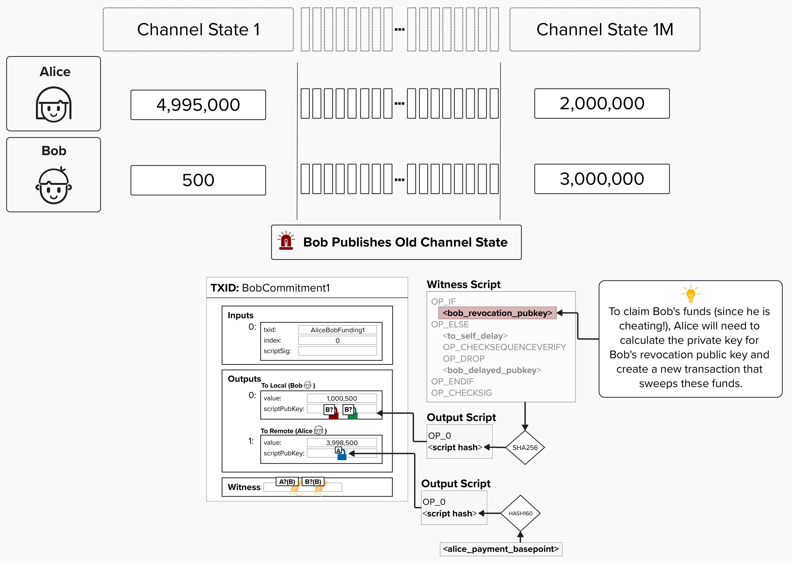
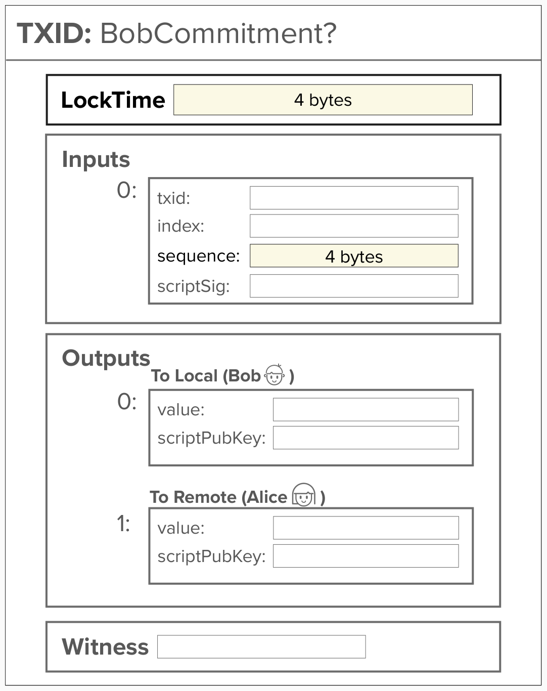
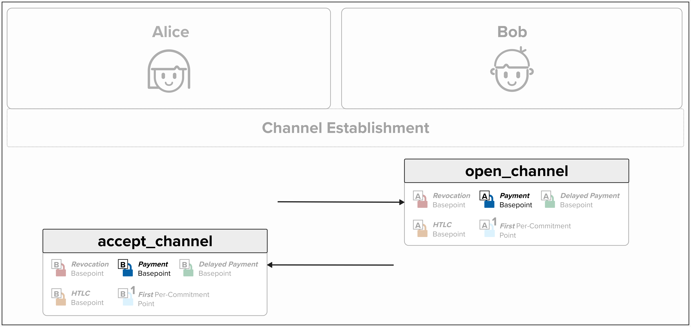
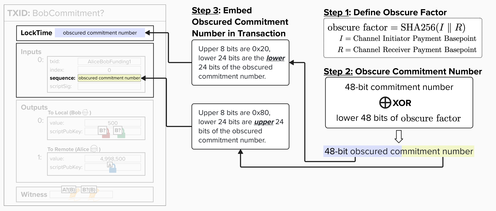
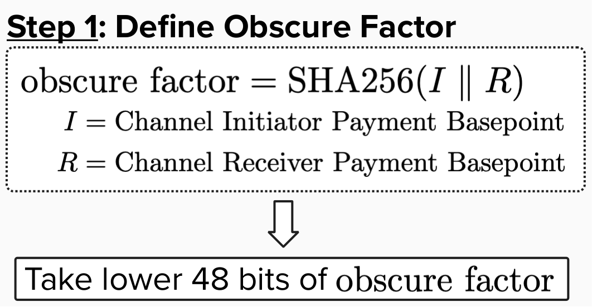

# Obscured Commitment Number

Okay, we're **very** close to implementing our first commitment transaction! We just have one piece left to review.

Imagine Alice and Bob have been sending payments back and forth for a while. They've even reached 1,000,000 payments - wow! What if Bob tries to pull a fast one and publish an old commitment transaction? Remember, each channel state uses a unique set of public and private keys! So, to spend from **Bob's Revocation Public Key**, Alice will have to derive the private key using the formula below:

```
revocationprivkey =
    revocation_basepoint_secret * SHA256(revocation_basepoint || per_commitment_point)
        +
    per_commitment_secret * SHA256(per_commitment_point || revocation_basepoint)
```

Crucially, to derive the components above, Alice needs the right **Per-Commitment Secret**, which means she must know the **Commitment Number** for this specific state!

*Don't be afraid to zoom into the diagram below!*

<p align="center" style="width: 50%; max-width: 300px;">
  
</p>

#### Question: How would we know which commitment state Bob is publishing so that we can punish him and claim all channel funds via the Revocation Path?

<details>
  <summary>Answer</summary>

One idea is to simply store all previous transactions so that we can iterate through our history and see which state matches the transaction Bob posted. But, that doesn't sound too efficient.

Another idea is to put the commitment number in the transaction itself! That way, just by looking at the transaction, we can identify the commitment number, generate the associated private key, and claim the funds from the revocation path. Justice is served!

This second approach - embedding the commitment number in the transaction itself - is exactly what Lightning does! Specifically, per [BOLT 3](https://github.com/lightning/bolts/blob/master/03-transactions.md#commitment-transaction), the commitment number is split and embedded within the **locktime** and **sequence** fields. Remember, the max number of commitments we can generate is 2^48 - 1, so we need **6 bytes (48 bits)** of storage space! Since the locktime and sequence fields only have 4 bytes each, we need to split the commitment number across these fields.

At this point, you may be wondering how we can embed the commitment number within the **locktime** and **sequence** fields. Don't these fields have a specific purpose? Won't putting arbitrary data in those fields cause an issue? Well, it depends on *how* you embed it, but more on that in just a moment.

<p align="center" style="width: 50%; max-width: 300px;">
  
</p>

#### Question: Should we put the raw commitment number in the transaction, which is publicly observable on the blockchain? Is this bad for privacy?

<details>
  <summary>Answer</summary>

If we embed the raw commitment number within the transaction, that would be a privacy leak, as anyone would be able to see how many commitment states our Lightning channel had at the time of closure.

To prevent this privacy leak, the Lightning protocol specifies that we must *obscure* the number of commitments by using an **XOR** operation with a SHA256-derived factor (based on *both channel partners'* **Payment Basepoints**). Since the **Payment Basepoints** should only be known by the channel parties, this ensures that outsiders will be unable to decipher the actual number of commitments. Remember, Alice and Bob exchange **Payment Basepoints** when setting up their channel.

<p align="center" style="width: 50%; max-width: 300px;">
  
</p>

Since the number of commitments requires up to 6 bytes to store, we separate the obscured commitment number into two 24-bit chunks:

- The upper 24 bits are placed in the **locktime** field, prefixed with `0x20` (8 bits) since this is a 4-byte field.
  - We prefix with `0x20` because it ensures the resulting locktime will be above 536,870,912 but below 546,937,241. Since anything above 500,000,000 is interpreted as a Unix timestamp, and this range corresponds to dates around 1987, the locktime will always be a valid timestamp in the past. This workaround enables us to use the locktime field for storing arbitrary data. Kinda spicy, but neat!

- The lower 24 bits are placed in the **sequence** field, prefixed with `0x80` (8 bits) since this is a 4-byte field.
  - We prefix with `0x80` because it disables any relative timelocks (in relation to the 2-of-2 multisig Funding Transaction). We're then free to use the remaining 24 bits to store our commitment transaction data!

<p align="center" style="width: 50%; max-width: 300px;">
  
</p>

</details>

</details>


## Write A Function To Generate An Obscure Factor

Let's get back to work! First and foremost, to generate an obscured commitment number, we'll need to write a function to generate an **obscure factor**. This is what we'll use to XOR our commitment number.

<p align="center" style="width: 50%; max-width: 300px;">
  
</p>

In the code editor below, you'll find the function `get_obscure_factor`. This function takes the following parameters:

- `opener_payment_basepoint` (bytes): The Payment Basepoint of the channel opener. In our ongoing example, Alice is the channel opener.
- `accepter_payment_basepoint` (bytes): The Payment Basepoint of the channel accepter.

To complete this exercise, implement a function that:

- Takes both parties' payment basepoints (`opener_payment_basepoint` and `accepter_payment_basepoint`)
- Returns a Python integer containing the 48-bit obscure factor

The function should hash both payment basepoints together and extract the last 6 bytes (48 bits) of the resulting hash.

<code-intro heading="Coding Exercise: Compute Obscured Commitment Number" exercises="ln-exercise-obscure-factor"></code-intro>

<checkpoint id="obscured-commitment"></checkpoint>

## Set Obscured Commitment Number in Transaction

Now let's bring this full circle by implementing a function that sets the obscured commitment number for a transaction in a given commitment state.

To do this, we'll complete `set_obscured_commitment_number`, which takes a `CMutableTransaction` and modifies its `nLockTime` and `nSequence` fields in place to embed the obscured commitment number.

This function takes the following inputs:

- `tx` (CMutableTransaction): The transaction to modify in place.
- `commitment_number` (int): The commitment number for the given channel state.
- `opener_bp` (bytes): The Payment Basepoint of the channel opener.
- `accepter_bp` (bytes): The Payment Basepoint of the channel accepter.

Go ahead and give it a try! To complete this function, you'll need to use the function we created in the last exercise to calculate the obscured commitment factor. You can then use that to derive the upper and lower 24 bits of the obscured commitment number (Steps 2 and 3 in the diagram below).

> Note: Commitment Numbers Count Up from Zero
>
> The commitment number we XOR with the obscure factor counts **upward** starting from 0:
> - Commitment number 0 (the first commitment)
> - Commitment number 1 (the second commitment)
> - Commitment number 42 (the 43rd commitment)
>
> This is different from the **per-commitment secret index**, which counts **downward** from 281,474,976,710,655:
> - First commitment secret: index 281,474,976,710,655
> - Second commitment secret: index 281,474,976,710,654
> - 43rd commitment secret: index 281,474,976,710,613
>
> While this may have been clear already, it's worth pointing it out so that there is no confusion. If the reason for the difference isn't clear - remember that the descending index for the commitment secret enables efficient secret storage!

<p align="center" style="width: 50%; max-width: 300px;">
  
</p>

<code-intro heading="Coding Exercise: Set Obscured Commitment Number" exercises="ln-exercise-obscured-commitment"></code-intro>

<code-outro text="Now we can assemble the full commitment transaction."></code-outro>
