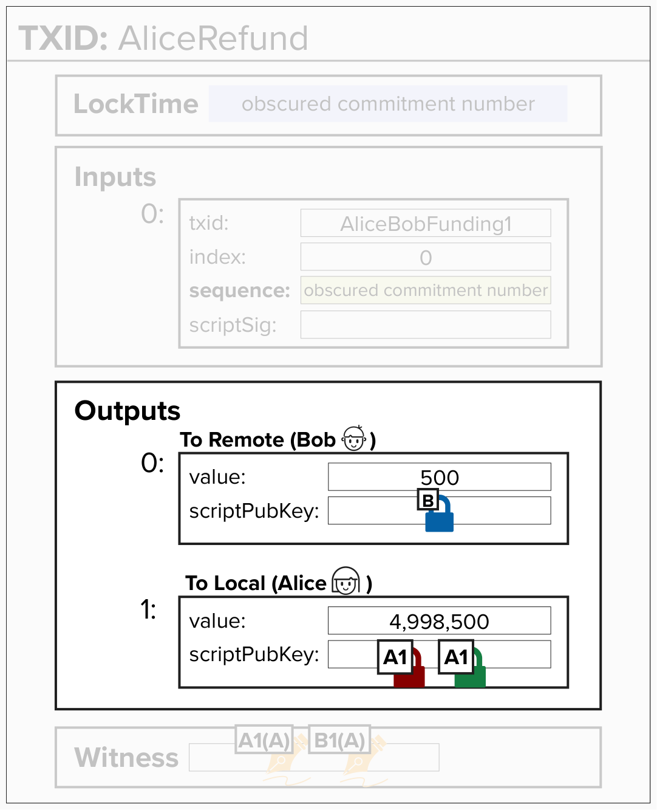
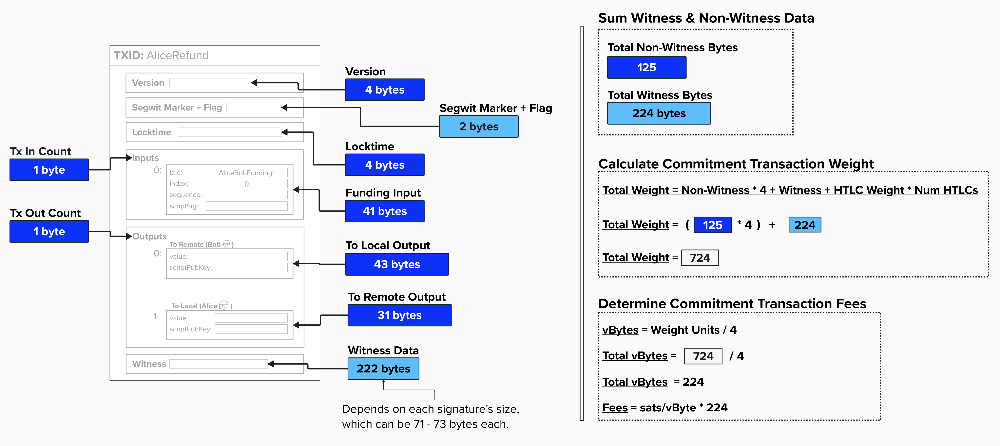
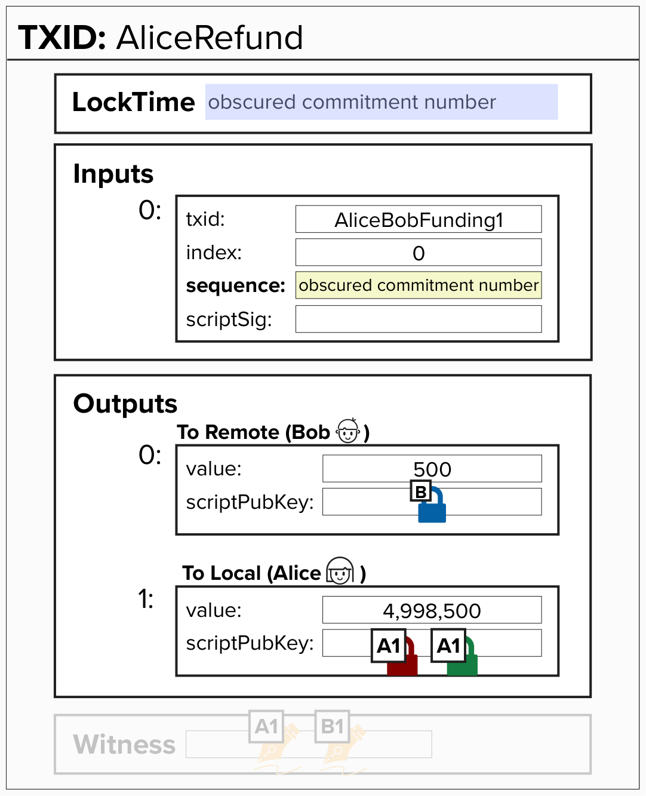

# Pulling It All Together: Build Our Commitment Transaction

We've come a long way! Let's piece together everything we've learned and **fully** implement our first commitment transaction, which we've been referring to as our "refund transaction".

Remember, Alice will actually build **both** her version of the commitment transaction **and** Bob's version for each commitment state. Do you remember why she needs to build Bob's version as well?

<details>
  <summary>Answer</summary>

We need to build Bob's version so that we can generate a signature to send to Bob for *his* version of the commitment transaction!

</details>

Take a look at the image below... we'll be translating this into code!

<p align="center" style="width: 50%; max-width: 300px;">
  
</p>

## Commitment Transaction Outputs

We'll start by focusing on commitment transaction outputs. Below are a few questions to build our intuition and see if you've been paying attention!

<details>
  <summary>Do the outputs follow a specific order?</summary>

Yes! If you recall from earlier, the Lightning network spec (specifically, BOLT 3: [Transaction Output Ordering](https://github.com/lightning/bolts/blob/master/03-transactions.md#transaction-output-ordering)) specifies that outputs should be ordered in the following manner:

- First, according to their value (smallest first).
  - If there is a tie, the output with the lexicographically lesser `scriptpubkey` comes first, then selecting the shorter script (if they differ in length).
  - For HTLC outputs, if there is a tie after sorting via the above, then they are ordered in increasing `cltv_expiry` order.

</details>

<details>
  <summary>Do Alice and Bob ALWAYS have an output? One for each of them?</summary>

No! We do not produce outputs for values that fall below the [dust limit](https://github.com/lightning/bolts/blob/master/03-transactions.md#dust-limits), as these would be uneconomical to spend on-chain, and therefore just take up space and add extra fees to our commitment transaction.

To add further nuance, each party specifies its own dust limit, informing the peer of the thresholds below which it will not create outputs. These are communicated in the [open_channel](https://github.com/lightning/bolts/blob/master/02-peer-protocol.md#the-open_channel-message) and [accept_channel](https://github.com/lightning/bolts/blob/master/02-peer-protocol.md#the-accept_channel-message) messages.

If a channel party's balance is too small to have its own output, it's added to fees and considered [**trimmed**](https://github.com/lightning/bolts/blob/master/03-transactions.md#trimmed-outputs).

</details>

<details>
  <summary>Who pays the fees for this commitment transaction?</summary>

If you recall, we're following **Channel Establishment V1**, which is the simpler channel opening protocol where one party funds the channel and that same party pays the fees.

In our case, Alice opened the channel, so she'll pay the fees - meaning that the fees will be subtracted from her channel balance.

</details>

<p align="center" style="width: 50%; max-width: 300px;">
  
</p>

## Commitment Transaction Fees

Now is as good a time as any to talk about fees! In Bitcoin, there are two main contributors to fees:

- **Transaction Weight**: This is the size, in **virtual bytes** (vBytes), of a transaction.
- **Demand for Blockspace**: As you're likely aware, Bitcoin blockspace is limited. Therefore, to get your transaction mined, you'll have to *incentivize* a miner to include your transaction in their block. Since many people are interested in getting their transaction mined, a fee market comes into existence. In other words, to get your transaction mined, you'll need to pay for it!

#### Virtual Bytes (vBytes)

To understand a "virtual byte", let's first review a "byte". A **byte** is simply 8 bits of data. In the diagram below, you can see each field within a Bitcoin transaction and its size (in bytes). By now, you should be familiar with most of these fields. However, there are a few that we haven't discussed, such as the Segwit Marker and Flag. Understanding these two fields is not imperative for this course, but if you'd like a more technical deep dive into the entire structure of a Bitcoin transaction, check out Learn Me A Bitcoin's [Transaction resource](https://learnmeabitcoin.com/technical/transaction/).

The Segregated Witness (SegWit) upgrade introduced the concept of **weight**, which is the **size** (in bytes) of certain parts of the transaction multiplied by a **multiplier**. For example, non-witness data is multiplied by 4, while witness data is multiplied by 1. If you add up the resulting **size x multiplier**, you get the **total weight** of a transaction. Finally, if you divide the **total weight** by 4, you get the **virtual bytes** of the transaction. This is where the term "witness discount" comes from - witness data has a lower multiplier (1x vs 4x), so it contributes proportionally less to fees than non-witness data.

The total fees that one would pay to get their transaction mined is measured by the **number of satoshis** they are willing to pay per **virtual byte**, also known as **sats/vByte**.

<p align="center" style="width: 50%; max-width: 300px;">
  
</p>

#### Question: Assuming no HTLCs, does the weight of a Lightning commitment transaction change?

<details>
  <summary>Answer</summary>

I'll admit, this question may be a little unfair since we have not yet reviewed HTLCs. However, since the diagram above *mostly* answers this question pretty explicitly, maybe the question isn't unfair after all!

The answer is yes, it may change, but not by much! The weight for a commitment transaction with no HTLCs falls, roughly, within a pretty narrow range of 720-724. This is because the Lightning protocol defines how Lightning transactions are structured, so there is not much room for variation. In other words, each Lightning transaction (without HTLCs or anchors) will only have a `to_local` and `to_remote` output. Additionally, the witness will always have two signatures and the standardized 2-of-2 multisig script. That said, as you may be able to see from the diagram above, each signature (and sighash flag) will likely be 71, 72, or 73 bytes, so this will cause the total weight to vary slightly.

Therefore, the maximum **weight** (assuming 73-byte signatures) of a simple (no HTLC or anchor) Lightning commitment transaction is **724**. If you don't believe me or the diagram above, take a look at the [Fee Calculation](https://github.com/lightning/bolts/blob/master/03-transactions.md#fee-calculation) section of BOLT 3 (also shown below). Since we have no HTLCs, the weight is simply 724.

```
Commitment weight (no option_anchors):   724 + 172 * num-untrimmed-htlc-outputs
```

</details>

## Write A Function To Create Commitment Transaction Outputs

Alright, let's get to work! We'll start by completing `create_commitment_transaction_outputs` in the code editor below.

To successfully complete this exercise, you'll need to return a **list** of output dictionaries, where each dictionary represents a commitment transaction output. Make sure to check if the output values are below the dust limit before adding them! If both `to_local` and `to_remote` are above the dust limit, then your implementation should return a list of two output dictionaries - one `to_local` and one `to_remote`.

<details>
  <summary>Click to see the Output Dictionary Structure</summary>

Each output dictionary represents a commitment transaction output. To be clear, unlike Bitcoin protocol types, this is a structure specific to the Programming Lightning course.

If you're familiar with Hash Time-Locked Contracts (HTLCs), all of these fields may look familiar. If not, no worries! Below is a brief overview of what you'll need to know ***for the purposes of this exercise***:

- `"value"`: The amount of bitcoin (in satoshis) locked to this output.
- `"script"`: The script bytes we're locking the bitcoin to. Since we've only learned about `to_local` and `to_remote` outputs thus far, you can imagine this holding the script bytes for those outputs.
- `"cltv_expiry"`: We'll cover this later when we discuss HTLCs! It's included because we'll need it for sorting outputs. Since there is no expiry for `to_local` and `to_remote` outputs, we'll set this to `None` for this exercise.
```python
{
    "value": 50000,          # int, amount in satoshis
    "script": b'\x00\x14...', # bytes, the locking script
    "cltv_expiry": None,     # int or None
}
```

</details>

This function takes the following inputs:

- `to_local_value`: The amount of bitcoin being locked to the `to_local` script.
- `to_remote_value`: The amount of bitcoin being locked to the `to_remote` script.
- `commitment_keys`: A dictionary that holds all of the keys you'll need to complete this transaction. See the dropdown below for more details.
- `remote_payment_basepoint`: The remote party's Payment Basepoint. You should know where this goes by now!
- `to_self_delay`: The number of blocks that the transaction holder needs to wait before they can claim their funds.
- `dust_limit_satoshis`: The dust limit. Remember, Alice and Bob specify their own dust limits when they open the channel.
- `fee`: The fee for this transaction.

<details>
  <summary>Click to see the commitment_keys Dictionary</summary>

The `commitment_keys` dictionary holds all of the public keys we need for any given channel state. In other words, these keys have already been tweaked by the **Per-Commitment Point** and are the public keys that we actually embed in the transaction scripts.
```python
commitment_keys = {
    # The per-commitment point used to derive the other keys
    "per_commitment_point": b'...',

    # The revocation key which allows the broadcaster's counterparty to punish
    # them if they broadcast an old state
    "revocation_key": b'...',

    # Local party's HTLC key (derived from local_htlc_basepoint)
    "local_htlc_key": b'...',

    # Remote party's HTLC key (derived from remote_htlc_basepoint)
    "remote_htlc_key": b'...',

    # Local party's delayed payment key (for to_local output)
    "local_delayed_payment_key": b'...',
}
```

</details>

> TIP 1: Since we're following **Channel Establishment V1** and we're acting as Alice, the fees should be deducted from our balance!

> TIP 2: Remember, you should not add outputs if the channel party's balance is **below** the `dust_limit_satoshis`.

<checkpoint id="commitment-outputs"></checkpoint>

## Write A Function To Sort Outputs

Great, we're moving along! We now have a list of output dictionaries, where each dictionary represents a Bitcoin transaction output. Things are pretty simple now, as we only have two outputs, but like all things in life, things will get complicated eventually.

To prepare ourselves for the future, let's implement a function to sort a list of output dictionaries such that they follow the [Lightning Spec](https://github.com/lightning/bolts/blob/master/03-transactions.md#transaction-output-ordering). Fun fact: the Lightning specification actually follows [BIP 69](https://github.com/bitcoin/bips/blob/master/bip-0069.mediawiki), which recommends how various Bitcoin applications should order inputs and outputs in transactions. By standardizing this, we help improve privacy. Otherwise, if individual applications all had their own logic for sorting inputs/outputs, they would leave a public "fingerprint" on the blockchain and it would be much easier to determine which software created which transaction.

Lightning builds on BIP 69 by adding a CLTV Expiry sort after first sorting by value and then lexicographically.

To successfully complete this exercise, implement `sort_outputs`, which takes a list of output dictionaries. The function should return the sorted list (or sort in place).

You can click below to remind yourself of which fields are available within each output dictionary. You must sort the outputs as follows:

- First, according to their value (smallest first).
  - If there is a tie, the output with the lexicographically lesser `scriptpubkey` comes first, then selecting the shorter script (if they differ in length).
  - For HTLC outputs, if there is a tie after sorting via the above, they are ordered in increasing `cltv_expiry` order.

<details>
  <summary>Click to see the Output Dictionary Structure</summary>

```python
{
    "value": 50000,          # int, amount in satoshis
    "script": b'\x00\x14...', # bytes, the locking script
    "cltv_expiry": None,     # int or None
}
```

</details>

## Write A Function To Create An Unsigned Commitment Transaction

Let's continue our coding journey by implementing `create_commitment_transaction` in the code editor below. We'll use the function we created in the previous exercise (`create_commitment_transaction_outputs`) to build our outputs, add those to a transaction dictionary, and then update the `lock_time` and `sequence` fields with the obscured commitment number.

In the next exercise, we'll add the witness data, and then we'll be good to go!

<p align="center" style="width: 50%; max-width: 300px;">
  
</p>

The `create_commitment_transaction` function takes the following inputs:

- `funding_outpoint`: The outpoint of the Funding Transaction (the 2-of-2 multisig output we're spending).
- `to_local_value`: The amount of bitcoin for the `to_local` output.
- `to_remote_value`: The amount of bitcoin for the `to_remote` output.
- `commitment_keys`: The derived keys for this commitment state.
- `local_payment_basepoint`: Our Payment Basepoint.
- `remote_payment_basepoint`: The remote party's Payment Basepoint.
- `commitment_number`: The commitment number for this state.
- `to_self_delay`: The number of blocks we must wait before claiming our funds.
- `dust_limit_satoshis`: The dust limit threshold.
- `feerate_per_kw`: The fee rate in satoshis per 1000 weight units.
- `offered_htlcs`: HTLCs we're offering (we'll cover these later!).
- `received_htlcs`: HTLCs we've received (we'll cover these later!).

> Note: Don't worry about the `offered_htlcs` and `received_htlcs` parameters for now. We'll dive into those in a later section. For this exercise, these will be empty lists.

<code-intro heading="Coding Exercises: Commitment Assembly" exercises="ln-exercise-commitment-outputs,ln-exercise-sort-outputs,ln-exercise-commitment-tx"></code-intro>

<code-outro text="The unsigned commitment transaction is ready. Let's finalize it with signatures."></code-outro>
