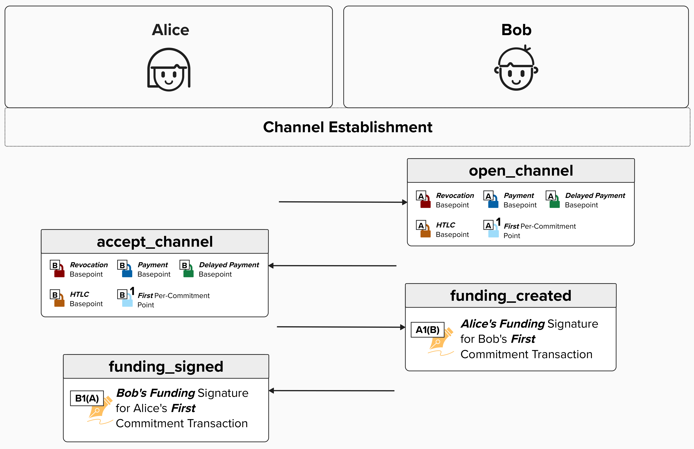
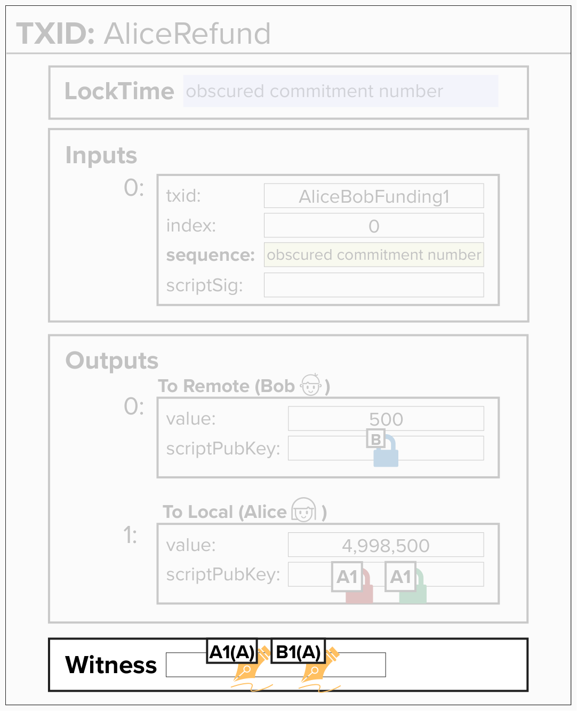

# Signing A Commitment Transaction

Let's finish this up by signing our commitment transaction and adding both our signature and Bob's signature to the witness. Remember, as part of **Channel Establishment V1**, Bob will send Alice **his** signature for **Alice's** version of the first commitment transaction, and Alice will send Bob **her** signature for **his** version of the commitment transaction.

<p align="center" style="width: 50%; max-width: 300px;">
  
</p>

If Alice wanted to broadcast her version of the first commitment transaction, she could simply generate her own signature and add it, along with Bob's signature and the witness script, to the witness. This would satisfy the spending conditions and allow her to broadcast her version of the commitment transaction.

#### Question: When Alice receives Bob's signature, will she sign her version of the commitment transaction and save the fully signed transaction somewhere? Or will she wait to sign it?

<details>
  <summary>Answer</summary>

Lightning implementations will ***not*** fully sign their version of the commitment transactions **until** they intend to broadcast them. If they did fully sign them and stored them in memory or a database, this would put them at risk of being published early - either by accident or by a malicious actor that gains access to them.

Therefore, it's best practice to wait to sign your version of a commitment transaction until you intend to publish it.

</details>

## Write A Function To Sign A Commitment Transaction

For this exercise, we'll implement `finalize_commitment_tx`. This function will take the serialized bytes of an unsigned commitment transaction, produce a signature using the **Funding Private Key** from our `ChannelKeyManager`, and add the appropriate witness data to satisfy the 2-of-2 multisig spending condition. It will return the resulting `CMutableTransaction` with the witness attached.

To successfully complete this exercise, you'll use the `ChannelKeyManager` instance (`km`) that we built earlier in this course. Specifically, you'll:

1. Obtain the **Funding Private Key** via `km.funding_key`.
2. Sign the 2-of-2 multisig funding input by calling `km.sign_input()`, which we implemented in an earlier exercise.
3. Build the witness stack: `[b'', sig1, sig2, funding_script]`, where the signature order depends on the `local_sig_first` parameter.

<details>
  <summary>Click here to see the sign_input method signature</summary>

We implemented `sign_input` as a method on `ChannelKeyManager` earlier in this course. Here's the method signature to help jog your memory:

```python
def sign_input(self, tx_bytes, input_index, script, amount, secret_key) -> bytes
```

It computes the BIP143 sighash and returns a DER-encoded signature with the SIGHASH_ALL byte appended.

</details>

<p align="center" style="width: 50%; max-width: 300px;">
  
</p>

<checkpoint id="witness-structure"></checkpoint>

This function takes the following inputs:

- `km`: A `ChannelKeyManager` instance, which holds our channel private keys and signing functionality.
- `unsigned_tx`: The serialized bytes of the unsigned commitment transaction.
- `funding_script`: The 2-of-2 multisig witness script (as bytes).
- `funding_amount`: The amount of funds locked in the 2-of-2 multisig.
- `remote_signature`: Our remote counterparty's signature to spend from the 2-of-2 multisig input.
- `local_sig_first`: A boolean value, indicating if our local signature should come before the remote signature in the witness.

Go ahead and give it a try!

<code-intro heading="Coding Exercise: Finalize Commitment" exercises="ln-exercise-finalize-commitment"></code-intro>

<code-outro text="Our commitment transaction is signed and ready to broadcast! Next, let's inspect what it looks like."></code-outro>
