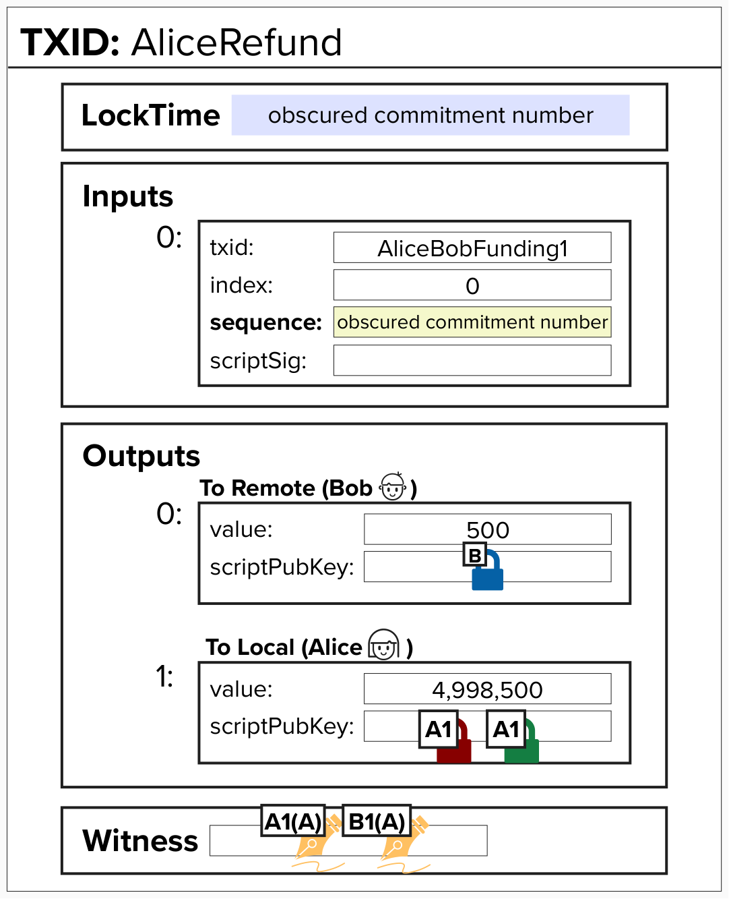

# Inspecting the Commitment Transaction

If you're reading this... congrats on making it this far! You're approaching a **really** important checkpoint.

In this next exercise, we're going to use all of the code we've built thus far to generate our first commitment transaction. Since we're playing the part of Alice, this will be our "refund" transaction, which will send our funds back to us if Bob goes offline.



## Generate a Commitment Transaction

Click the button below to generate a signed commitment (refund) transaction. You'll need to paste your **Funding Transaction ID** — you can find it in the **Transactions** section under **TOOLS** (top-right corner). The results are saved to the **Transactions** notebook.

<tx-generator id="gen-commitment"></tx-generator>

Under the hood, this generator is running all of the functions we created earlier! It creates two sets of keys (one for us, Alice, and one for Bob), fetches the funding UTXO using the Funding TxID, and then calls:

- `create_commitment_tx`: Creates an unsigned commitment transaction.
- `create_funding_script`: Creates the 2-of-2 multisig script, which is needed to generate a signature and pass into the witness.
- `finalize_commitment_tx`: Generates our (Alice's) signature and adds it to the witness (along with Bob's signature and the witness script), resulting in a fully signed transaction ready to be broadcast!

## Decoding Your Transaction

Now let's dig into the details! Copy the **transaction hex** you just generated from the **Transactions** section (open it via **TOOLS** in the top-right corner), then head over to the **Bitcoin Node** terminal.

In the Bitcoin Node terminal, run the following command, replacing `<your_tx_hex>` with the hex you copied:

```
decoderawtransaction <your_tx_hex>
```

You should get an output similar to the below. See if you can map this back to the image at the top of this page. You can also scroll down, and each field will be described for you.

```
{
  "txid": "...",
  "hash": "...",
  "version": 2,
  "size": 346,
  "vsize": 181,
  "weight": 721,
  "locktime": 542394654,
  "vin": [
    {
      "txid": "898448...",
      "vout": 0,
      "scriptSig": {
        "asm": "",
        "hex": ""
      },
      "txinwitness": [
        "",
        "3045022100...",
        "30440220...",
        "522102...52ae"
      ],
      "sequence": 2159794176
    }
  ],
  "vout": [
    {
      "value": 0.00000500,
      "n": 0,
      "scriptPubKey": {
        "asm": "0 cc1b07838e387deacd0e5232e1e8b49f4c29e484",
        "type": "witness_v0_keyhash"
      }
    },
    {
      "value": 0.04998500,
      "n": 1,
      "scriptPubKey": {
        "asm": "0 4adb4e2f00643db396dd120d4e7dc17625f5f2c11a40d857accc862d6b7dd80e",
        "type": "witness_v0_scripthash"
      }
    }
  ]
}
```

Let's walk through the decoded output field by field.

## Version

```
"version": 2,
```

The **version** is set to `2`, which is required for any transaction that uses `OP_CHECKSEQUENCEVERIFY` (CSV). As we learned earlier, our `to_local` output relies on a relative timelock via CSV to enforce the `to_self_delay`. If the version were set to `1`, the CSV opcode would be treated as a no-op, and our timelock would not be enforced. So version 2 is essential here.

## Weight and (Virtual) Size

Let's take a look at the size-related fields. The first few fields (txid, hash, version) are more self-explanatory, so we'll focus on the size and weight!

The **size** is the number of bytes our transaction contains. However, after the SegWit upgrade, which provided a discount for data placed in the witness, the concept of a **virtual size** was introduced.

If you were to multiply each part of the transaction data's size by its associated multiplier, you'd get the transaction's **weight units**. Notice here how our transaction has 721 weight units, right in between the range of 720-724!

If we divide the **weight units** by 4, we get the **virtual size**. The total fees we would pay to broadcast this transaction would be the `sats/vbyte * vsize`.

```
"size": 346,
"vsize": 181,
"weight": 721,
```

## Locktime

```
"locktime": 542394654,
```

If you look at the locktime, you'll notice it looks like a strange number. That's because it's not a "normal" locktime at all.

As we learned earlier when we created the **obscured commitment number**, we place the lower 24 bits of the **obscured commitment number** in the locktime field, prefixed with `0x20` (8 bits).

This ensures the resulting locktime will evaluate to something above 536,870,912 but below 553,648,127. Since anything above 500,000,000 is interpreted as a Unix timestamp, and this range corresponds to dates around 1987, the locktime will always be a valid locktime in the past!

As we can see above, the locktime is valid and in the past, and only we know how to combine it with the sequence field to learn the commitment number for this state!

<details>
  <summary>Why does the locktime look so strange?</summary>

Remember how we created the **obscured commitment number** earlier in the course? The locktime field is one of the two places where we encode it.

Specifically, the lower 24 bits of the obscured commitment number are placed in the locktime, prefixed with `0x20` (8 bits). This produces a value between 536,870,912 and 553,648,127. Since Bitcoin interprets any locktime above 500,000,000 as a Unix timestamp, and these values correspond to dates in the late 1980s, the locktime is always in the past and will never prevent the transaction from being mined.

This is a clever trick: we're "hiding" the commitment number in plain sight, right inside a standard transaction field. Only the two channel parties know the **obscured commitment number base** (derived from their payment basepoints), so only they can extract the real commitment number from the locktime and sequence fields.

</details>

## Input

If you look at the `vin`, you'll see the one input for our commitment transaction, the 2-of-2 multisig output! You should recognize that the `txid` is equal to the Funding Transaction TxID.

`vout` is 0 because, as mentioned earlier, all funding outputs **for this course** will be at index 0, but that is not the case in the real world; they can be any index.

Since we're using SegWit (to prevent transaction malleability), the witness data has been moved out of the `scriptSig` and into the `txinwitness`, so the `scriptSig` is blank.

```
"vin": [
  {
    "txid": "898448...",
    "vout": 0,
    "scriptSig": {
      "asm": "",
      "hex": ""
    },
```

## Witness

Take a moment and see if you can guess what is in the witness field!

<details>
  <summary>What's in the witness?</summary>

Remember, since there is a bug in `OP_CHECKMULTISIG` which pops an extra item off the stack, we must first add an empty element (`""`).

Then, we add the two signatures for the public keys in the 2-of-2 multisig script.

Finally, we add the multisig script itself. Since we previously locked to the hash, we need to provide the script so that Bitcoin knows the actual locking condition to evaluate for this input.

</details>

```
"txinwitness": [
  "",
  "3045022100...",
  "30440220...",
  "522102...52ae"
]
```

The witness contains four elements:

1. An empty string (`""`) to satisfy the `OP_CHECKMULTISIG` bug that pops one extra item off the stack.
2. The first signature (Alice's or Bob's, depending on key ordering) for the 2-of-2 multisig.
3. The second signature for the 2-of-2 multisig.
4. The full 2-of-2 multisig redeem script (`OP_2 <pubkey1> <pubkey2> OP_2 OP_CHECKMULTISIG`). Since the funding output locked to the SHA256 hash of this script, we need to reveal the actual script for validation.

## Sequence

The last part of the input is the `sequence` field.

```
"sequence": 2159794176
```

We place the upper 24 bits of the **obscured commitment number** here, prefixed with `0x80` (8 bits).

By prefixing this field with `0x80`, we disable any relative timelocks (in relation to the 2-of-2 multisig Funding Transaction). Combined with the locktime, we can reconstruct the full obscured commitment number.

## Outputs

Here, we can see the `to_local` and `to_remote` outputs! Can you tell which is which?

It's much easier to identify them by simply looking at the amounts, but see if you can identify which is which by looking at the `"asm"` only. It's possible!

If you noticed the `type` field, that would have given it away as well. Remember, the `to_remote` is a P2WPKH, while the `to_local` is a P2WSH.

However, another way to tell which is which is by the *length* of the "asm", which is meant to be a human-readable script. The `0` stands for `OP_0` and the data after is the hash! If you recall, the `to_remote` takes the HASH160 (results in 20 bytes) of the public key, while the `to_local` takes the SHA256 (results in 32 bytes) of the witness script. So the `to_local` will be longer!

### to_remote (P2WPKH)

```
{
  "value": 0.00000500,
  "n": 0,
  "scriptPubKey": {
    "asm": "0 cc1b07838e387deacd0e5232e1e8b49f4c29e484",
    "type": "witness_v0_keyhash"
  }
}
```

This is the **to_remote** output, which pays our counterparty. We can identify it by the `"type": "witness_v0_keyhash"`, which tells us this is a **P2WPKH** (Pay-To-Witness-Public-Key-Hash) output. The `to_remote` output is simple: it locks funds directly to the counterparty's public key hash, with no timelocks or special conditions. They can spend it immediately.

Notice the `asm` field shows `0` followed by a 20-byte hash. The `0` represents `OP_0`, and the 20 bytes are the HASH160 of the counterparty's **Payment Public Key**.

### to_local (P2WSH)

```
{
  "value": 0.04998500,
  "n": 1,
  "scriptPubKey": {
    "asm": "0 4adb4e2f00643db396dd120d4e7dc17625f5f2c11a40d857accc862d6b7dd80e",
    "type": "witness_v0_scripthash"
  }
}
```

This is the **to_local** output, which holds our own balance. We can identify it by the `"type": "witness_v0_scripthash"`, meaning this is a **P2WSH** (Pay-To-Witness-Script-Hash) output. The `to_local` script is more complex because it has two spending paths: the revocation path (for our counterparty, in case we cheat) and the delayed path (for us, after `to_self_delay` blocks).

Notice the `asm` field shows `0` followed by a 32-byte hash. This is longer than the `to_remote` hash because P2WSH uses a SHA256 hash (32 bytes) of the full witness script, while P2WPKH uses a HASH160 (20 bytes) of the public key. This length difference is actually a quick way to visually distinguish the two output types.
