# Checkpoint

Wow, now is probably a good time to take a deep breath!

At this point, you've implemented most of the code to build fully [BOLT 3](https://github.com/lightning/bolts/blob/master/03-transactions.md) compliant Lightning funding and commitment transactions! You're part of a very small group of people in the world who have done this.

Since we're playing the part of Alice, you've now successfully built the **Funding Transaction** and Alice's version of the **Commitment Transaction**. In the real world, we would have also built Bob's version locally so that we can generate a signature to send to him, but we'll leave that as a bonus exercise for the ambitious learner.

<p align="center" style="width: 50%; max-width: 300px;">
  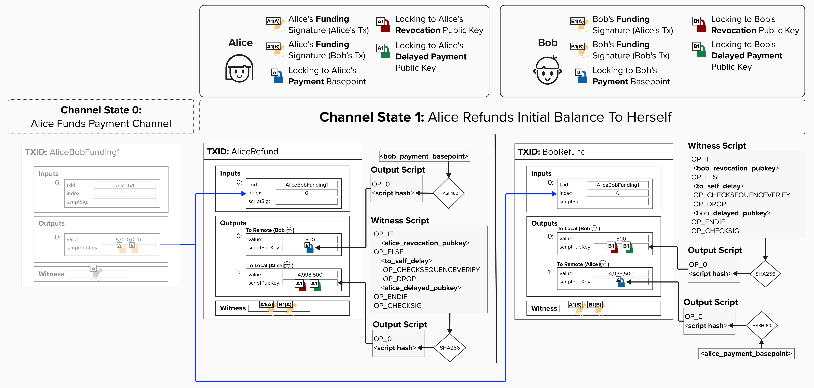
</p>

# Sending Payments Across The Lightning Network

Okay, by now you're probably itching to learn about **payments**. After all, Lightning is meant to help Bitcoin realize the dream outlined in the whitepaper: a Peer-to-Peer Electronic Cash System.

Below is a diagram that we saw earlier when discussing how we can create new public keys for each commitment state. Specifically, this diagram does a good job of showing *which keys* we'll use in each commitment state. For example, if you zoom in below, you'll see that, in **Commitment State 2**:

- The **Revocation Public Keys** and **Delayed Public Keys**, which are placed in the `to_local` output script, are different than the ones in **Commitment State 1**! The diagram attempts to visualize this by incrementing the index. For example, Alice's **Delayed Payment Public Key** for **Commitment State 2** is `A2`. Remember, this is accomplished by combining the **Delayed Payment Basepoint** with the **Per-Commitment Point** for the **Second Commitment State** using the equation we reviewed earlier.
- The `to_remote` output is simply the remote party's **Payment Basepoint**. It is *not* changed with each state, making it easier for the remote party to claim their funds if a commitment transaction is published, as they do not need to derive a private key that is unique to that state.

<p align="center" style="width: 50%; max-width: 300px;">
  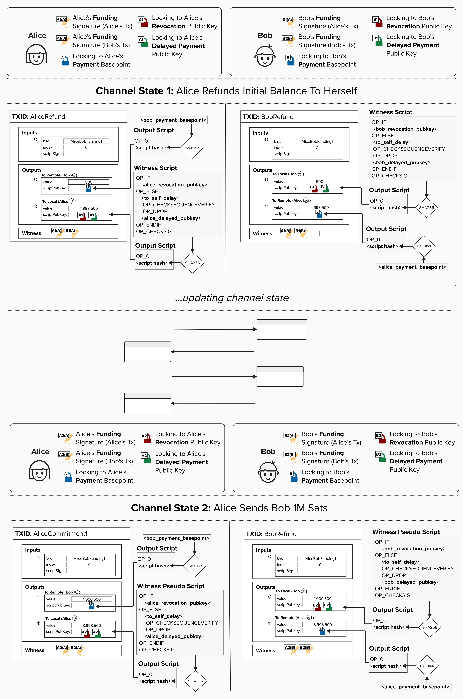
</p>

So, by now, you may have the following questions:

1. How do we get from **Commitment State 1** to **Commitment State 2**?
2. What are the protocol messages that the above diagram alludes to?
3. How does this allow us to route payments *across multiple channels*?
4. When will Bitcoin hit $1M US Dollars?!

Well, let's answer questions 1-3. If you know the answer to question 4, please let me know!

To answer questions 1-3, it's easiest if we jump straight into the deep end and start with how to route payments across **multiple parties** on the Lightning Network. While it may seem counterintuitive to start with the more complex example, it's actually easier. This is because the **protocol** that defines how payments are sent is the same *regardless of whether you're sending a payment to a direct peer or across multiple channels*. **In other words, the protocol (rules of the game) will be the same regardless of whether Alice is simply paying Bob (a direct peer) OR if Alice is paying Dianne, who is connected to Bob (Alice → Bob → Dianne).**

We'll learn about the exact protocol shortly, but for now, it's worth noting that the protocol is the same in both scenarios because it simplifies things and reduces the complexity of implementing Lightning, as developers do not need to write unique code for two different use cases (direct payments and routed payments).

## Routing Payments

Enough small talk, let's dive in!

At this point, we've only implemented the **Funding Transaction** and **First Commitment Transaction**, so almost the entire channel balance is on our (Alice's) side of the channel with Bob. Below is a wildly oversimplified visualization of our channel.

<p align="center" style="width: 50%; max-width: 300px;">
  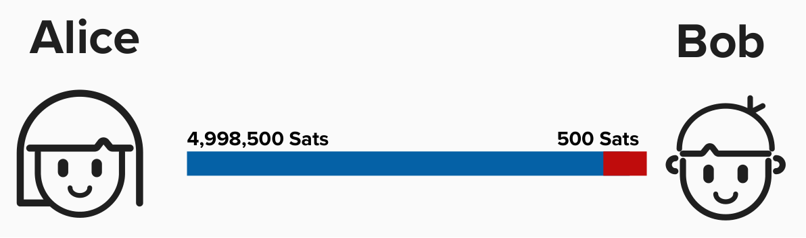
</p>

The magic of Lightning is that participants can have many channels open to many different counterparties, and you can route payments across these channels.

Below is another wildly oversimplified diagram. Note how the following two payment channels now exist:

1. Alice & Bob
2. Bob & Dianne
   - This means that Bob and Dianne have their own **Funding Transaction** and set of **Commitment Transactions**.

<p align="center" style="width: 50%; max-width: 300px;">
  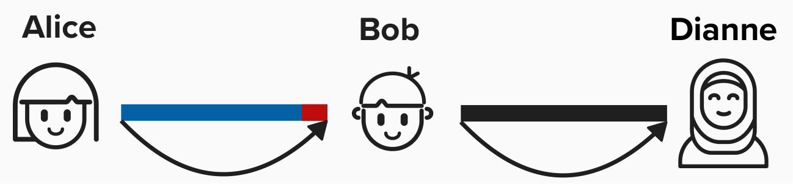
</p>

## Starting With The End In Mind

Let's begin our journey into Lightning payments by reviewing how things work at a high level, starting with the end result in mind. Routing a payment across the Lightning network just means that the **channel balance distributions** will change for each channel, such that, ***for every channel pair***, when the payment is complete:

- The sender will have less Bitcoin on their side of the channel
- The receiver will have more Bitcoin on their side of the channel

**For example, imagine we (Alice) want to pay Dianne 404,000 sats**. While we don't have a direct channel to Dianne, we have a channel with Bob, and Bob has a channel with Dianne. We can leverage this and pay Dianne by *routing the payment through Bob*. You can see the original channel balances and updated channel balances in the visual below.

#### Take a moment and verify the following:

- **Total Channel Balances Remain Constant**: The total amount of bitcoin in each channel has not changed. More specifically, Alice and Bob's channel has 5M sats (1,000 is set aside for fees) in both channel states, while Bob and Dianne have 4.5M in both channel states. This should also make sense intuitively, considering that each channel is anchored to an on-chain 2-of-2 multisig output, and this funding output does not change during normal Lightning operations.
- **Individual Channel Balances Are Updated**: Alice now has 405,000 less sats than she had prior to the payment, while Dianne has 400,000 more.
- **Bob Has More Bitcoin**: Before the payment, Bob had a claim to 2,500,500 sats **across both channels**. After the payment, Bob has a claim to 2,505,500 sats **across both channels**. He now has 5,000 more sats.

<p align="center" style="width: 50%; max-width: 300px;">
  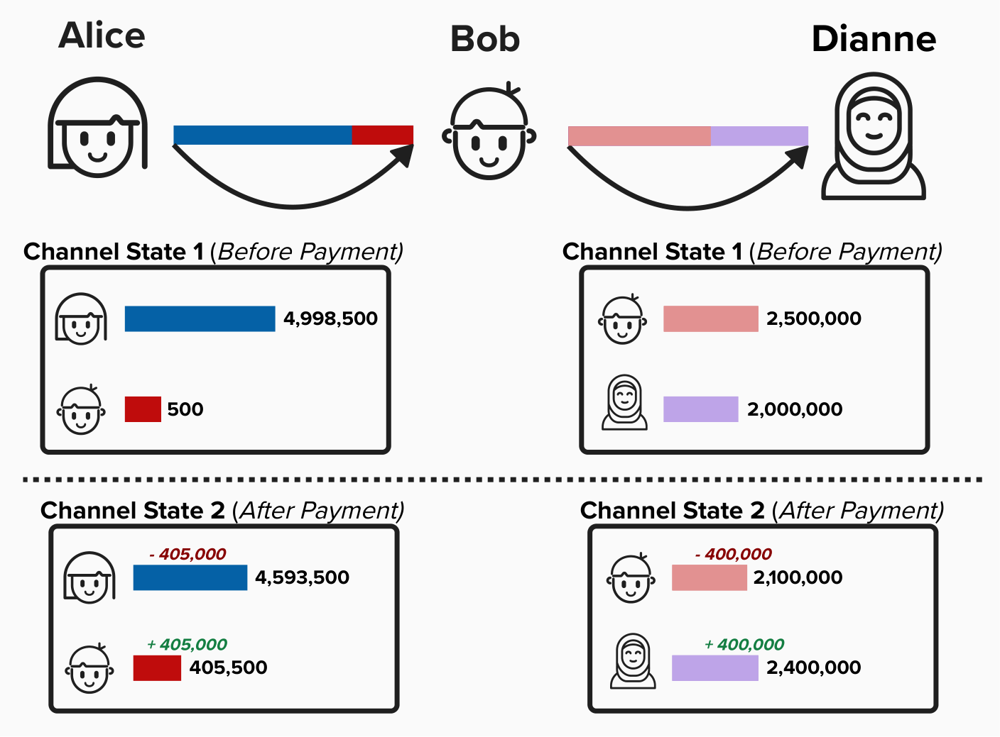
</p>

#### Question: Why did Bob's balance increase by 5,000 sats? Shouldn't Alice have only sent him 400,000 sats?

<details>
  <summary>Answer</summary>

The 5,000 sats are **fees** paid to Bob! Alice will have to pay fees to each hop along the payment route to incentivize them to forward the payment. Without this economic incentive, forwarding nodes (Bob, in this case) have little to gain (outside of altruism) when forwarding the payment.

</details>

# Introduction to Hash Time-Locked Contracts (HTLCs)

So, the big question is: how can Alice **trustlessly** and **atomically** route a payment to Dianne over an arbitrary number of hops? To answer this, let's start by reviewing each of these terms.

- **Trustlessly**: Alice does not need to trust Bob (or any intermediate hop). For example, it should not be possible for Bob to tell Alice that the payment has been forwarded when, in fact, it was not. Similarly, Bob should not need to trust Alice. For example, it should not be possible for Bob to forward a payment without a guarantee that Alice will pay Bob.
- **Atomically**: The payment should either fully succeed or fully fail. In other words, it should not partially complete, meaning that Alice pays Bob *but* Bob *does not* pay Dianne.

If the above two properties don't fully make sense just yet, don't worry! We'll inch our way towards a complete understanding of them now.

To achieve these two properties, Lightning uses **Hash Time-Locked Contracts**, also known as **HTLCs**. To help us understand HTLCs, we'll start by reviewing a few important primitives below.

## Invoice

To build our intuition of Lightning HTLCs, let's walk through an example. Imagine Alice goes to the local coffee shop, which Dianne owns. She is interested in buying a double espresso with raw milk, since that's what the influencers on Twitter are recommending.

She asks Dianne to generate an **invoice** for her. This invoice will provide basic payment information, such as the product that Alice is buying, the cost, and how long this offer is valid for.

<p align="center" style="width: 50%; max-width: 300px;">
  
</p>

## Contracts

When we think of payments, we may think of simply sending money and getting something in return, but there is more going on here. Each payment is actually a **contract**. For instance, when Alice buys a coffee, she sets up the following informal agreement with the coffee shop:
```
If Alice pays 400,000 sats
  Then the vendor will give her coffee

(This offer is valid for 8 hours, as the vendor may change their prices tomorrow)
```

<p align="center" style="width: 50%; max-width: 300px;">
  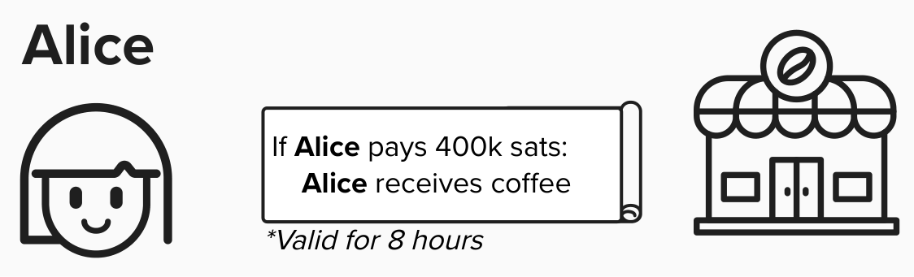
</p>

## Contracts on Lightning

Since Alice does not have a channel open with Dianne, the coffee shop owner, Alice will create a payment contract with Bob instead, since Bob has a channel open with Dianne. This contract will have the following condition: **If Bob pays Dianne 400,000 sats, Alice will send Bob 405,000 sats**, effectively refunding him ***and providing a fee for his service***.

Here is the same contract, but in an **If-Else** format.
```
If Bob pays Dianne 400,000 sats:
  Alice will send Bob 405,000 sats
Else If 8 hours elapses:
  Contract expires
```

<p align="center" style="width: 50%; max-width: 300px;">
  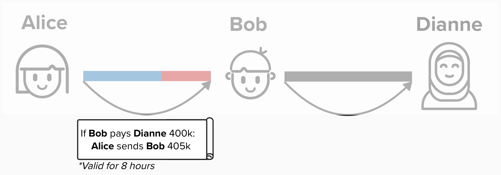
</p>

**One VERY important concept to understand is that, in Lightning, Bob will pay Dianne first. In other words, the payments will occur in reverse order! So Bob pays Dianne, and then Alice pays Bob. This is why Alice's contract with Bob starts with the following condition: `If Bob pays Dianne 400,000 sats:`**

## Proof of Payment

Let's improve the above contract by making it a little more precise. What we really need is a mechanism to **prove** that Bob paid Dianne. For example, if Bob is able to provide Alice with a *verifiable* **receipt** from Dianne, then Alice can be assured that Bob actually paid Dianne.

<p align="center" style="width: 50%; max-width: 300px;">
  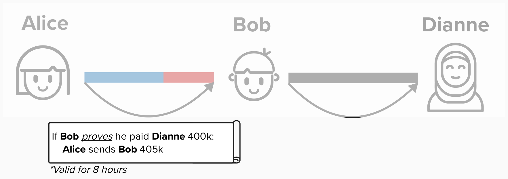
</p>

#### Question: How can we use cryptography to create a verifiable receipt?

<details>
  <summary>Answer</summary>

To create a **proof of payment** mechanism, Dianne can generate a large, 256-bit random number (called the **Preimage**) and then take the SHA256 hash of it (called the **Preimage Hash**). For example, Dianne could generate the following:

- Preimage (Secret): `8845245608872841509637822048114565670970616821530093488522820396031866013946`
- Preimage Hash: `566d49f57a1914e8c648d6bd169401b4f4e0fc9cf4ac2f4715ab01216b480c62`
    - This is the SHA256 hash of the Preimage Secret!

Dianne can then take the **Preimage Hash** and include it in the invoice that she gives Alice, but Dianne will keep the **Preimage** to herself for now!

<p align="center" style="width: 50%; max-width: 300px;">
  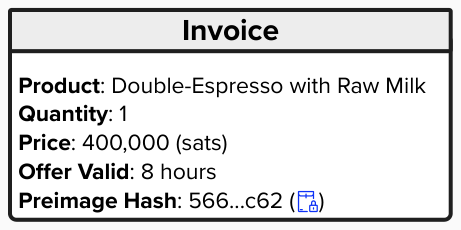
</p>

Alice can now update the contract with Bob, requiring that Bob provide the **Preimage** in order to claim the 405,000 sats from Alice. Since the **Preimage** is only known by Dianne, Bob will set up a contract with Dianne **with the same Preimage Hash that Alice gave him**.

Here is the crucial part: **This creates a chain of payments, where Bob only pays Dianne if she provides Bob with the Preimage**. Once Bob has the **Preimage**, he can turn around and claim the funds from Alice, since this is exactly the same **Preimage** that is locked in his contract with Alice.

Since these contracts don't last forever, we'll implement an expiry time, measured in **block height**. If the **Preimage** is not provided by a specific block height, then the contract expires and the funds are no longer claimable by Bob or Dianne.

<p align="center" style="width: 50%; max-width: 300px;">
  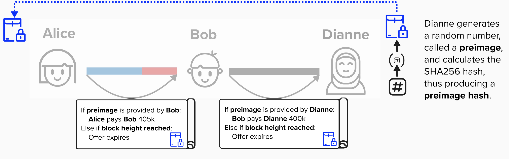
</p>

Together, the above components allow Alice to create a **Hash Time-Locked Contract** (**HTLC**), meaning that the contract is "locked" such that the receiver of the contract (Bob) must provide the **Preimage** within a specific number of blocks to be able to claim the locked funds.

**Take a minute to think through how we can set up these contracts in Bitcoin. How will we represent them? When you're ready, head over to the next section to learn how to implement a simple HTLC!**

</details>

<checkpoint id="offered-vs-received"></checkpoint>

# Simple HTLC Example

Now that we have a high-level understanding of how HTLCs enable payment routing across the Lightning network, let's see how they're implemented at the **transaction level**!

> ***NOTE***: We'll simplify things for the moment and just focus on how we'd implement a simple HTLC between Alice and Bob in Bitcoin Script. Once we have this down, we'll do what we always do - make things more complicated!

Let's begin our journey by zooming into Alice's contract with Bob. As you can see, it has the following spending conditions:

- If Bob provides a **preimage**, he can claim the funds.
- If a **block height** is reached, then the contract expires.

<p align="center" style="width: 50%; max-width: 300px;">
  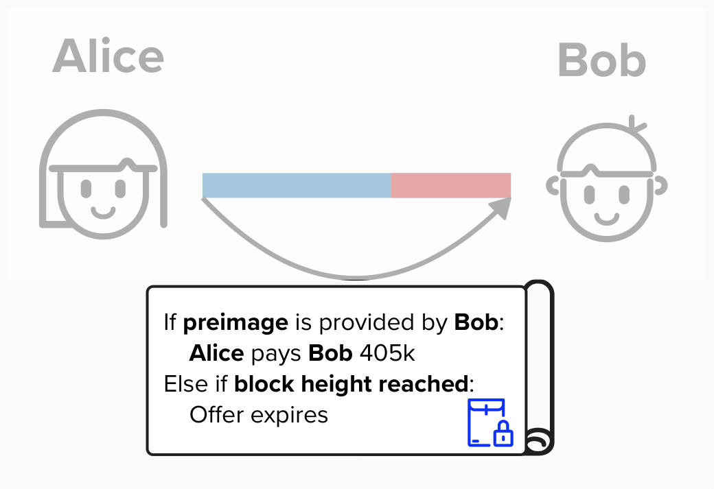
</p>

If we were to translate the above contract into a Bitcoin transaction, we would represent it as a **script**. To simplify things a little further for this example, let's forget about "Lightning" for a second. Instead, we'll simply imagine that Alice is creating an **on-chain** HTLC contract with Bob, and she initiates this contract by mining the below transaction.

**Take a moment to examine the HTLC witness script and confirm that you understand what is going on!** This is really where all the magic happens.

> ***NOTE***: The signatures and public keys that are visualized in this "Simple HTLC" exercise are **NOT** meant to map back to any of the public keys we've created during this course. They are simply meant to be representations for any signature or public keys belonging to Alice or Bob. In other words, the main focus of this exercise is the HTLC script itself - not how the public keys or signatures are created.

<p align="center" style="width: 50%; max-width: 300px;">
  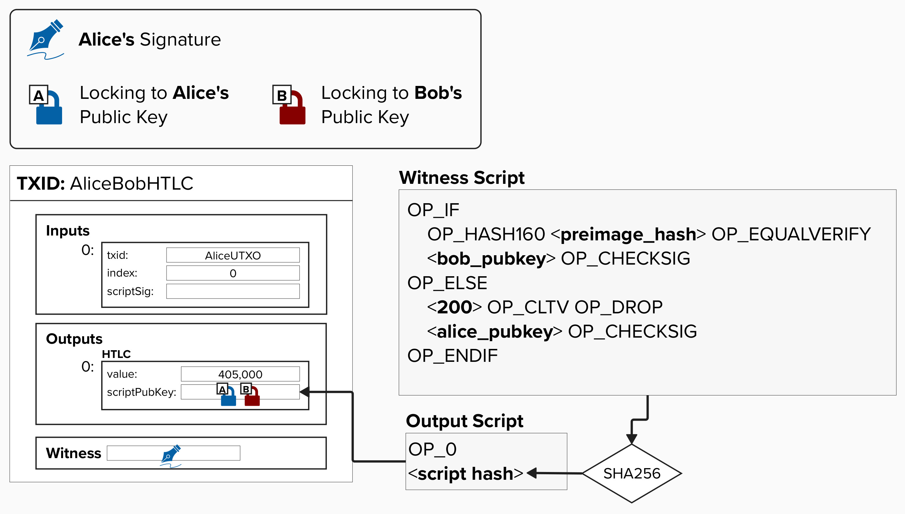
</p>

<details>
  <summary>Click to learn more about the Witness Script</summary>

This witness script has the following two spending paths:

1. If the **preimage** is provided, then Bob can spend from this path and claim any funds locked in this output. Additionally, this path ends with an `OP_CHECKSIG`, meaning that Bob will have to provide a valid signature.

<details>
  <summary>Why does Bob's path also require a signature? Is the preimage not enough?</summary>

If there was no `OP_CHECKSIG`, then *anyone* who knows the **preimage** would be able to spend from this path. For this Simple HTLC, that might be okay if Bob keeps the preimage private. However, as we saw earlier, Lightning involves *routing* payments across multiple participants, **and the preimage is the same for each channel contract**. Therefore, since multiple people may eventually learn the same preimage, we also lock the funds to the recipient's public key to ensure that they are the only ones who are able to claim the funds via the **preimage path**. If this doesn't make complete sense yet, don't worry - it will soon!

</details>

2. The second path is timelocked with an `OP_CHECKLOCKTIMEVERIFY` opcode, meaning that it is only valid once we've reached block height 200. This path also requires a signature from Alice. Together, these components allow Alice to reclaim this output once the timelock expires.

</details>

Since Bob knows the preimage, he has the ability to generate a new transaction which can spend from this output and move the funds to a new UTXO that Bob unilaterally controls. Below is an example of what it would look like if Bob created a new transaction to claim this HTLC. **Take a moment to examine the witness stack and confirm that you understand what is happening!**

<p align="center" style="width: 50%; max-width: 300px;">
  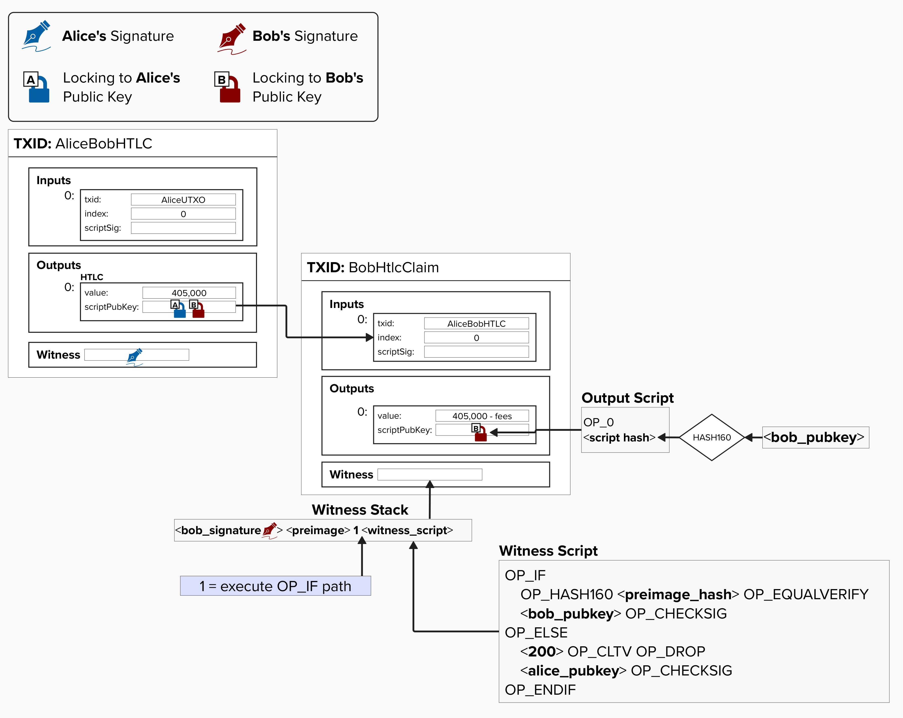
</p>

<details>
  <summary>Click to learn more about the Witness Stack</summary>

Pay-To-Witness-Script-Hash (P2WSH) evaluation involves the following steps. While the below diagram does not explicitly detail the entire script evaluation for this HTLC, it provides the majority of the information needed to understand how Bob would claim the funds.

<p align="center" style="width: 50%; max-width: 300px;">
  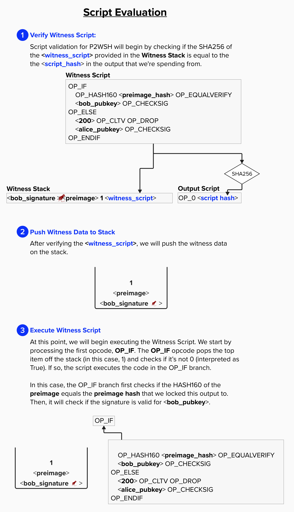
</p>

</details>

## Claim The HTLC!

For this exercise, we'll change things up and pretend to be Bob. The reasoning for doing this will soon become clear! In our role acting as Bob, our job is to claim the HTLC from the transaction above and rejoice with our newfound Bitcoin.

Most of the work is already done for us. In fact, we won't be doing any coding! The main purpose of this exercise is to dig into the details of the transaction and see ***how*** Bob claims the funds using a **preimage**.

### Step 1: Initiating The Contract

As we discussed earlier, to initiate this contract, imagine Alice and Bob created an HTLC output for 405,000 sats. Below is the raw transaction hex.
```
02000000000101a7a015aebdeba2205db63d17c7975ec0e7df930ca28e00fbfeadd1f0266bee080000000000ffffffff01082e0600000000002200208d3ae22e8fb32079a95497ee254f215500ecb1276ab3f46376b9fba4c4b788dd02473044022018f471487aa1fe83d1b9cc646c504de1a914480422c6dd0573684d9d6a2a0f1c0220757feb4134b18caf87fa8947f942a4a5cedffe86e3fa4679eaeedd63fa9dd3750121029141a3333093051ea2ea71445f651d413dd4a75369c887a46bf9f0f036e6ef5600000000
```

#### View the details of the transaction hex!

If we decode this transaction, we can see the outputs. There is a lot going on here, but the important piece to focus on is the **vout**. This part of the transaction lists all of the outputs, their amounts, their index, and their locking scripts. For this exercise, there is only one output, so it should be easy to find our HTLC! Once you see it, verify that it's the same as below. The HTLC output will be index 0 (`"n": 0`) and have a value of `0.00405000`.
```
"asm": "0 8d3ae22e8fb32079a95497ee254f215500ecb1276ab3f46376b9fba4c4b788dd"
```

If you forget what this is, look at the diagram above! You'll see that we put the hash of the witness script, preceded by OP_0, in the `scriptPubKey`. In other words, this is the SHA256 of the HTLC script!

### Step 2: Verify The Locking Script

Now, you may have read the above and thought, "How am I supposed to verify that locking script? I can't reverse a SHA256 hash function!". Well, I'm going to prove it to you below!

Let's go ahead and verify the locking script for the purposes of this exercise. Below, you'll see how the witness script is converted into hexadecimal. In Bitcoin, all opcodes have a hex representation so that they can be effectively communicated between computers. You can view a list of them [here](https://en.bitcoin.it/wiki/Script).

<p align="center" style="width: 50%; max-width: 300px;">
  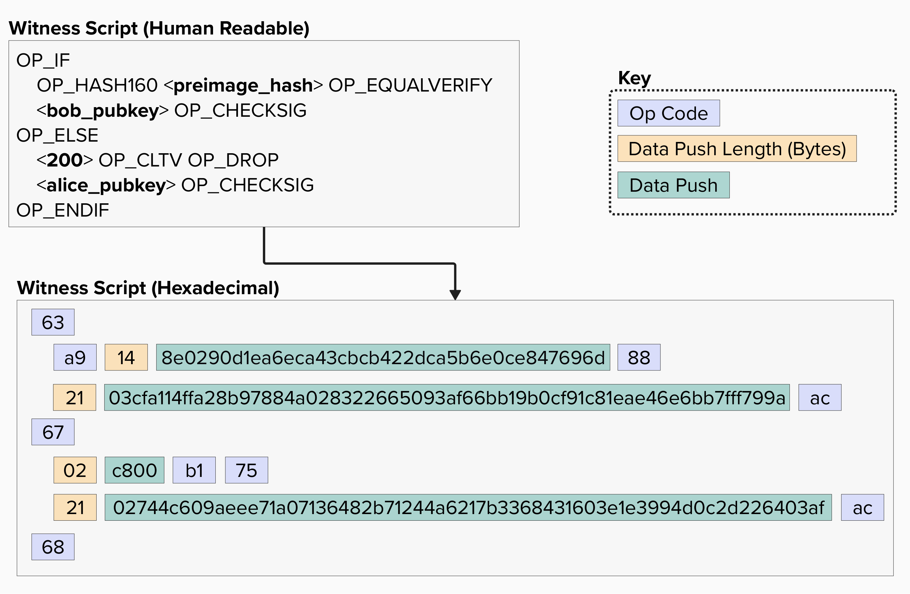
</p>

If we combine all of the above into a single hex representation, we get the below.
```
63a9148e0290d1ea6eca43cbcb422dca5b6e0ce847696d882103cfa114ffa28b97884a028322665093af66bb19b0cf91c81eae46e6bb7fff799aac6702c800b1752102744c609aeee71a07136482b71244a6217b3368431603e1e3994d0c2d226403afac68
```

#### Validate The Output Script

Okay, now that we've seen how to convert our witness script to hex, let's take the SHA256 of the witness script hex and verify that it's the same as the output script in Alice's transaction.

Is the SHA256 of the witness script hex the same as what we saw before?
```
"asm": "0 8d3ae22e8fb32079a95497ee254f215500ecb1276ab3f46376b9fba4c4b788dd"
```

**Yes!** At this point, we've now validated that the transaction has an HTLC output.

### Step 3: Retrieve Preimage

Great, so we've confirmed that we can claim this output if we have the preimage. We just need to find a secret that, when hashed, equals the **RIPEMD160( SHA256(`preimage`) )** - also known as [HASH160](https://learnmeabitcoin.com/technical/cryptography/hash-function/#hash160) in Bitcoin.

One key difference between HASH160 and *just* using SHA256 is that HASH160 returns a 20-byte result while SHA256 returns a 32-byte result. Therefore, by locking to the HASH160, we reduce the size of the data that eventually needs to be stored on-chain.

#### Find The Preimage

To make this exercise a little simpler, this HTLC output is locked to the hash of a string (converted to bytes) instead of a 256-bit number, which is standard for the Lightning protocol. In other words, if we take the **RIPEMD160( SHA256() )** of the correct string, it should equal the preimage hash embedded in the witness script.

Remember, the preimage hash is: `8e0290d1ea6eca43cbcb422dca5b6e0ce847696d`. You can verify that by looking at the witness script above!

**Can you guess what the preimage string might be?**

<details>
  <summary>Click here to see the preimage</summary>

Well, surprise surprise - the preimage is: `ProgrammingLightning`!

If we take the **RIPEMD160( SHA256() )** of **"ProgrammingLightning"** (converted to bytes), we get `8e0290d1ea6eca43cbcb422dca5b6e0ce847696d` - which matches the preimage hash in the contract.

</details>

### Step 4: Claim HTLC

Now that we have identified the preimage, let's claim the funds!

Building an entire transaction to spend from Alice's HTLC would take some time, so a transaction has already been created for you. You can find it below.
```
020000000001015a69f41bdf1ec310c6aef64902236a56f8810f0336fb5762a96df363eca664200000000000ffffffff01082e0600000000002200208d3ae22e8fb32079a95497ee254f215500ecb1276ab3f46376b9fba4c4b788dd0448304502210083759ddf9f02594cf191f052db565fe2e8fc141044ad9177b16a903c448ae98c022078266e29026228d01d0130a466014b91c5e058b75a4058b7f99cb533d2ab7935011450726f6772616d6d696e674c696768746e696e6701016563a9148e0290d1ea6eca43cbcb422dca5b6e0ce847696d882103cfa114ffa28b97884a028322665093af66bb19b0cf91c81eae46e6bb7fff799aac6702c800b1752102744c609aeee71a07136482b71244a6217b3368431603e1e3994d0c2d226403afac6800000000
```

#### Verify The Preimage

If we decode the above transaction, we can examine the hex representation of Bob's claim transaction (seen below).

<p align="center" style="width: 50%; max-width: 300px;">
  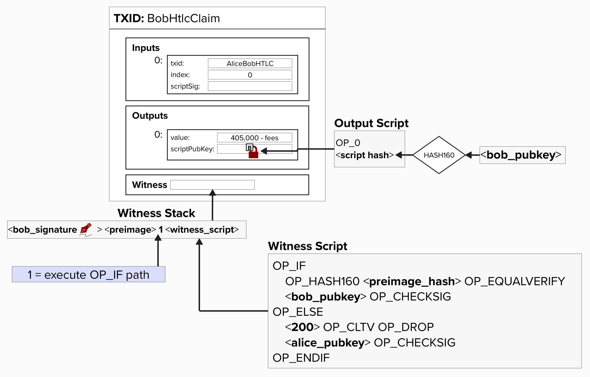
</p>

Check out the **txinwitness** field. You should see the following:
```
"txinwitness": [
  "304502210083759ddf9f02594cf191f052db565fe2e8fc141044ad9177b16a903c448ae98c022078266e29026228d01d0130a466014b91c5e058b75a4058b7f99cb533d2ab793501",
  "50726f6772616d6d696e674c696768746e696e67",
  "01",
  "63a9148e0290d1ea6eca43cbcb422dca5b6e0ce847696d882103cfa114ffa28b97884a028322665093af66bb19b0cf91c81eae46e6bb7fff799aac6702c800b1752102744c609aeee71a07136482b71244a6217b3368431603e1e3994d0c2d226403afac68"
]
```

#### Question: Do you know what each of the above elements are? Take a guess, and click below to see the answer.

<details>
  <summary>Answer</summary>

The witness will contain all of the information needed to claim the HTLC!

- Signature: `304502210083759ddf9f02594cf191f052db565fe2e8fc141044ad9177b16a903c448ae98c022078266e29026228d01d0130a466014b91c5e058b75a4058b7f99cb533d2ab793501`
- Preimage: `50726f6772616d6d696e674c696768746e696e67`
- Path Identifier (OP_IF): `01`
- Witness Script: `63a9145f8ad6404f3f5eebbfeffd1b01d37cfc648b7f7d876702c800b17521031b84c5567b126440995d3ed5aaba0565d71e1834604819ff9c17f5e9d5dd078fac68`

</details>

So, according to the above, `50726f6772616d6d696e674c696768746e696e67` is our preimage? Is that right? Well, since we have to represent all data in hex format, then we shouldn't expect to see "ProgrammingLightning" here. If we convert "ProgrammingLightning" to its hex representation, we get `50726f6772616d6d696e674c696768746e696e67` - confirming that the preimage in the witness is indeed the string "ProgrammingLightning"!

Great, nice job! You've successfully dug deeeeeeeep into Bitcoin Script and validated how an HTLC output works. If this transaction were published on-chain, Bob would successfully claim his HTLC funds. Now, let's get back to Lightning!

## Recap

So, let's do a quick recap of the above exercise. We started by examining an HTLC output, and we confirmed that the locking script had the following spending paths:

1. If Bob (and only Bob) knows the **preimage**, he can claim the funds by providing the preimage with his signature.
2. Otherwise, after **block height 200**, Alice can claim the funds by providing a signature.

### The Key Takeaway

While it was fun to dig into the weeds, there is one key takeaway from this exercise that will be **very important** for routing payments on Lightning! **The takeaway is that, to claim the HTLC on-chain, Bob will include the preimage within the witness**. Therefore, it will be visible **on-chain**! We'll circle back to this as we dive deeper into how HTLCs work in Lightning.

## Bonus (Submarine Swaps)

The above architecture is actually very close to how **Submarine Swaps** work on Lightning! This topic is a little more advanced and requires a basic understanding of how Lightning and HTLCs work. If you have that, feel free to click below and dig in. If not, make a note to come back after we finish reviewing HTLCs!

<details>
  <summary>Click to learn how Submarine Swaps work</summary>

Submarine Swaps are a way to atomically swap bitcoin between off-chain and on-chain without any counterparty risk.

For example, imagine Alice's channel balance is almost exhausted and she only has 20,000 sats on her side of the channel. However, Alice has plenty of Bitcoin **on-chain**, and she wants to use that to get **inbound liquidity** from Bob.

One option is that Alice can send Bob **on-chain** Bitcoin and ask him to refund her by sending her the same amount (or maybe slightly less, since Bob is providing her a service) over Lightning. If Alice and Bob trust each other, then they could do this, but we don't like trust!

Another option that is trustless is that Alice and Bob do the following:

1. Alice and Bob first agree to perform a Submarine Swap. In other words, Alice agrees to pay Bob 405,000 sats **on-chain** and, in exchange, Bob will send Alice 400,000 sats over Lightning. Bob sends Alice a public key that she can use in the **on-chain** HTLC. Alice then generates the **preimage** and **preimage hash**.
2. Alice creates an **on-chain** HTLC that locks 405,000 sats to the following spending paths:
   - If Bob provides the **preimage** to the **preimage hash** and a signature to his public key, then he can claim the bitcoin.
   - If block height **200** is reached, then Alice can claim her funds back by signing with her signature.
3. Alice will then create a **Lightning invoice** for 400,000 sats. Crucially, **she will use the same preimage** that she used in the on-chain HTLC. Therefore, if Bob pays the off-chain Lightning invoice, he is guaranteed to receive the **preimage**, which is the same preimage for the on-chain transaction.

As long as Bob has sufficient time to claim the on-chain transaction, then this operation allows Alice to trustlessly receive funds **off-chain** (in Lightning) in exchange for sending funds **on-chain**. This is a form of an **atomic swap**. It's called "atomic" because it will either fully succeed or fully fail. In other words, if Bob pays the off-chain Lightning invoice and obtains the preimage, then it's guaranteed that he will be able to claim the on-chain funds as well.

<p align="center" style="width: 50%; max-width: 300px;">
  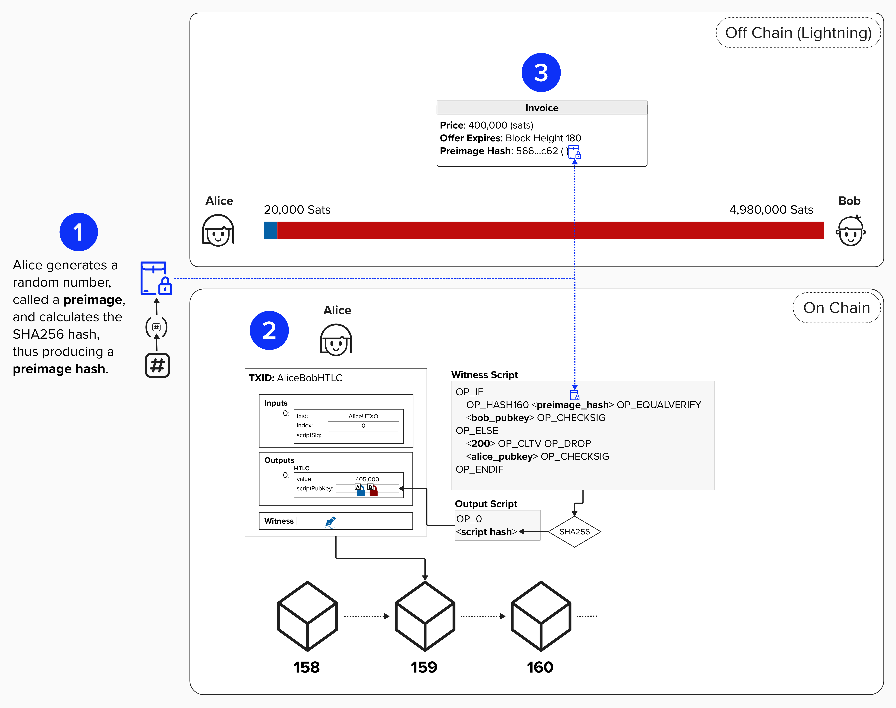
</p>

</details>

# HTLCs on Lightning

Okay, we should now be familiar with the mechanics of an HTLC! As a brief review, HTLCs are a specific type of locking condition whereby bitcoin can be claimed if:

1. You know the **preimage** that, when hashed, equals the **preimage hash** that is embedded in the locking script.
2. After a timeout, you can claim the funds by providing a valid signature.

Now that we've seen how a simple on-chain HTLC works between Alice and Bob, let's extend this concept to see how HTLCs work off-chain on Lightning to route payments from Alice to Dianne!

Recall from earlier that Dianne provided Alice with a **preimage hash**, which is the SHA256 hash of a randomly generated number that ***only Dianne knows***. This hash is currently included in the HTLC that Alice set up with Bob. Take a moment to re-read the last few sentences if you need to. This is very important!

<p align="center" style="width: 50%; max-width: 300px;">
  
</p>

## Linking Preimage Hashes on Lightning

To link all of the contracts (bitcoin scripts) along the payment path from Alice to Dianne, Alice can ***instruct*** Bob to create an HTLC with Dianne that uses **the same preimage hash**.

Take a moment to examine the below diagram. Note, the payment (HTLC) between Alice and Bob is for 405,000 sats, so it is ordered *above* Bob's output on the commitment transaction. For the purposes of this example, it doesn't really matter what the channel balance is between Bob and Dianne, so we'll just order the HTLC at index 0. Remember, you can zoom in!

<p align="center" style="width: 50%; max-width: 300px;">
  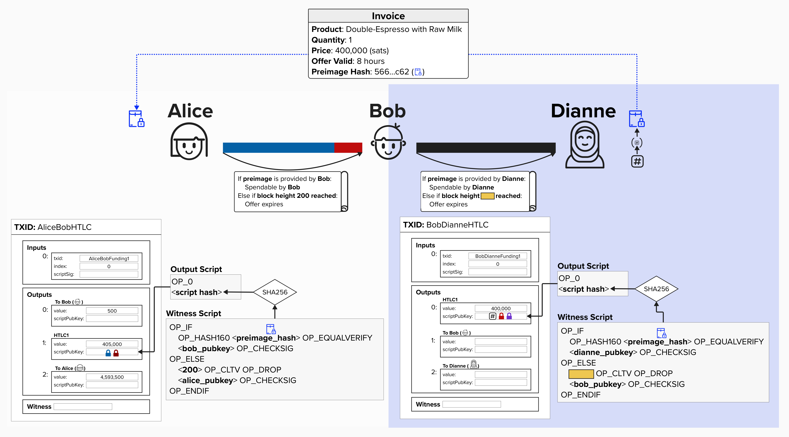
</p>

#### Question: You probably noticed that the block height expiry is not visible for Bob and Dianne's HTLC output. This is on purpose! What do you think it should be? Should it be before (<200), equal to (200), or after (>200) Alice and Bob's expiry?

<details>
  <summary>Answer</summary>

This is actually a ***very*** important part of what makes Lightning payments **secure** and **atomic**, so let's take a moment to stress this point.

Imagine that Bob and Dianne's HTLC output expired at block height 200 - **the same as Alice and Bob's**. If this were the case, it would be possible for Dianne to claim the HTLC from Bob at block height 200. Remember, Dianne knows the secret, because she generated it!

Simultaneously, when block height 200 comes around, Alice will assume the payment is going to expire, so she can reclaim her HTLC output by spending from the expiry path. If this were to happen, Dianne would have claimed the 400,000 sats from Bob, but he would **NOT** be able to claim his 405,000 sats from Alice via the preimage path, because she would have already claimed them via the expiry path. Ouch!

To protect Bob against this sort of attack, Bob may decide that he requires, at least, a **20 block delay** to claim the HTLC from Alice. Therefore, he will create an HTLC that times out at **block height 180**. This ensures that, if Dianne provides the preimage right before the HTLC expires, Bob still has **20 blocks** before his HTLC with Alice expires, giving him sufficient time to claim his HTLC.

**FUN FACT**: This **delay** is actually called `cltv_expiry_delta`, and it's something that Lightning nodes announce to the network via the `channel_update` [message](https://github.com/lightning/bolts/blob/master/07-routing-gossip.md#the-channel_update-message).

</details>

## Atomic Payments

Okay, great - we've fixed the expiry issue! Our payment is now **atomic**. In other words, it will either entirely succeed - meaning Dianne will be paid from Bob, and Bob will be paid from Alice - or it will entirely fail.

<p align="center" style="width: 50%; max-width: 300px;">
  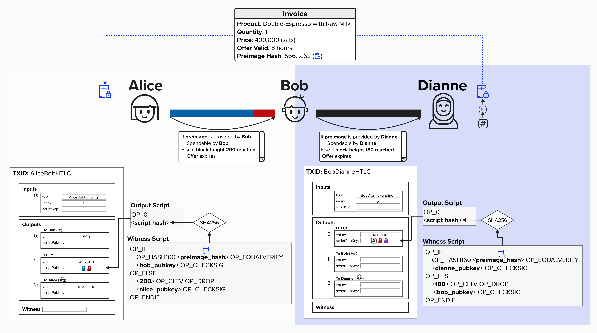
</p>

# Protocol Messages

Now that we've built our intuition for how HTLCs can be routed along the Lightning Network and the importance that timelocks play, let's see how HTLCs are communicated at the protocol level.

**WARNING: While the below protocol messages are real, the HTLCs that we're visualizing are a simplified version. In other words, we're abstracting away asymmetric commitment transactions and revocation paths for now. We'll add those back in once we build a strong foundation!**

### Channel Update

The first protocol message we'll review is the `channel_update` message. We won't discuss every field in the `channel_update` message just yet (this will come in a later course that focuses on routing payments and the gossip network), but if you'd like to learn more, you can read [BOLT 7: Routing Gossip](https://github.com/lightning/bolts/blob/master/07-routing-gossip.md#the-channel_update-message).

Each node in the Lightning Network that announces its willingness to forward payments will broadcast a `channel_update` message, indicating the **fees** it charges and its **timelock** requirements, known as `cltv_expiry_delta`. For example, in the image below, Bob broadcasts a `channel_update` message that informs Alice (and anyone else who wants to send a payment through Bob) the fee and timelock requirements to route payments **across his channel with Dianne**. This is a crucial detail; `channel_update` messages are specific to a channel **and** a channel direction.

In the channel below, Bob's `channel_update` message signals the following requirements to Alice:

#### Fees

- **Base Fee**: This is the fee that Bob will charge to route any payment across his channel with Dianne, regardless of the amount. In this case, it's 1,000 sats.
- **Fee Per Millionth**: This is the proportional feerate that Bob will charge *per satoshi* that is sent over this channel. It's measured in millionths of a satoshi. In this case, Bob will effectively charge 0.01 satoshis per satoshi that is routed over his channel.

#### Timelock Requirements

- **CLTV Delta**: This is the minimum delay (or difference) that Bob requires between the following two HTLCs:
  - Bob's HTLC with Dianne
  - Bob's HTLC with Alice

Remember, the delay protects Bob by giving him sufficient time to claim his funds from his HTLC with Alice!

<p align="center" style="width: 50%; max-width: 300px;">
  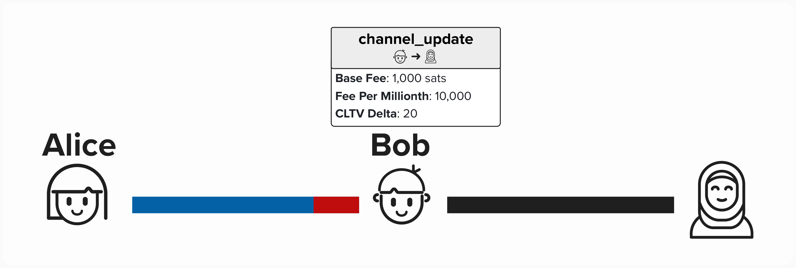
</p>

### Calculating Fees and Timelocks

Let's bring this example full circle by showing how Alice would go about calculating the total fees and timelocks for this payment. To do this, we'll need to introduce one more field; this time, in the invoice that Dianne provided to Alice.

If you look in the image below, you'll see that Dianne now specifies a **Min Final CLTV Expiry Delta** of **20 blocks** in her invoice. This is how Dianne can specify the minimum expiry that she will accept for any incoming HTLCs.

Alice can use this information, along with Bob's fees and timelock requirements, to create the HTLCs we reviewed earlier!

Since Alice wishes to send 400,000 sats to Dianne, routed through Bob, this means that she will have to pay 5,000 sats in fees to Bob. Assuming the current block height is **160**, you can see how Alice calculates the expiry timelocks below. First, Alice will take Dianne's **Min Final CLTV Expiry Delta** of **20 blocks** and adds it to the current block height, so the HTLC between Bob and Dianne cannot expire earlier than block height **180**. Next, since Bob also requests a **CLTV Delta** of **20 blocks** - meaning he wants 20 blocks between when his HTLC with Dianne expires and his HTLC with Alice expires - Alice will set her HTLC with Bob to expire at block height **200**.

<p align="center" style="width: 50%; max-width: 300px;">
  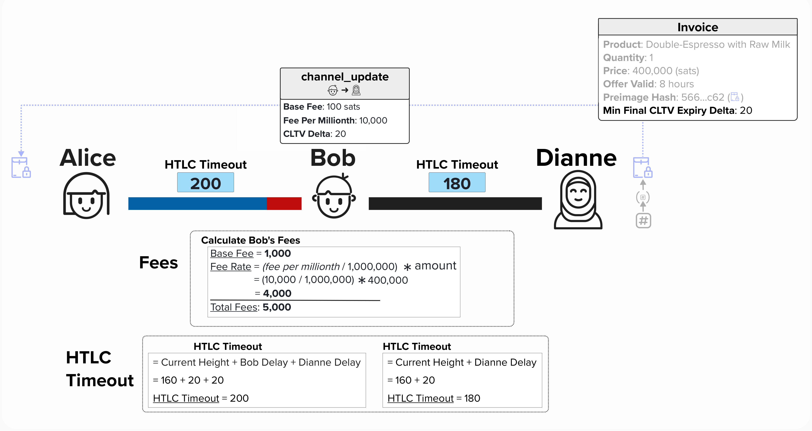
</p>

### Adding HTLCs

A natural question that may have arisen by now is... "How do we add HTLCs"?

Well, all forms of communication in the Lightning Network have standardized message formats, and HTLCs are no different! To add an HTLC, Alice will send an [`update_add_htlc` message](https://github.com/lightning/bolts/blob/master/02-peer-protocol.md#adding-an-htlc-update_add_htlc) to Bob with the following information:

- `channel_id`: This is derived from the Funding Transaction ID and the Funding Output Index, serving as a unique identifier for the channel.
- `id`: This is an always-incrementing identifier for HTLCs that are sent over this channel. It must start at 0.
- `amount_msat`: This is the amount we wish to add an HTLC for.
- `payment_hash`: This is the **preimage hash** that will be included in the HTLC script.
- `cltv_expiry`: This is the block height for which the HTLC expires.
- `onion_routing_packet`: The onion routing packet contains specific directions that must be passed along to each node in the payment path. Since it's encrypted, **only the recipient will be able to read the onion packet intended for them**.
  - When Bob receives the onion packet from Alice in the `update_add_htlc` message, he will decrypt the portion intended for him, which informs him *where* to forward the payment to, how much to send, and what the expiry should be.
  - By the time Dianne receives the `update_add_htlc` message from Bob, it will have a final onion that is intended for her. Note that, even though Bob sends the message, Alice created the onion. To prove this onion was created by Alice and mitigate "probing attacks", Alice will embed a **Payment Secret** in the final onion (see diagram below). This secret is a random 256-bit value that is provided by Dianne, and it's included in the invoice that Alice receives. Since Alice is the only one who sees the invoice (none of the hops in the payment path do), then the only way the **Payment Secret** can be embedded in the onion is if Alice put it there. Since the onion will also include the payment amount and expiry, this allows Dianne to verify that the HTLC that Bob is sending is indeed what Alice asked him to send!
    - By embedding the **Payment Secret** in the onion, Alice prevents Bob from performing a form of a probing attack whereby he attempts to send a smaller payment to see if Dianne will accept it. The reason this *may* work (if there was no such thing as a **Payment Secret**) is that it's possible for Dianne to create an invoice that does not include an amount. For example, Alice could ask Dianne for an invoice without an amount if Alice wants to tip Dianne and determine the amount herself. If this happened, then Dianne wouldn't know how much the tip was for *until she received the HTLC from Bob*, so she would have no way of knowing that Bob altered the amount. Therefore, Bob would be able to sneak extra fees without Alice or Dianne knowing.

<p align="center" style="width: 50%; max-width: 300px;">
  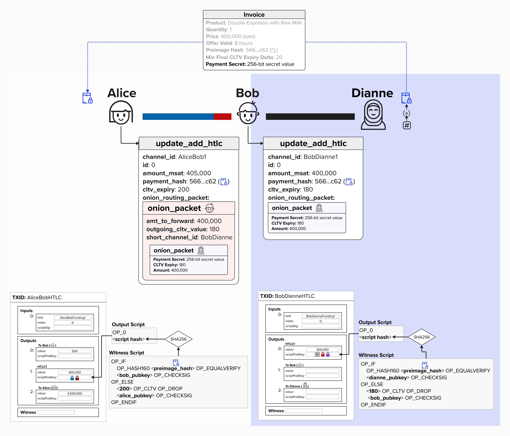
</p>

Remember, the above diagram is a simplified visual of adding HTLCs. What is accurate is that we will add a new output for each HTLC (assuming it's large enough - more on that later). However, in reality, there will be an HTLC output with a more complicated spending script on both Alice and Bob's version of the commitment transaction.

Another caveat: there are actually a few more protocol messages that are involved with making payments! We'll review them shortly. As a brief teaser, if you recall, we'll have to provide the **Per-Commitment Secret** each time we update our channel so that our counterparty can punish us if we attempt to cheat in the future.

### Fulfilling HTLCs

Okay, let's bring the HTLCs full circle by reviewing how they are fulfilled. Of course, one option is for the recipient, who knows the preimage, to simply claim the payment on-chain by publishing their commitment transaction along with a new transaction that sweeps the funds from the preimage hash path. That would be very similar to the exercise we did in the previous section. However, that would also close our payment channel, as now the 2-of-2 funding output would be spent!

Therefore, instead of claiming the payment on-chain, the recipient of the HTLC will send an `update_fulfill_htlc` message to their counterparty, which specifies the **channel** and HTLC **id** for which they have the preimage. This *proves* to their counterparty that they *could* claim the payment on-chain, but they want to keep operating the payment channel. Therefore, both parties will work together to remove the funds from the HTLC output and add them to their new respective outputs.

For example, in the below diagram, you can see that the 405,000 sats have been removed from the HTLC output, which is now gone, and added to Bob's side of the channel. This is now the next commitment state - Commitment State 1 (the one after the refund)!

<p align="center" style="width: 50%; max-width: 300px;">
  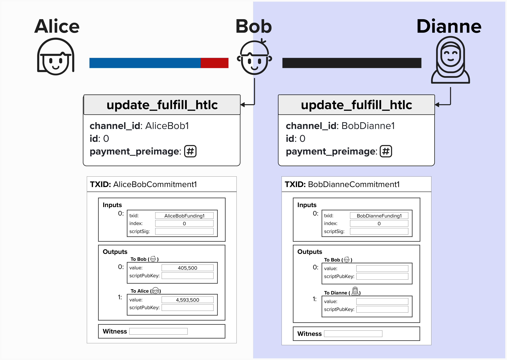
</p>

#### Question: If Dianne decides to NOT give Bob the preimage and, instead, claim the HTLC output on-chain, why is the payment still atomic? In other words, why can Bob still claim the HTLC from Alice?

<details>
  <summary>Answer</summary>

As we saw earlier, to claim the HTLC on-chain, Dianne will have to reveal the preimage **in the witness**! Since Bob's HTLC with Dianne expires at **block height 180**, Dianne would need to publish the transaction on-chain before **block height 180**. Otherwise, Bob will reclaim these funds once the HTLC expires by publishing his own on-chain transaction to sweep the funds.

If Dianne does close the channel and claim the funds on-chain at **block height 180**, Bob still has until **block height 200** before Alice times out her HTLC with Bob. Therefore, Bob can simply find the preimage on-chain and send it to Alice via an `update_fulfill_htlc` message, allowing him to unwind his HTLC with Alice and keep their payment channel operating smoothly.

</details>

### Failing HTLCs

Sometimes things don't work out, and we need to fail an HTLC. For example, imagine Dianne's node goes offline and is unable to provide the preimage. In this case, Bob will want to fail his HTLC with Alice, since he has no idea when Dianne will come back online.

To fail an HTLC, a peer will send either an `update_fail_htlc` or `update_fail_malformed_htlc` message to the counterparty that **sent** them the HTLC. These messages serve similar purposes - to inform the sender why the HTLC failed.

#### Update Fail HTLC

`update_fail_htlc` messages will contain an encrypted `reason`, which only the original **sender** can read. In the diagram below, you can see a variety of reasons that one might use to signal why an HTLC has failed. They are categorized into the following four buckets:

- **BAD ONION**: Something about the onion was invalid. For instance, it had the wrong version number or the HMAC did not verify.
- **PERM**: There was a permanent failure. For instance, the node does not support a required feature for this payment. If the sender receives a permanent error, they will remove the failing node from future payment attempts along that route. Note that some failure reasons fall within multiple categories. For example, an invalid onion version is both **BAD ONION** and **PERM**.
- **NODE**: There was a node-level failure. For instance, the node is temporarily unavailable or has disabled the channel.
- **UPDATE**: There was an error with the payment parameters, such as an insufficient fee, an HTLC amount below the node's minimum threshold, or an incorrect CLTV expiry.

When reading the above, you may have been wondering how the sender knows where the error originated. That would be a great question, and we'll dig into it in great detail later in the next Programming Lightning course. In the meantime, the brief answer is that, in Lightning, the sender will create a **shared secret** with each hop in the payment route. This secret is used to encrypt the onion at each step **such that only the intended recipient can decrypt it using their shared secret**.

When the sender receives an error message, they can try to decrypt it using the shared secrets for each hop in the route. When one of the shared secrets works (and verifies the HMAC), then the sender will know who sent the error and be able to read it.

#### Update Fail Malformed HTLC

The `update_fail_malformed_htlc` message is similar to the `update_fail_htlc` message in that it is meant to signal an error in the payment route. However, this error message is restricted to failure reasons that fall within the **BAD ONION** category, meaning that the onion was corrupted along the path and is not readable.

<p align="center" style="width: 50%; max-width: 300px;">
  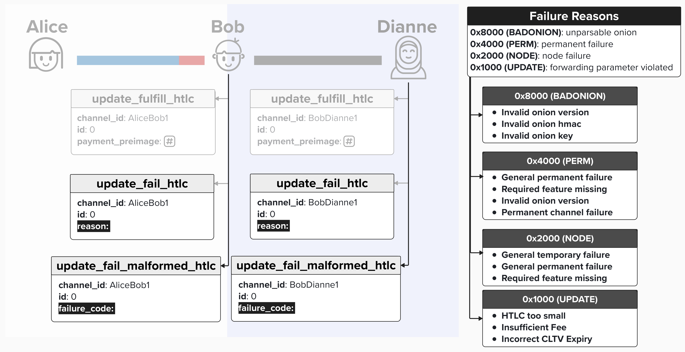
</p>

# HTLCs & Updating Channel State

Thus far, we've done a deep dive into the process of **adding** and **removing** HTLCs from commitment transactions. Now, let's reintroduce **asymmetric commitment transactions** and review how Alice and Bob's channel states progress as HTLCs are added and fulfilled.

Alice and Bob start their payment channel in **Channel State 1**. Previously, we called each of these transactions "Refund" transactions, as they allow Alice or Bob to claim their original channel funds if either party goes offline. That said, if Alice and Bob are playing "nice", these would only be broadcasted to the bitcoin network if Alice and Bob *never* move to a new channel state. To ensure you're following along, make sure to verify the following in the diagram below. Remember to zoom in if you need to!

1. In the `to_local` script, Alice uses a **Revocation Public Key** and **Delayed Payment Public Key** that are unique to Channel State 1. This is visualized with the `A1` notation on each public key icon. On the other hand, Bob also uses a unique **Revocation Public Key** and **Delayed Payment Public Key** for his `to_local` script. We learned how to create these keys earlier in the course!
2. In the `to_remote` script, Alice simply puts Bob's **Payment Basepoint**. Similarly, Bob puts Alice's **Payment Basepoint**. As we'll see, these keys are *not* changed for each new channel state. This provides an extra layer of protection for our counterparty, as they will always be able to claim their output on the remote party's commitment - even if they lose channel data and cannot obtain the **Per-Commitment Point** for the given channel state.
3. Alice will send Bob her signature for *his* commitment transaction, which is different than the signature she uses for *her* version of the commitment transaction. This should make intuitive sense, as both transactions are different at the byte level, so their signatures will not be the same.

<p align="center" style="width: 50%; max-width: 300px;">
  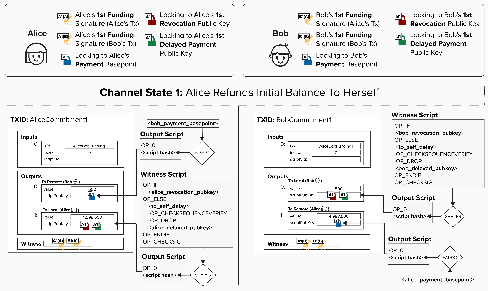
</p>

Now, as we saw earlier, Alice is in a predicament... She wants to buy a double espresso with raw milk from Dianne, but she doesn't have a direct channel with Dianne. Luckily, Alice doesn't need one! Instead, she can route a payment through Bob and pay him for his service.

To start this process, she will send an `update_add_htlc` message to Bob with the necessary information that Bob needs to set up **both** his new commitment transaction with Alice **and** his new commitment transaction with Dianne. Specifically, this includes the channel ID, HTLC ID, amount, payment hash, CLTV expiry, and the encrypted onion packets. If you're wondering why Alice specifies the channel ID (isn't it obvious?), it's because Alice and Bob could have multiple channels open with each other, so Alice will want to specify *which* channel she is routing the payment over.

The below diagram represents **Channel State 2**, where there is now 405,000 sats in a new HTLC output. HTLC outputs require their own channel state because the HTLC payment contract needs to be enforceable if one party goes offline or stops cooperating.

In the below diagram, you'll notice that we use a new **Revocation Public Key** and **Delayed Payment Public Key** for both Alice and Bob's commitment transactions, which is signaled using the `A2` and `B2` notation on the public keys. Similarly, we have new signatures from both Alice and Bob.

<p align="center" style="width: 50%; max-width: 300px;">
  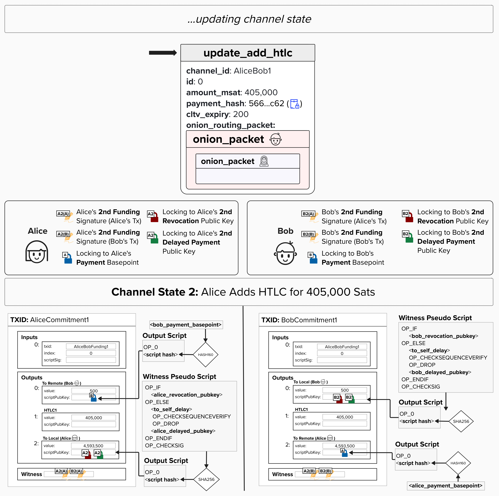
</p>

Assuming Dianne provides the preimage to Bob, Bob will then turn around and provide the preimage to Alice via the `update_fulfill_htlc` protocol message. Since Alice now knows that Bob *could* claim the HTLC on-chain **and** Dianne must have provided the preimage (meaning she received the payment), Alice will work with Bob to create a new commitment transaction - **Channel State 3** - which removes the HTLC output and puts the HTLC funds on Bob's side of the channel.

<p align="center" style="width: 50%; max-width: 300px;">
  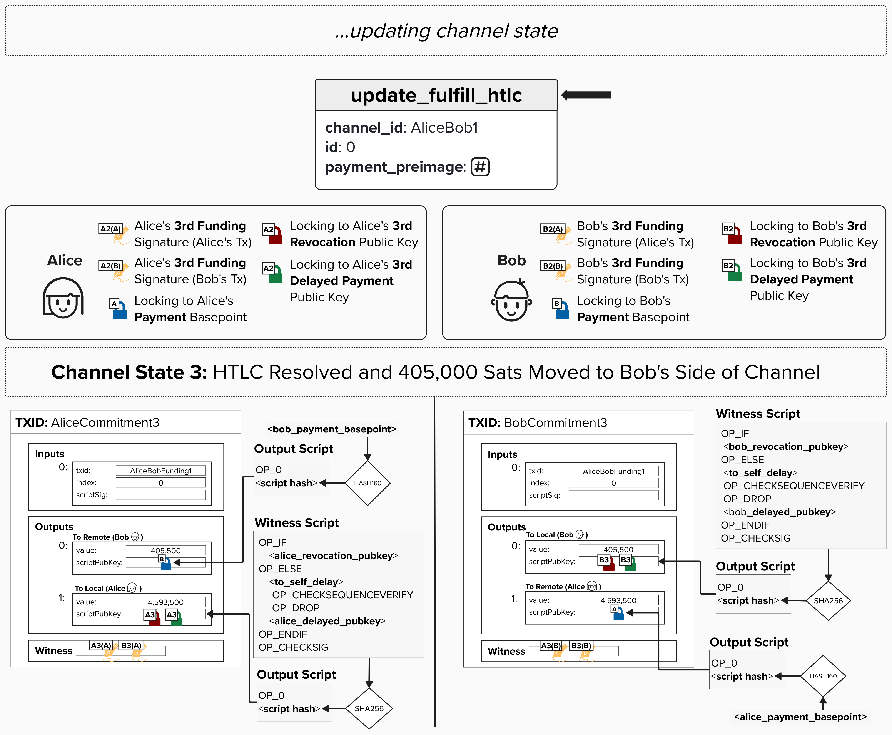
</p>

# Revoking Old Channel States

If you've made it this far, the following question may be burning a hole in your mind... **"What about revoking old transaction states!?"**

So far, we've reviewed how revoking old transactions works, but we haven't seen it in action yet! Now that we've seen how to **add** and **remove** HTLCs, we're in a perfect position to bring everything full circle and discuss how Alice and Bob revoke old states!

To do this, we'll return to the process of adding and removing HTLCs, but we'll throw in a few new protocol messages as well.

### Update Add HTLC (Alice -> Bob)

As we saw earlier, Alice will begin the payment process by sending Bob an `update_add_htlc` message. At this point in the process, Bob will put the HTLC in a **staging area**. This represents a future *possible* commitment state, but Alice has **not** yet **irrevocably committed** to this commitment state.

In Lightning, a ***new*** channel state is only considered **irrevocably committed** once both nodes revoke their old channel states. Since, at this point, Alice has *just* proposed a new HTLC, but her old commitment state without the HTLC is still valid, this HTLC is not yet considered **irrevocably committed**. If this concept doesn't make sense yet, don't worry - it should become much clearer shortly.

It's also worth noting that Bob **should not** forward the HTLC to Dianne until it's irrevocably committed. Remember, "forwarding" the HTLC means setting up a new HTLC output on Bob's commitment transaction with Dianne.

If Bob were to forward prematurely, Alice could still publish her soon-to-be-old commitment transaction - the one without the HTLC output that still shows 405,000 sats on Alice's side. Since Bob doesn't yet know the **Per-Commitment Secret** needed to calculate the **Revocation Private Key** for Alice's output, he would be unable to punish Alice for broadcasting this old state.

This creates a dangerous situation: Dianne could claim the 405,000 sats from Bob's commitment transaction with her (because Bob already forwarded the HTLC), but Bob would be unable to refund those sats back from Alice (because Alice's old state doesn't have the HTLC, and Bob can't punish her for using it).

<p align="center" style="width: 50%; max-width: 300px;">
  
</p>

### Commitment Signed (Alice -> Bob)

Once Alice wants to commit to a new channel state, she will send a `commitment_signed` message to Bob. This message will include Alice's **Funding Signature** for Bob's new commitment transaction. Since Alice has all the cryptographic material she needs to construct Bob's version of the commitment transaction herself, she is able to generate her signature to send to Bob.

It's worth emphasizing the following two points:

1. Alice *could* have sent multiple payments to Bob by sending multiple `update_add_htlc` messages. She could then commit to multiple HTLCs at once via one `commitment_signed` message.
2. At this stage in the payment process, Bob technically has two valid transactions that Alice **cannot** derive the revocation secret key for!

#### Question: Why are the incentives aligned such that it's safe for Alice to send her signature to Bob for the new commitment state before Bob sends Alice his signature?

<details>
  <summary>Answer</summary>

Remember how, earlier, we said that both direct payments and routed payments follow the same protocol? In other words, regardless of whether Alice is paying Bob directly or Alice is paying Dianne (routed through Bob), it will follow the same exact protocol messages.

Therefore, the new HTLC that Alice is adding to both her and Bob's commitment transaction is either a direct payment to Bob *or* an HTLC that Bob will earn routing fees for forwarding. In both cases, Bob stands to gain by cooperating because he is either receiving a payment directly *or* earning fees. It does not make sense for him to publish the old state, which has not been revoked, as he will have less money in the old state compared to the new state.

</details>

You'll probably notice that there is a field in the `commitment_signed` that we're not discussing yet - `htlc_signatures`. We haven't yet reviewed what these are, but we'll return to this shortly. If you're familiar with Lightning already, then these are Alice's signatures for Bob's HTLC success transaction.

<p align="center" style="width: 50%; max-width: 300px;">
  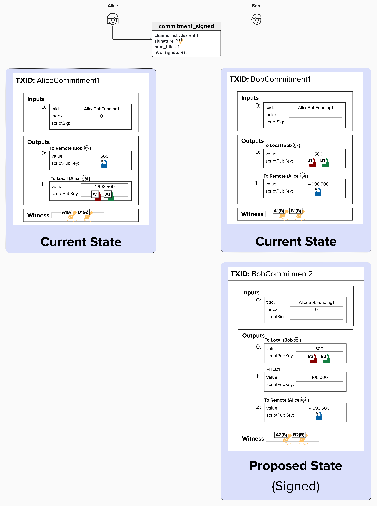
</p>

### Revoke And Ack (Bob -> Alice)

Okay, here is where the magic happens! Much of what we've been reviewing in this course leads up to this exact moment.

Now that Alice has committed to a new channel state, Bob is incentivized to revoke his transaction from the current channel state. Why? Because it's not safe for him to forward the payment or reveal the preimage (if he is the recipient of the payment) until Alice revokes her version of the current state's commitment transaction. However, she won't do that until Bob revokes his state.

Therefore, Bob will send a `revoke_and_ack` message to Alice, providing Alice with the **Per-Commitment Secret** *for the current channel state* and the **Per-Commitment Point** for the *next channel state*. With this information, Alice can now calculate the **Revocation Secret** for the **Revocation Public Key** used in **Commitment State 1**. At this point, Bob is now disincentivized from publishing that transaction, as Alice would be able to spend all of the funds from Bob's `to_local` output.

Also, note that Alice does not yet have Bob's **Funding Signature** for Alice's newest commitment version. This is another reason why Alice cannot revoke her old state yet! If she did, she would not have a *broadcastable* commitment transaction for the new state!

<p align="center" style="width: 50%; max-width: 300px;">
  
</p>

In the diagram above, there is a brief reminder of how the **Per-Commitment Secret** and **Per-Commitment Point** are generated. In short, Alice and Bob both start the payment channel with a **Commitment Seed**, which is a 256-bit seed. For each channel state, they calculate a unique **Per-Commitment Secret** and **Per-Commitment Point**, which are generated using the **Commitment Seed** and an always-decrementing index, which starts at `281474976710655`.

### Commitment Signed (Bob -> Alice)

Once Bob revokes his old channel state, he will send Alice a `commitment_signed` message. This is the same protocol message that Alice sent Bob earlier, but this time it's coming from Bob and contains Bob's **Funding Signature** for Alice's version of the new commitment transaction.

Alice now has two valid commitment transactions that she could publish, and Bob does not know the **Revocation Secret** for either. However, since Bob won't release the preimage or forward the payment until the new state is **irrevocably committed**, Alice is incentivized to revoke her old state. Otherwise, her payment will never complete.

<p align="center" style="width: 50%; max-width: 300px;">
  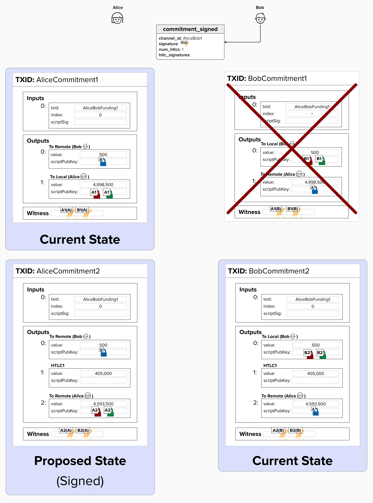
</p>

### Revoke And Ack (Alice -> Bob)

Since Alice wants her payment to complete (she's been waiting on her double espresso!), she will now send Bob a `revoke_and_ack` message with the **Per-Commitment Secret** from Channel State 1, enabling Bob to calculate the **Revocation Private Key** for Channel State 1. She will also send Bob the **Per-Commitment Point** for the next channel state.

<p align="center" style="width: 50%; max-width: 300px;">
  
</p>

# HTLC Offerer

Alright, we're getting a little ahead of ourselves! We've learned how to **add** and **remove** HTLCs, but we haven't learned what a Lightning HTLC actually looks like yet.

There are a few reasons we've pushed this off. First, the HTLC script will change depending on if you're **offering** or **receiving** the HTLC. Second, the scripts are pretty... complicated.

In our ongoing example, Alice is **offering** the HTLC, since she is attempting to make a payment through Bob. On the other hand, Bob is **receiving** the HTLC, since he is accepting the HTLC and, if successful, the HTLC funds would be moved to Bob's side of the channel.

<p align="center" style="width: 50%; max-width: 300px;">
  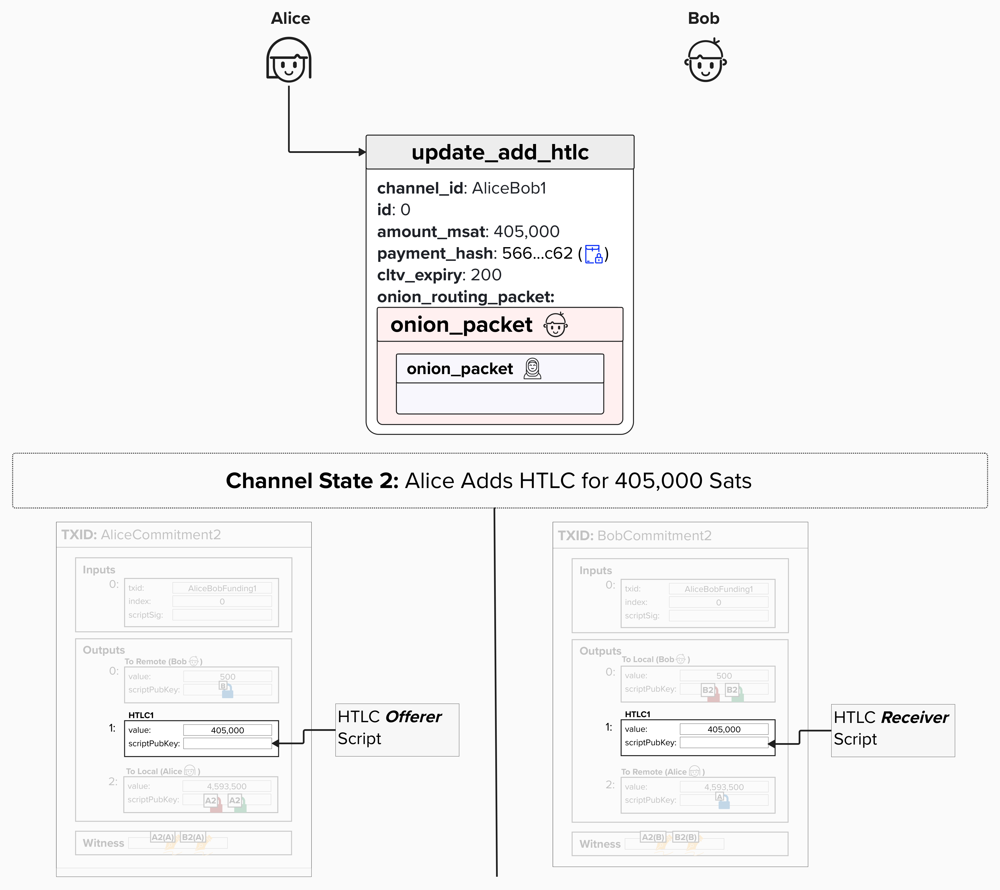
</p>

## HTLC Offerer Pseudo Script

The HTLC scripts are not easy on the eyes, so let's inch our way towards them, starting with pseudo script. As a reminder, "pseudo script" means we'll be writing the script in plain English, describing the spending paths that will eventually need to be implemented in Bitcoin's native programming language, [**Script**](https://en.bitcoin.it/wiki/Script).

Alice, the ***HTLC offerer***, has to create an HTLC output where:

1. **Bob** can spend the output if he has the **Revocation Private Key** for this specific commitment state. This protects Bob in the future if Alice attempts to cheat by publishing this HTLC commitment transaction **after** they have agreed to move to a new channel state.
2. **Bob** can spend the output if he has the **preimage**.
3. **Alice** can spend (effectively, reclaim) the output if the **HTLC expires**. Remember, Alice proposed a block height at which the HTLC expires.

<p align="center" style="width: 50%; max-width: 300px;">
  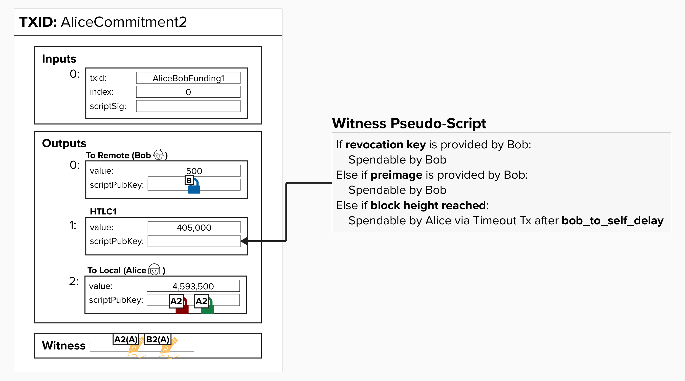
</p>

**This is very nuanced, but there's actually a dilemma here!** The HTLC expiry path has two conflicting timelock requirements:

1. **Absolute Timelock** (`OP_CHECKLOCKTIMEVERIFY`): The HTLC must expire at a specific block height (`cltv_expiry`). This ensures Bob can safely forward the HTLC without worrying that Alice will arbitrarily expire the contract early.

2. **Relative Timelock** (`OP_CHECKSEQUENCEVERIFY`): Alice's spending path must be delayed by `to_self_delay` blocks to give Bob time to claim the funds via the Revocation Path if Alice cheats.

#### Question: Can you spot the problem with combining these two timelocks in the same output script?

<details>
  <summary>Answer</summary>

The issue is that the **relative timelock** doesn't start counting until the transaction is mined. But the transaction can't be mined until *after* the **absolute timelock** is satisfied.

This means, in the worst case, if Alice times out the HTLC right when the contract expires at `cltv_expiry`, **she still has to wait another `to_self_delay` blocks before she can actually spend the output**. This gives Bob extra time beyond what the HTLC expiry intended.

While this might seem like it just inconveniences Alice, it actually creates a problem for the entire payment route's timelock calculations. Do you know how we can fix this?

</details>

## Addressing The Dilemma

To fix this timelock dilemma, we'll add a second transaction for Alice, known as the **HTLC Timeout Transaction**. This transaction will use the same script as our `to_local` output, but with the following differences:

1. The transaction will have a `locktime` set to the **HTLC's block height expiration**, known as `cltv_expiry` (Check Locktime Verify Expiry) in the protocol. This means the transaction cannot be mined until the `cltv_expiry` block height has passed.
2. The **input** for this transaction will be the **HTLC output** from the commitment transaction.
3. The HTLC Timeout Transaction will spend from a **2-of-2 multisig path in the commitment transaction's HTLC output script**. Therefore, it will require signatures from both Alice and Bob. **Alice and Bob will pre-sign the HTLC Timeout Transaction when creating the HTLC output on their commitment transactions**, effectively agreeing to the "expiry" terms of the contract.
   - NOTE: As we'll see shortly, the public keys used for the 2-of-2 multisig (and the associated signatures) are derived from the **HTLC Basepoint**.

<details>
  <summary>Click to see how Alice and Bob exchange signatures for the HTLC Timeout Transaction</summary>

Remember how the `commitment_signed` message had a field for `htlc_signatures`, and we said we'd discuss it later? Well, now it's "later"!

When Alice and Bob add new HTLCs to their commitment transactions, they exchange the signatures needed to spend from the HTLC output using the HTLC Timeout Transaction. SPOILER ALERT: Bob will also have a second HTLC transaction for his version of the commitment transaction, called the **"HTLC Success Transaction"**, which is why Alice sends him an HTLC signature.

In the diagram below, you'll see that when adding an HTLC and moving to a new channel state, Bob sends Alice an HTLC Signature, which Alice will use in her **HTLC Timeout Transaction** if she needs to publish it on-chain. Bob is able to create Alice's **HTLC Timeout Transaction** locally and send her the signature because he has all the information he needs to do so. Remember, Alice gave Bob her **Delayed Payment Basepoint** and **Revocation Basepoint** when they opened the channel, and Alice sent Bob the `cltv_expiry` in the `update_add_htlc` message, so Bob has everything he needs to generate the signature.

<p align="center" style="width: 50%; max-width: 300px;">
  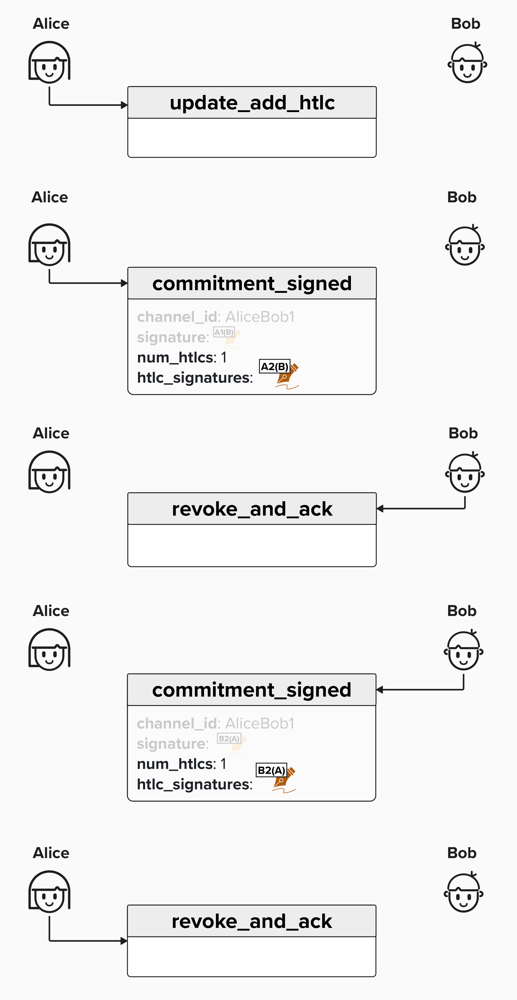
</p>

</details>

Together, these updates allow Alice to enforce both the **absolute timelock** and the **relative timelock**. This is because Alice cannot publish the **HTLC Timeout Transaction** until the HTLC expires at block height `cltv_expiry` (the absolute timelock). Once published, she must wait an additional `to_self_delay` blocks before claiming her funds (the relative timelock via `OP_CHECKSEQUENCEVERIFY`).

<p align="center" style="width: 50%; max-width: 300px;">
  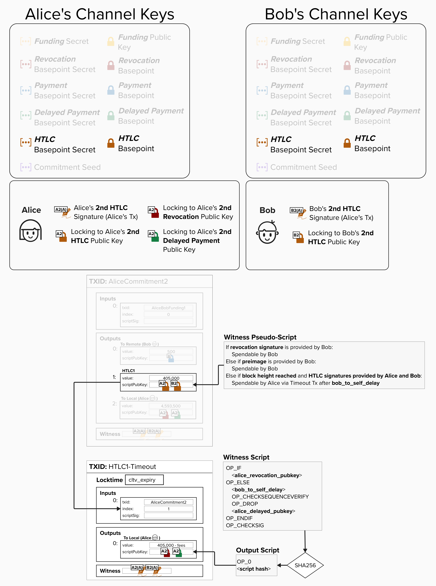
</p>

## Putting It All Together

As a brief review, the HTLC output has the following spending conditions:

1. **Revocation Path**: If Bob has the revocation secret (in case Alice cheats by broadcasting an old transaction), he can immediately claim the output.
2. **Preimage Path**: If Bob has the preimage, he can immediately claim the output.
3. **Expiry Path**: If the HTLC expires, Alice can claim the output via the **2-of-2 multisig path**, which must be claimed using the **HTLC Timeout Transaction**. This allows Alice to expire the HTLC and reclaim her funds - while also enforcing the `to_self_delay`.

For the HTLC Timeout Transaction, we have the following spending paths:

- **Revocation Path**: Bob can claim the output immediately with the revocation secret.
- **Delayed Path**: Alice can claim the output after the `to_self_delay`.

<p align="center" style="width: 50%; max-width: 300px;">
  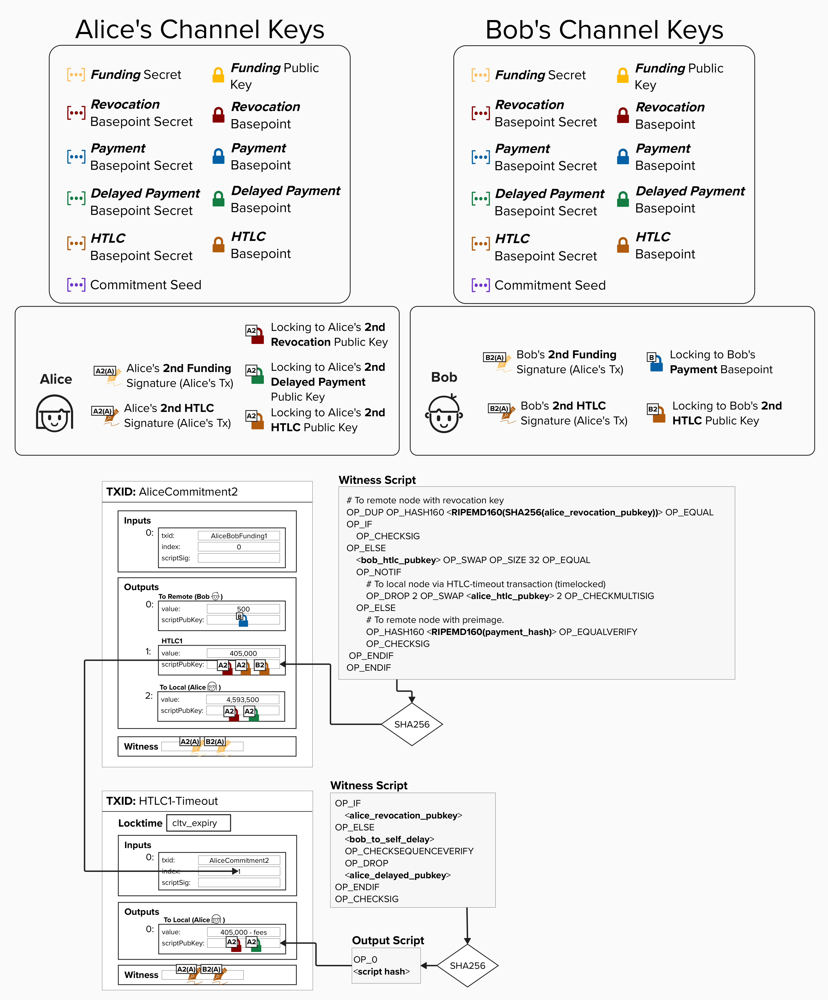
</p>

Now that we can see the full HTLC script, let's draw attention to the **`OP_CHECKMULTISIG`** spending path, which sends to the **HTLC Timeout Transaction**. If Bob does not cooperate to "unwind" the HTLC by either fulfilling or failing it, then Alice's only option to expire the HTLC is to publish the **HTLC Timeout Transaction**. Since the **HTLC Timeout Transaction** requires one signature from Alice and one from Bob, both parties effectively agree on the expiry terms when they exchange signatures during the process of adding the HTLC. This way, Bob can rest assured that Alice is only able to expire the HTLC using the **HTLC Timeout Transaction**, which Bob knows has an absolute timelock set to `cltv_expiry`.

If you're interested in seeing a full breakdown of the HTLC script to better understand how to spend from each path, see the dropdowns below!

<details>
  <summary>Click here to see an in-depth breakdown of spending from the HTLC Timeout Path</summary>

<p align="center" style="width: 50%; max-width: 300px;">
  
</p>

</details>

<details>
  <summary>Click here to see an in-depth breakdown of spending from the Preimage Path</summary>

<p align="center" style="width: 50%; max-width: 300px;">
  
</p>

</details>

## Deriving HTLC Keys

Now that we understand the HTLC scripts, let's review how the HTLC public keys are derived.

### Public Keys

HTLC public keys are derived exactly the same way as the **Delayed Payment Public Keys** we reviewed earlier. As a reminder, here's the formula:

```
pubkey = basepoint + SHA256(per_commitment_point || basepoint) * G
```

Where:
- `basepoint`: The basepoint of the key you're deriving (e.g., **Delayed Payment Basepoint**, **HTLC Basepoint**)
- `per_commitment_point`: The **Per-Commitment Point** for the specific commitment transaction

### Private Keys

The corresponding private keys are derived the same way, but using the **Basepoint Secrets** instead of the **Basepoints**:

```
privkey = basepoint_secret + SHA256(per_commitment_point || basepoint)
```

<p align="center" style="width: 50%; max-width: 300px;">
  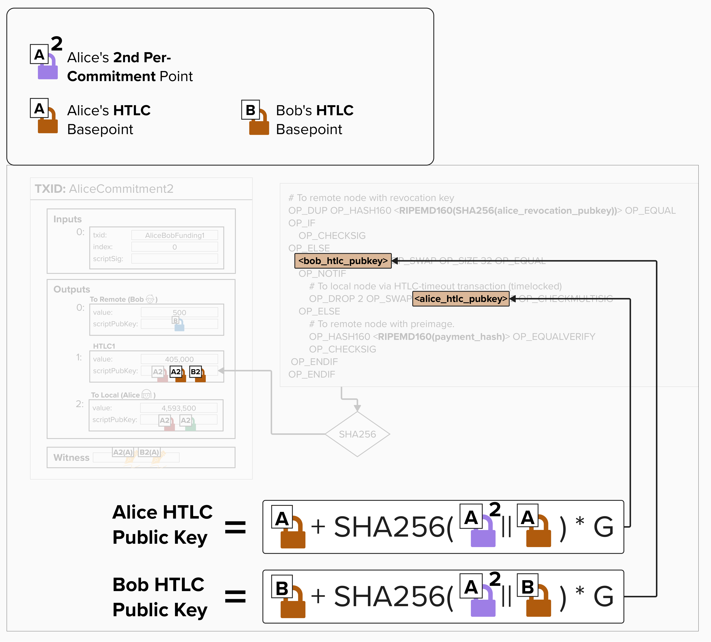
</p>

### Question: What should we do if Alice wants to forward a payment that is below the dust limit?

<details>
  <summary>Answer</summary>

If you've ever used Lightning to send a small payment, such as 1 sat, you know firsthand that it's **possible** to send payments that are below the dust limit. However, it doesn't make sense to add an output for such a payment, as creating the output would cost more than the output is worth!

That's why, per [BOLT 3](https://github.com/lightning/bolts/blob/master/03-transactions.md#commitment-transaction-outputs), any HTLC payments (minus fees) below the `dust_limit_satoshis` threshold are added to the transaction fees during routing. It's worth elaborating on two things:

- `dust_limit_satoshis` is specified by each channel party, allowing them to set **their own** threshold for amounts they won't create commitment outputs for. If the two parties have different dust limits, their commitment transactions won't be identical: one might include an HTLC output, while the other "trims" it (adding the value to fees instead). This is a neat feature of Lightning that is enabled by the fact that commitments are asymmetric. Since Alice and Bob exchange fee-related information when they start their channel, they will know each other's dust limit and create their signatures (which they send to each other) appropriately.
- When determining if an HTLC is below the dust limit, you must also factor in fees for the second-stage transaction **if your Lightning channel does not support anchor outputs or zero fee commitments**. For example, if you're routing a payment for 600 sats, but the second-stage HTLC Timeout Transaction fees are 300 sats, your resulting P2WSH output would be below the P2WSH dust threshold of 330 satoshis. You can view the various dust thresholds in BOLT 3 [here](https://github.com/lightning/bolts/blob/master/03-transactions.md#dust-limits).

Below is a diagram showcasing how to calculate fees for the second-stage HTLC transaction. Remember, if the Lightning channel supports anchor outputs or zero-fee commitments, then you do not need to include fees on this transaction, as they can be included later. However, if a Lightning channel does not support anchor outputs or zero fee commitments, then you should trim HTLCs if, when including second-stage fees, the amount is below the dust threshold.

<p align="center" style="width: 50%; max-width: 300px;">
  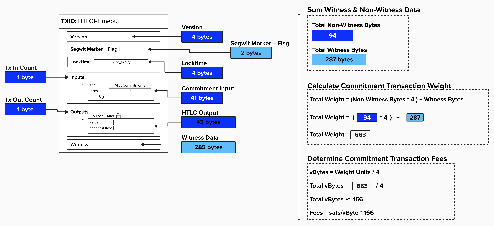
</p>

> *NOTE*: If your Lightning channel supports zero fee commitments, then trimmed HTLCs are added to the shared anchor output, until it reaches 240 sats.

</details>

# Create Offered HTLC Script

Wow! We've come a long way! Now, let's build one of the most complex scripts in Lightning - the **offered HTLC script**! As we just learned, this script is used when offering an HTLC to your counterparty.

For this exercise, let's build it in the code editor below. We'll implement the `create_offered_htlc_script` function, which takes the following inputs:

- `revocation_pubkey`: Our **Revocation Public Key**, which is created by combining our counterparty's **Revocation Basepoint** with our **Per-Commitment Point**.
- `local_htlcpubkey`: Our **HTLC Public Key**, which is derived from our **HTLC Basepoint** and our **Per-Commitment Point**.
- `remote_htlcpubkey`: Our counterparty's **HTLC Public Key**, which is derived from their **HTLC Basepoint** and our **Per-Commitment Point**.
- `payment_hash`: The hash of the payment preimage.

# Create HTLC Timeout Transaction

Next up, let's build the **HTLC Timeout Transaction**! Remember, this transaction enables the **HTLC offerer** to claim back their funds after the HTLC times out.

For this exercise, let's implement it in the code editor below.

The `create_htlc_timeout_transaction` function takes the following parameters:

- `htlc_outpoint`: The outpoint (txid + vout) of the HTLC output we're spending from.
- `htlc_amount`: The amount locked in the HTLC (in satoshis).
- `cltv_expiry`: The absolute block height when this HTLC expires.
- `local_keys`: Our commitment keys. See the dropdown below for more information.
- `to_self_delay`: The number of blocks that we must wait before we can claim our funds using the **Delayed Payment Public Key** path.
- `feerate_per_kw`: The fee rate in satoshis per 1000 weight units.

# Finalize HTLC Timeout Transaction

Our HTLC Timeout functionality is almost fully implemented! There are just two important pieces left: generating our signature and building the witness. So, for this exercise, we'll tackle those two steps by building the `finalize_htlc_timeout` function.

This function takes the following parameters:

- `keys_manager`: Our Channel Keys Manager, which can generate signatures.
- `tx`: The unsigned HTLC timeout transaction we created earlier.
- `input_index`: The index of the input we're signing on the HTLC Timeout Transaction.
- `htlc_script`: The offered HTLC script that we're spending from.
- `htlc_amount`: The amount in the HTLC output (needed for signature generation).
- `remote_htlc_signature`: Our counterparty's signature (pre-signed when the HTLC was created).
- `local_htlc_privkey`: The derived HTLC private key for this commitment transaction.

> **Key Derivation Reminder**
>
> Remember, we need to sign the HTLC Timeout Transaction with the **derived** HTLC Private Key for this specific commitment transaction. We cannot use the HTLC Basepoint Secret directly!
>
> The derivation follows this equation from BOLT 3:
> ```
> privkey = basepoint_secret + SHA256(per_commitment_point || basepoint)
> ```
>
> For this exercise, the derived key is provided as the `local_htlc_privkey` parameter, so you can use it directly.


Go ahead and try implementing the function below! To successfully complete this exercise, you'll need to generate the local HTLC signature and then add the following witness to the transaction.
```
0 <remotehtlcsig> <localhtlcsig> <> htlc_script
```

<code-intro heading="Coding Exercises: Offered HTLCs" exercises="ln-exercise-offered-htlc-script,ln-exercise-htlc-timeout-tx"></code-intro>

<code-outro text="Now let's look at the other side: received HTLCs."></code-outro>
