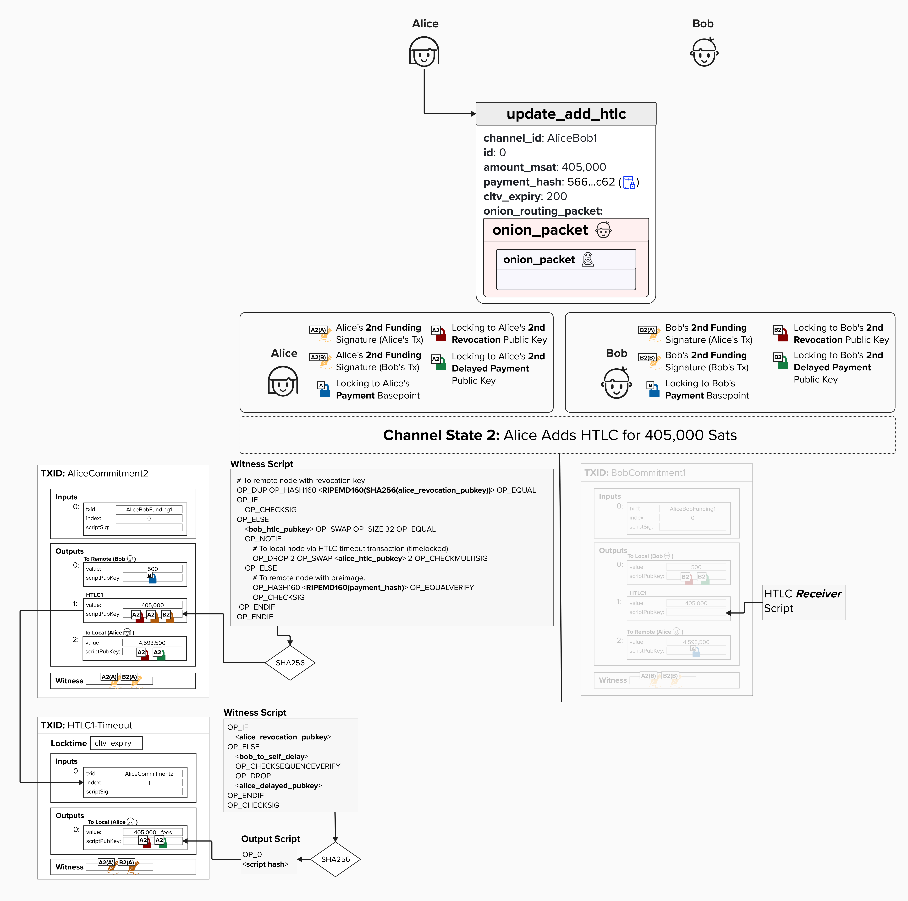
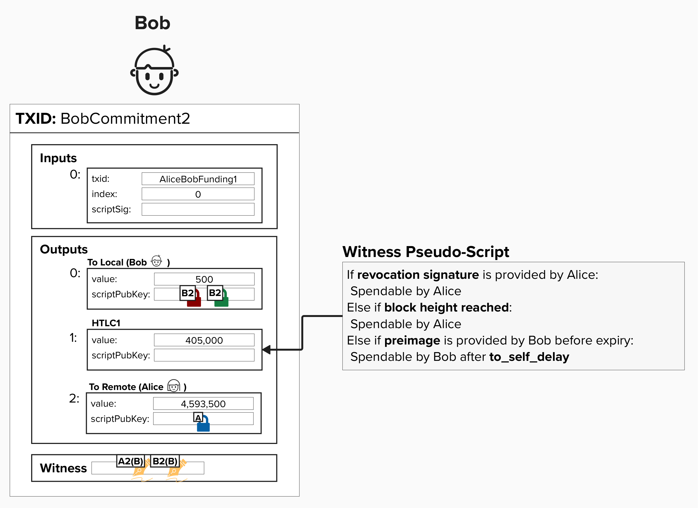
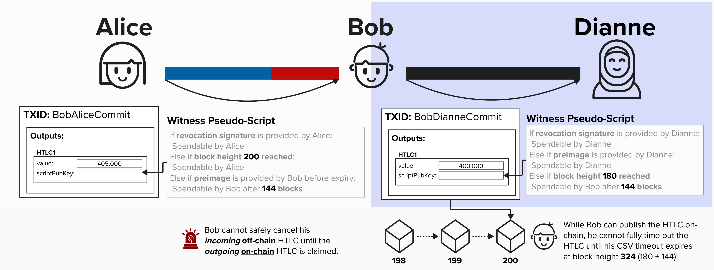
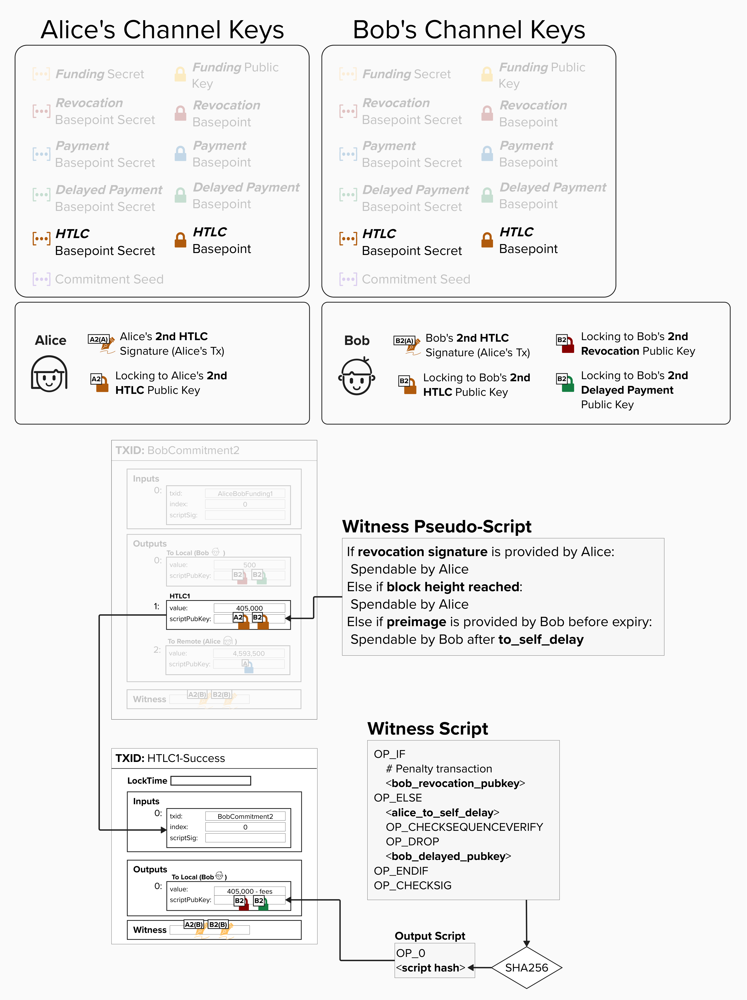
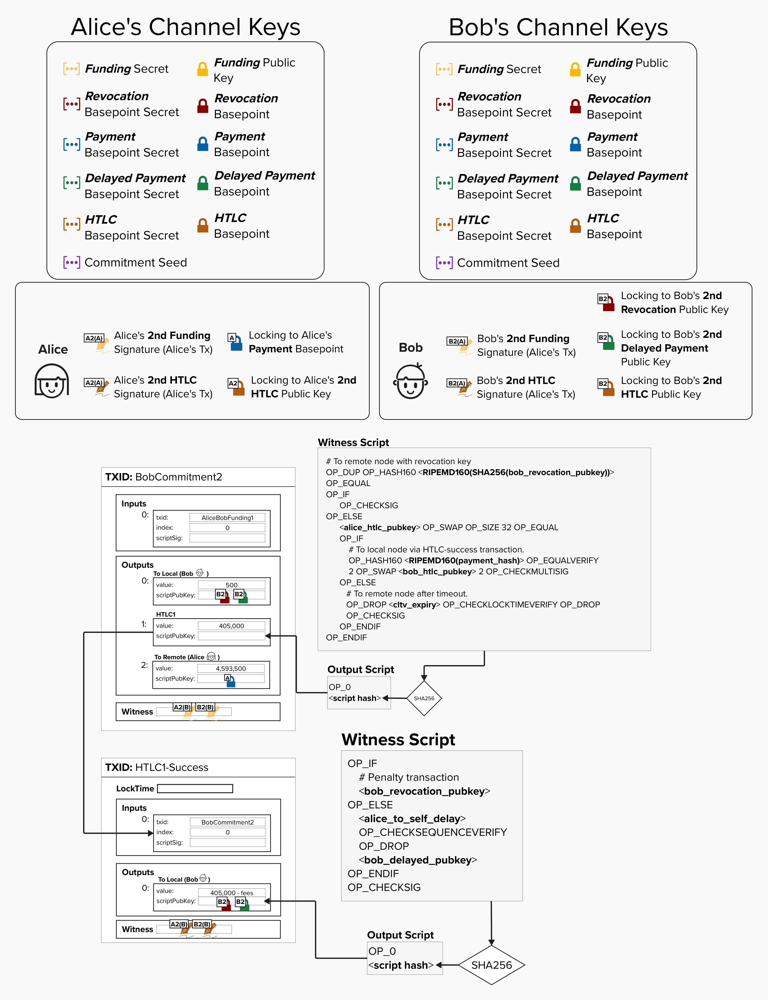

# HTLC Receiver

Now that we've reviewed Alice's HTLC script, let's take a look at Bob's - the **HTLC Receiver**!

Below is a diagram depicting the progress we've made thus far in our HTLC script journey. On the left, you can see the HTLC Offerer's (Alice's) full HTLC script. Now it's time to review Bob's!

<p align="center" style="width: 50%; max-width: 300px;">
  
</p>

Bob, the ***HTLC receiver***, has to create an output where:

- **Alice** can spend the output if she has the **Revocation Private Key**. This protects Alice in the future if Bob attempts to publish this commitment transaction after they have agreed to move to a new channel state.
- **Alice** can spend (effectively, reclaim) the output if the **HTLC expires**.
- **Bob** can spend the output if he obtains the **preimage** *before* the HTLC expires. Since this spending path involves Bob sending bitcoin to himself, it has to be timelocked by `to_self_delay` blocks.

<p align="center" style="width: 50%; max-width: 300px;">
  
</p>

However, similar to the HTLC Offerer script, there is a dilemma here! Bob's spending path must be delayed by `to_self_delay` blocks to give Alice time to sweep the output if Bob attempts to cheat in the future.

#### Question: Looking at the simplified transaction, can you spot why these timelocks could pose a problem?

<details>
  <summary>Answer</summary>

This is very similar to the prior dilemma we ran into - the issue lies with using both **relative** and **absolute** timelocks. However, now that we've introduced the fact that the HTLC script changes depending on whether you're offering or receiving the HTLC, we can dig into another reason that second-stage HTLC transactions are needed.

Take a look at the diagram below. Returning to our motivating example, remember that Bob is forwarding an HTLC from Alice to Dianne. Therefore, Bob has an **Incoming HTLC** from Alice and an **Outgoing HTLC** to Dianne. The HTLCs have the following expiry times:

- Alice → Bob: Expires at block height **200**
- Bob → Dianne: Expires at block height **180**

<p align="center" style="width: 50%; max-width: 300px;">
  
</p>

Now, imagine that Dianne goes offline after agreeing to transition to a new channel state which has the HTLC on her commitment with Bob. Since Dianne is now unresponsive, Bob **must** force-close his channel on-chain to ensure that he is safe and does not lose the bitcoin locked in the HTLC output.

Why is this? Imagine he does *not* close the channel on-chain and decides to wait until Dianne comes back online. If Dianne comes back online at block height 300, then Alice would have already expired the HTLC with Bob. So, if Bob's HTLC with Dianne is still pending, there is a chance that Dianne decides to claim the funds using the **preimage** path - but since Bob's HTLC with Alice is already expired, Bob cannot turn around and claim his 405,000 sats from Alice anymore. To ensure Bob does not lose funds, he'll have to expire the HTLC on-chain if Dianne goes offline!

Now, with this context, we can see the timelock issue more clearly! If we had both timelocks in the same HTLC script, then Bob would not be able to claim the HTLC output on-chain until **144** blocks ***after*** the **180** block height expiry, meaning that Dianne could actually still claim the HTLC funds using the preimage up to block height **324**.

If Bob wanted to safely put both timelocks in the same script, he would need to require that his HTLC expiry with Alice is ***after*** block height **324**. However, since `to_self_delay` values can sometimes exceed 2,000 blocks, the `cltv_expiry_delta` that nodes advertise would also need to exceed 2,000 blocks. If this were the case, then failed Lightning payments could be "stuck" for many weeks - an obvious unacceptable user experience.

By moving the HTLC expiry to a "second-stage" transaction (HTLC Timeout or HTLC Success), either party can immediately claim the HTLC funds, while still providing a revocation path in case they attempt to cheat in the future.

</details>

## Addressing The Dilemma

To fix this timelock dilemma, we'll add a second transaction for Bob, just like we did for Alice. However, this transaction will be called the **HTLC Success Transaction**. Just like the HTLC Timeout Transaction, this will use the same script as our `to_local` output, and it will have the following features:

1. The **input** for this transaction is the **HTLC output** from Bob's commitment transaction.
2. The HTLC Success Transaction will spend from a **2-of-2 multisig path in the commitment transaction's HTLC output script**. Therefore, it will require signatures from both Alice and Bob to spend. **Alice and Bob will pre-sign the HTLC Success Transaction when creating the HTLC output on their commitment transactions**.

Together, these changes allow Bob to claim the HTLC funds on-chain as long as he has the preimage before `cltv_expiry`. The funds then move to the second-stage success transaction, where they remain until Bob's `to_self_delay` passes.

<p align="center" style="width: 50%; max-width: 300px;">
  
</p>

## Putting It All Together

Putting it all together, the HTLC output has the following spending conditions:

1. **Revocation Path**: If Alice holds the revocation private key (in case Bob cheats by broadcasting an old transaction), she can immediately spend the output.
2. **Timeout Path**: If the `cltv_expiry` passes, Alice can spend the output.
3. **Preimage Path**: If Bob provides the preimage, he can spend the output via the HTLC Success Transaction, **which is set up in advance with Alice's signature for the 2-of-2 multisig condition. This allows Bob to claim the funds before the `cltv_expiry` and also enforce his `to_self_delay`**.

For the HTLC Success Transaction:

- **Revocation Path**: Alice can spend the output immediately with the revocation private key for this commitment state.
- **Delayed Path**: Bob can spend the output after the `to_self_delay`.

<p align="center" style="width: 50%; max-width: 300px;">
  
</p>

# Create Received HTLC Script

We're almost finished coding our BOLT 3-compliant Lightning implementation. Let's bring it home by building our **received HTLC script**!

For this exercise, let's implement it in the code editor below. We'll build the `create_received_htlc_script` function, which takes the following inputs:

- `revocation_pubkey`: Our **Revocation Public Key**, which is created by combining our counterparty's **Revocation Basepoint** with our **Per-Commitment Point**.
- `local_htlcpubkey`: Our **HTLC Public Key**, which is derived from our **HTLC Basepoint** and our **Per-Commitment Point**.
- `remote_htlcpubkey`: Our counterparty's **HTLC Public Key**, which is derived from their **HTLC Basepoint** and our **Per-Commitment Point**.
- `payment_hash`: The hash of the payment preimage.
- `cltv_expiry`: The absolute block height when this HTLC expires.

<details>
  <summary>Hint</summary>

Once again, head back over to the [BOLT 3 specification](https://github.com/lightning/bolts/blob/master/03-transactions.md#received-htlc-outputs) and try implementing the script exactly as it appears in the BOLT.

The received HTLC script is very similar to the offered HTLC script, but with an important difference: the success path (with preimage) now requires the 2-of-2 multisig, while the timeout path only requires a signature from the remote party.

We'll build the script by concatenating raw opcode bytes and data together, just like we did for the offered HTLC. Here are the key tools you'll need:

- **Opcode bytes**: Each Bitcoin opcode has a corresponding hex byte (e.g., `OP_DUP` is `0x76`, `OP_HASH160` is `0xa9`, `OP_IF` is `0x63`, `OP_CHECKSIG` is `0xac`, `OP_CLTV` is `0xb1`).
- **Pushing data**: Prepend the data with a length byte. For example, to push a 33-byte public key, write `bytes([33]) + pubkey_bytes`.
- **Pushing integers**: For the `cltv_expiry` value, you'll need to encode it as a little-endian byte sequence and push it with the appropriate length prefix.
- **Concatenation**: Build the full script by concatenating all the byte segments together with `+`.

You'll also need these helper functions for hashing:

- `hashlib.new('ripemd160', data).digest()`: Takes the RIPEMD160 hash of data and returns the digest bytes.
- `hashlib.sha256(data).digest()`: Takes the SHA256 hash of data and returns the digest bytes.
- To compute HASH160 (SHA256 followed by RIPEMD160) of a public key, chain both: `hashlib.new('ripemd160', hashlib.sha256(pubkey_bytes).digest()).digest()`.

</details>

<details>
  <summary>Step 1: Prepare the Hash Values</summary>

Just like we did with the HTLC Offerer script, let's start by preparing two hash values that will be used in the script. The first is the RIPEMD160 of the payment (preimage) hash. The second is the public key hash of the **Revocation Public Key**.

</details>

<details>
  <summary>Step 2: Start the Revocation Check</summary>

The revocation path is identical to the offered HTLC.

We first check if the provided value is equal to the hash of the **Revocation Public Key**. To do this, we use `DUP HASH160 <hash> EQUAL` to check if the two data elements are equal.

</details>

<details>
  <summary>Step 3: Set Up Success vs Timeout Logic</summary>

Okay, here's where the received HTLC script starts to differ from offered HTLCs!

We still check the witness element size, but the logic is flipped: if the witness element is exactly 32 bytes (preimage), we take the IF branch. Otherwise, we execute the ELSE branch.

</details>

<details>
  <summary>Step 4: Handle the Success Path (2-of-2 Multisig with Preimage)</summary>

For received HTLCs, we claim the payment (success path) by providing the preimage **and** the signatures required to spend from the 2-of-2 multisig.

</details>

<details>
  <summary>Step 5: Handle the Timeout Path (with CLTV)</summary>

If there's no preimage, then the counterparty (Alice) can simply reclaim their funds after the CLTV expiry.

</details>

<details>
  <summary>Step 6: Close the Outer Conditional</summary>

Finally, we close the outer IF/ELSE structure.

</details>

<checkpoint id="htlc-timeout-vs-success"></checkpoint>

# Create HTLC Success Transaction

Next up, let's build the **HTLC Success Transaction**! As we just learned, this is the counterpart to the HTLC Timeout Transaction - it enables Bob to claim a received HTLC when he obtains the payment preimage.

For this exercise, let's implement it in the code editor below.

The `create_htlc_success_transaction` function takes the following parameters:

- `htlc_outpoint`: The outpoint (txid + vout) of the HTLC output we're spending from.
- `htlc_amount`: The amount locked in the HTLC (in satoshis).
- `local_keys`: Our commitment keys. See the dropdown below for more information.
- `to_self_delay`: The number of blocks that we must wait before we can claim our funds using the **Delayed Payment Public Key** path.
- `feerate_per_kw`: The fee rate in satoshis per 1000 weight units.

<details>
  <summary>Hint</summary>

This function is very similar to `create_htlc_timeout_transaction`, which we implemented a few exercises ago. The main difference is that the **HTLC Success Transaction** has **no locktime**!

Below are a few hints to help you on your journey.

1. **Calculate the fee and output amount**
   - Use `calculate_htlc_success_tx_fee(feerate_per_kw)` to get the fee. Note that this is a different function than the one we used for the Timeout Transaction, since the Success Transaction is slightly larger (it includes the preimage in the witness).

2. **Determine output amount**
   - Subtract the fee from `htlc_amount`.

3. **Create the output script**
   - The output uses the same `to_local` script structure we built earlier. You can use the `create_to_local_script()` function!

4. **Build the transaction input**
   - Create a dictionary with the following keys:
     - `"previous_output"`: Set to `htlc_outpoint` (a dict with `"txid"` and `"vout"`)
     - `"script_sig"`: Empty bytes (`b""`) since this is SegWit
     - `"sequence"`: Set to `0`
     - `"witness"`: Empty list for now (`[]`)

5. **Build the transaction output**
   - Create a dictionary with the following keys:
     - `"value"`: The output amount in satoshis
     - `"script_pubkey"`: Use the script you just created! Make sure to call `to_p2wsh()`.

6. **Build the transaction dictionary** with:
   - `"version"`: `2`
   - `"lock_time"`: `0` - Unlike the Timeout Transaction, there's no absolute timelock!
   - `"inputs"`: A list containing your input dict
   - `"outputs"`: A list containing your output dict

7. **Return the transaction!**

</details>

<details>
  <summary>Step 1: Calculate Fees and Output Amount</summary>

Just like we did for the **HTLC Timeout Transaction**, we'll start by calculating the fee for the **HTLC Success Transaction**. However, we'll use a different function this time, as the **HTLC Success Transaction** will be larger since it includes a preimage in the witness.

A helper function, `calculate_htlc_success_tx_fee`, is available for this exercise.

Once we have the fee for this transaction, which depends on the feerate, we'll determine the output amount by subtracting it from the `htlc_amount`.

</details>

<details>
  <summary>Step 2: Create the to_local Output Script</summary>

Similar to the **HTLC Timeout Transaction**, the **HTLC Success Transaction** pays to a `to_local` script.

</details>

<details>
  <summary>Step 3: Create the Transaction Input</summary>

Next, let's define our HTLC Success input! Similar to the Timeout Transaction, we'll keep it unsigned, so we just need to create an input dictionary.

</details>

<details>
  <summary>Step 4: Create the Transaction Output</summary>

Now, let's create our output dictionary. Remember to convert the witness script to a P2WSH output using `to_p2wsh()`!

</details>

<details>
  <summary>Step 5: Assemble the Complete Transaction</summary>

Go ahead and create the complete transaction dictionary! The notable difference between this exercise and the Timeout Transaction is that there is no locktime expiry!

</details>


# Finalize HTLC Success Transaction

Nice, our HTLC Success functionality is almost done! Now, just like we did with our HTLC Timeout Transaction, we need to write code to generate our signature and build the witness for our HTLC Success Transaction.

For this exercise, we'll complete `finalize_htlc_success`, which takes the following parameters:

- `keys_manager`: Our Channel Keys Manager, which can generate signatures.
- `tx`: The unsigned HTLC Success Transaction we created earlier.
- `input_index`: The index of the input we're signing on the HTLC Success Transaction.
- `htlc_script`: The received HTLC script that we're spending from.
- `htlc_amount`: The amount in the HTLC output (needed for signature generation).
- `remote_htlc_signature`: Our counterparty's signature (pre-signed when the HTLC was created).
- `local_htlc_privkey`: The derived HTLC private key for this commitment transaction.
- `payment_preimage`: The 32-byte preimage that unlocks the HTLC.

Go ahead and try implementing the function below! To successfully complete this exercise, you'll need to generate the (local) HTLC signature and then add the following witness to the transaction.
```
0 <remotehtlcsig> <localhtlcsig> <payment_preimage> htlc_script
```

<details>
  <summary>Hint</summary>

This function is very similar to `finalize_htlc_timeout`, which we recently implemented. The key difference is the witness structure. Instead of an empty byte string for the timeout path, we provide the **payment preimage**!

Here are a few hints to get you going:

1. **Generate the local HTLC signature**
   - Use `keys_manager.sign_transaction_input(tx, input_index, htlc_script, htlc_amount, local_htlc_privkey)` to generate a signature. This will return the DER-encoded signature with the SIGHASH_ALL byte appended.

2. **Build the witness stack**
   - The witness for the HTLC Success path follows this structure: `0 <remotehtlcsig> <localhtlcsig> <payment_preimage> htlc_script`
   - Build this as a Python list of byte strings: `[b"", remote_htlc_signature, local_htlc_signature, payment_preimage, htlc_script]`
   - The preimage is exactly 32 bytes, which tells the script interpreter to take the success path (the IF branch that checks `OP_SIZE 32 OP_EQUAL`).

3. **Attach the witness to the transaction**
   - Make a copy of the transaction (e.g., using `copy.deepcopy(tx)`).
   - Set `signed_tx["inputs"][input_index]["witness"]` to the witness list we just built.

4. **Return the signed transaction!**

</details>

<details>
  <summary>Step 1: Sign the Transaction Input</summary>

First, let's generate our signature for the HTLC receiver output on our commitment transaction. To do this, we can use the `sign_transaction_input` function we created earlier in this course.

</details>

<details>
  <summary>Step 2: Build the Witness Stack</summary>

Now, let's build the witness stack!

Below is a breakdown of each element:

1. **Empty bytes (`b""`)**: First, we need to add a dummy element to the stack (`OP_0`), since there is an `OP_CHECKMULTISIG` bug that pops an extra item off the stack.

2. **Remote HTLC signature**: Next, we add our counterparty's pre-signed signature. Remember, they give this to us when we are setting up the HTLC!

3. **Local HTLC signature**: Then we add our signature, which we just created.

4. **Payment preimage (`payment_preimage`)**: This is the key difference from the witness we created for the Timeout Transaction! Since the preimage is exactly 32 bytes, it will cause the Bitcoin Script interpreter to evaluate the success path (IF branch). The interpreter will then hash the preimage and check if it matches the payment hash.

```
OP_DUP OP_HASH160 <RIPEMD160(SHA256(revocationpubkey))> OP_EQUAL
OP_IF
    OP_CHECKSIG
OP_ELSE
    <remote_htlcpubkey> OP_SWAP OP_SIZE 32 OP_EQUAL
    OP_IF
        # To local node via HTLC-success transaction.
        OP_HASH160 <RIPEMD160(payment_hash)> OP_EQUALVERIFY
        2 OP_SWAP <local_htlcpubkey> 2 OP_CHECKMULTISIG
```

5. **HTLC script**: Finally, we provide the full received HTLC script.

</details>

<details>
  <summary>Step 3: Insert Witness into the Transaction</summary>

Lastly, we'll add the witness to the transaction's input.

Don't forget to return the signed transaction!

</details>

<code-intro heading="Coding Exercises: Received HTLCs" exercises="ln-exercise-received-htlc-script,ln-exercise-htlc-success-tx"></code-intro>

<code-outro text="Let's wrap up with HTLC fee calculations and dust handling."></code-outro>
