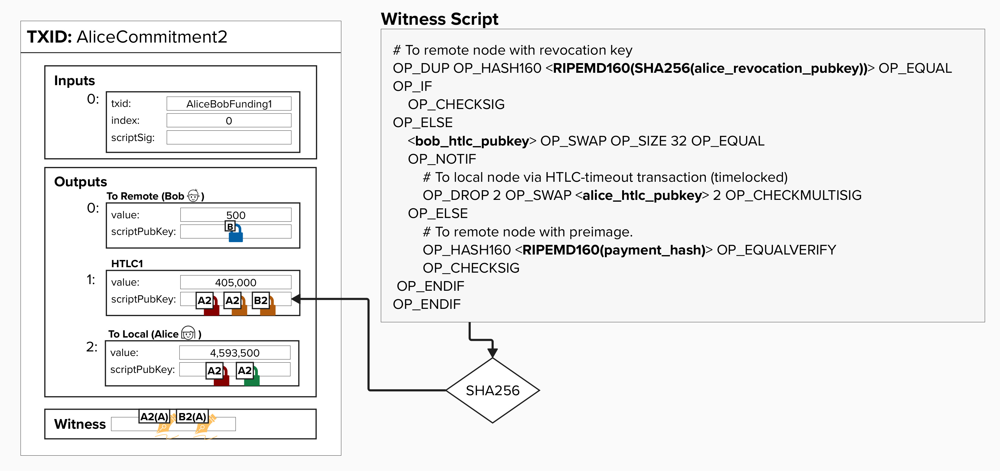
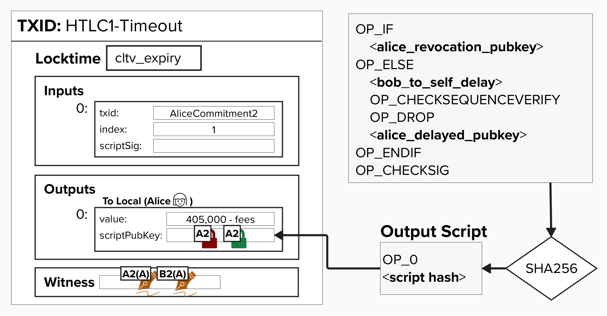

# Updating Our Commitment Transaction

Believe it or not, we're almost done with our last coding exercises! At this point, we've implemented our HTLC Timeout Transaction, but we haven't added the HTLC to our commitment transaction just yet. Let's do that now!

For this next exercise, we're going to return to the `create_commitment_transaction` function that we created earlier in the course. If you need a reminder, check the code editor below or view the function definition below.

If you recall, we ignored the two inputs `offered_htlcs` and `received_htlcs`, as we had not yet reviewed HTLCs. Now that we have a solid understanding of how HTLCs work and have implemented them ourselves, let's update the `create_commitment_transaction` function so that it will add HTLCs to our commitment transactions.

## Write A Function To Create HTLC Outputs

To begin this journey, we'll start by implementing a helper function that will produce a list of output dictionaries for our HTLCs. This is very similar to the `create_commitment_transaction_outputs` function we implemented earlier. As we'll see shortly, by producing a list of output dictionaries for our HTLCs, we'll be able to easily add them to the list containing our `to_local` and `to_remote` outputs so they can easily be sorted.

<details>
  <summary>Click to see the output dictionary structure</summary>

As a reminder, each output dictionary represents a commitment transaction output. This structure is specific to the Programming Lightning course.

- `"value"`: This is simply the amount of bitcoin locked to this output.
- `"script"`: This is the script bytes we're locking the bitcoin to. Since we've only learned about `to_local` and `to_remote` outputs thus far, you can imagine this holding the script bytes for those outputs.
- `"cltv_expiry"`: This is the HTLC expiry (block height).

</details>

For this exercise, let's implement `create_htlc_outputs` in the code editor below. This function takes the following inputs:

- `commitment_keys`: This is a dictionary that holds all of the keys you'll need to complete this transaction. You can learn more about it below.
- `offered_htlcs`: A list of HTLCs that we offered to our counterparty. These will be encumbered with an HTLC Offerer script.
- `received_htlcs`: A list of HTLCs that our counterparty offered to us. These will be encumbered with an HTLC Receiver script.

<details>
  <summary>Click to see the commitment_keys dictionary</summary>

The `commitment_keys` dictionary is meant to hold all of the public keys we'll need for any given channel state. In other words, these keys have already been tweaked by the **Per-Commitment Point** and are unique to a specific channel state.

</details>

<details>
  <summary>Click to see the HTLC output dictionary</summary>

Each HTLC output dictionary represents an HTLC that needs to be added to a commitment transaction.

</details>


## Update Our create_commitment_transaction Function

Now, let's put everything together and update the `create_commitment_transaction` function to include HTLC outputs. Earlier in the course, we implemented most of this function but left out the HTLC functionality. Now that we've built all the HTLC scripts and helper functions, let's add them to our commitment transaction!

For this exercise, head back to the code editor below and update the function to account for any `offered_htlcs` or `received_htlcs` that may be passed in.

To successfully complete this exercise, you'll need to:

1. Create HTLC outputs using the `create_htlc_outputs` function we just implemented.
2. Sort all outputs (including HTLCs) according to BOLT 3 specifications.


<checkpoint id="htlc-dust"></checkpoint>

# Get Our HTLC Commitment Transaction

Alright, if you've put in the Proof-of-Work and completed all of the exercises up to this point, then you'll be able to generate your very own commitment transaction with one "outgoing" HTLC. It's called "outgoing" because it represents a payment from us (Alice) to Bob, so, if successful, bitcoin will be deducted from our channel balance and added to Bob's.

Below is a visual representation of the commitment transaction we're about to create.

<p align="center" style="width: 50%; max-width: 300px;">
  
</p>

## Decoded Commitment Transaction (With HTLC)

Below is an example of what a decoded commitment transaction with an HTLC output looks like. We won't dig into each element like we did earlier, but we'll pay attention to the outputs!
```
{
  "txid": "e0a0022dba0f494f3670eb1026b4e11402e7c08d96b0a67ae29ad6cc97a4d54c",
  "hash": "ed57ba86d775bffb0e4c44dfd50318bc21a19ec37f705b0481502cd6cf4bcc4f",
  "version": 2,
  "size": 389,
  "vsize": 224,
  "weight": 893,
  "locktime": 537394831,
  "vin": [
    {
      "txid": "2626e0a9f56033e5583952abeb15c6e039f3a550e459621a5c49b6a9050a0ae8",
      "vout": 0,
      "scriptSig": {
        "asm": "",
        "hex": ""
      },
      "txinwitness": [
        "",
        "30440220577d5855b17f6534d875e314e9af66a5fc4fe35731c207dd6a937bb9da70e05f02207463d3234b9c1f50a5842d0735d2d274c26187f4f247822a076c636d28f1639201",
        "3045022100e28922e44a57c1b923eebad555dfa90f826cb04522764a0b6e17649cebb38d520220706227ac148a223226c65d613bc31257e60bb3f6e6f83b18fa698e108a04073501",
        "522102744c609aeee71a07136482b71244a6217b3368431603e1e3994d0c2d226403af2103cfa114ffa28b97884a028322665093af66bb19b0cf91c81eae46e6bb7fff799a52ae"
      ],
      "sequence": 2159794202
    }
  ],
  "vout": [
    {
      "value": 0.00000500,
      "n": 0,
      "scriptPubKey": {
        "asm": "0 8c4e98f51715d292104530224efba56176fb39b1",
        "desc": "addr(bcrt1q338f3aghzhffyyz9xq3ya7a9v9m0kwd3v7t2jl)#euqsj43f",
        "hex": "00148c4e98f51715d292104530224efba56176fb39b1",
        "address": "bcrt1q338f3aghzhffyyz9xq3ya7a9v9m0kwd3v7t2jl",
        "type": "witness_v0_keyhash"
      }
    },
    {
      "value": 0.00405000,
      "n": 1,
      "scriptPubKey": {
        "asm": "0 d2aeedb3a6f262cdf4a7cf7cf59e6d71d66f5574cb07a7de101d3b43b74ec5ef",
        "desc": "addr(bcrt1q62hwmvax7f3vma98ea70t8ndw8tx74t5evr60hssr5a58d6wchhsh6ew90)#damuphn7",
        "hex": "0020d2aeedb3a6f262cdf4a7cf7cf59e6d71d66f5574cb07a7de101d3b43b74ec5ef",
        "address": "bcrt1q62hwmvax7f3vma98ea70t8ndw8tx74t5evr60hssr5a58d6wchhsh6ew90",
        "type": "witness_v0_scripthash"
      }
    },
    {
      "value": 0.04593500,
      "n": 2,
      "scriptPubKey": {
        "asm": "0 5ae871c433f2bc223753610b819831f5c4327168b19c5afeecb7d1d7e808b463",
        "desc": "addr(bcrt1qtt58r3pn727zyd6nvy9crxp37hzryutgkxw94lhvklga06qgk33sj2x8v8)#5k8t7swq",
        "hex": "00205ae871c433f2bc223753610b819831f5c4327168b19c5afeecb7d1d7e808b463",
        "address": "bcrt1qtt58r3pn727zyd6nvy9crxp37hzryutgkxw94lhvklga06qgk33sj2x8v8",
        "type": "witness_v0_scripthash"
      }
    }
  ]
}
```

### Outputs

Once again, we can see the `to_local` and `to_remote` outputs! Can you tell which is which?

Even without looking at the amount, we should be able to identify the `to_remote` output pretty easily - it's the only output that is locked to a `"type": "witness_v0_keyhash"` (Pay-To-Witness-Public-Key-Hash).

Since the `to_local` and HTLC outputs are both Pay-To-Witness-Script-Hash, we will have to tell them apart by their amount (or recreate the script and hash it).

As you can see, our outputs are sorted properly, so our HTLC is right there in the middle (index 1)!
```
"vout": [
  {
    "value": 0.00000500,
    "n": 0,
    "scriptPubKey": {
      "asm": "0 8c4e98f51715d292104530224efba56176fb39b1",
      "desc": "addr(bcrt1q338f3aghzhffyyz9xq3ya7a9v9m0kwd3v7t2jl)#euqsj43f",
      "hex": "00148c4e98f51715d292104530224efba56176fb39b1",
      "address": "bcrt1q338f3aghzhffyyz9xq3ya7a9v9m0kwd3v7t2jl",
      "type": "witness_v0_keyhash"
    }
  },
  {
    "value": 0.00405000,
    "n": 1,
    "scriptPubKey": {
      "asm": "0 d2aeedb3a6f262cdf4a7cf7cf59e6d71d66f5574cb07a7de101d3b43b74ec5ef",
      "desc": "addr(bcrt1q62hwmvax7f3vma98ea70t8ndw8tx74t5evr60hssr5a58d6wchhsh6ew90)#damuphn7",
      "hex": "0020d2aeedb3a6f262cdf4a7cf7cf59e6d71d66f5574cb07a7de101d3b43b74ec5ef",
      "address": "bcrt1q62hwmvax7f3vma98ea70t8ndw8tx74t5evr60hssr5a58d6wchhsh6ew90",
      "type": "witness_v0_scripthash"
    }
  },
  {
    "value": 0.04593500,
    "n": 2,
    "scriptPubKey": {
      "asm": "0 5ae871c433f2bc223753610b819831f5c4327168b19c5afeecb7d1d7e808b463",
      "desc": "addr(bcrt1qtt58r3pn727zyd6nvy9crxp37hzryutgkxw94lhvklga06qgk33sj2x8v8)#5k8t7swq",
      "hex": "00205ae871c433f2bc223753610b819831f5c4327168b19c5afeecb7d1d7e808b463",
      "address": "bcrt1qtt58r3pn727zyd6nvy9crxp37hzryutgkxw94lhvklga06qgk33sj2x8v8",
      "type": "witness_v0_scripthash"
    }
  }
]
```

<checkpoint id="p2wsh-wrapping"></checkpoint>

# Get Our HTLC Timeout Transaction

Let's wrap things up and generate our **HTLC Timeout Transaction**.

Below is a visual representation of the transaction we're about to create.

<p align="center" style="width: 50%; max-width: 300px;">
  
</p>

# Decoding Our HTLC Timeout Transaction

Below is an example of what a decoded HTLC Timeout Transaction looks like. See if you can dig through the major elements and understand what they are (`txid`, `locktime`, `vin`, `txinwitness`, and `vout`).
```
{
  "txid": "5ac2986270151d7c7cefc31981494d467007cfbfdea2542b0dfb44d0a147aec1",
  "hash": "237f5c1112d9f723146607249990d1eb2fd059a5c6d0a66a2a62b1c854a21cd9",
  "version": 2,
  "size": 378,
  "vsize": 165,
  "weight": 660,
  "locktime": 200,
  "vin": [
    {
      "txid": "e0a0022dba0f494f3670eb1026b4e11402e7c08d96b0a67ae29ad6cc97a4d54c",
      "vout": 1,
      "scriptSig": {
        "asm": "",
        "hex": ""
      },
      "txinwitness": [
        "",
        "304402203fd80f2eb2e4584d6829222e04b2d449cb73a98c96b330f2fda2c472d6e28c6c02205d9ee5b26700306073cecf23ba86bab870cebb781245917df0eb75e91690ce3801",
        "3045022100b65a70467fd69bbee3ed3dece19181b55b466da282d7897b3ba751f581e74e8c02200543907787f3452a6b6f293f3d35241edcfa23530b36ee42c8976ff0d90540de01",
        "",
        "76a914f8b861c3e79f385e24a113932589a19443da0dbe8763ac6721020c76717fefcb1c635f804c0c9c16ec04232356dcbc2a589fb87f3550de64d1107c820120876475527c2103e322cd335c60831c19dbe93dc666a5a04945cbfd51a53c69894c5e79de16e9f552ae67a914b8bcb07f6344b42ab04250c86a6e8b75d3fdbbc688ac6868"
      ],
      "sequence": 0
    }
  ],
  "vout": [
    {
      "value": 0.00403260,
      "n": 0,
      "scriptPubKey": {
        "asm": "0 5ae871c433f2bc223753610b819831f5c4327168b19c5afeecb7d1d7e808b463",
        "desc": "addr(bcrt1qtt58r3pn727zyd6nvy9crxp37hzryutgkxw94lhvklga06qgk33sj2x8v8)#5k8t7swq",
        "hex": "00205ae871c433f2bc223753610b819831f5c4327168b19c5afeecb7d1d7e808b463",
        "address": "bcrt1qtt58r3pn727zyd6nvy9crxp37hzryutgkxw94lhvklga06qgk33sj2x8v8",
        "type": "witness_v0_scripthash"
      }
    }
  ]
}
```

# Closing Lightning Channels

Wow! Things got pretty intense, but, if you made it through, you now understand how transactions on the Lightning Network work! Remember, whether you're sending a payment to a direct channel partner (Alice -> Bob) or routing it through multiple hops (Alice -> Bob -> Dianne), you will always send payments via an **HTLC**. This simplifies protocol design and enhances privacy, as there is no discernible difference between receiving a payment from your channel partner or from someone else, routed through your channel partner.

At some point, Alice and Bob may want to close their Lightning channel and move their funds out of this 2-of-2 multisig. When either party decides to do this, they have a few options to get it done.

## Cooperative Closure

The best option, by far, is to initiate a **cooperative closure**. During a cooperative closure, Alice and Bob will work together to settle any pending HTLCs and then create a new transaction that locks their respective balances to simple **Pay-To-Witness-Public-Key-Hash** scripts with no timelocks. This way, Alice and Bob can both spend their funds immediately.

Alice and Bob also have the ability to specify which address they'd like to lock their funds to, which may be a separate wallet that is not related to their Lightning wallet.

## Force Closure

A valid, but sub-optimal, way of closing a channel is by initiating a **force closure**. During a force closure, either party will publish their version of the current commitment transaction with any applicable HTLC Timeout/Success transactions.

Force closures can be initiated for a variety of reasons, such as:

- One party goes offline for an extended period of time.
- Two parties cannot agree on essential operations, such as which feerate to use on commitment transactions.
- One party attempts to cheat the other by publishing an old state.

