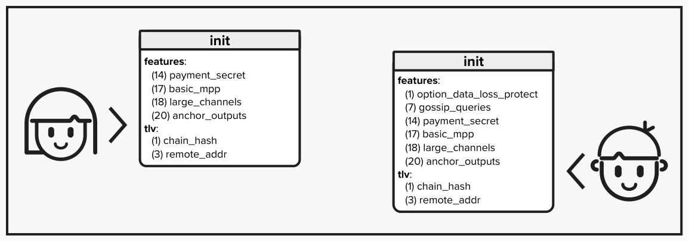
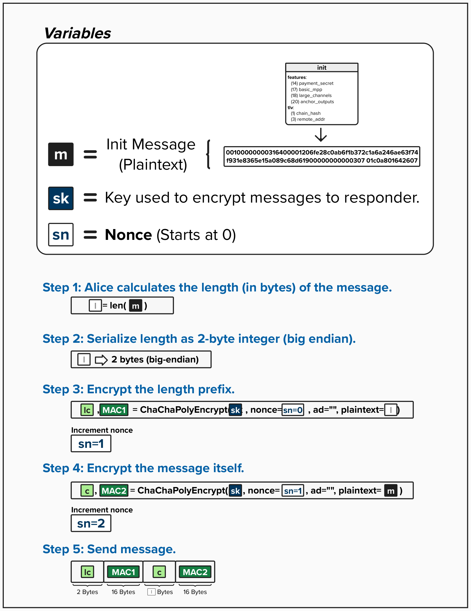

# Noise Protocol: Encrypting Messages

Now that Alice and Bob have completed the handshake phase of the Noise Protocol, they are ready to move to the messaging phase. All Lightning messages are now encrypted and authenticated. According to [BOLT 1](https://github.com/lightning/bolts/blob/master/01-messaging.md#the-init-message), the ***first*** message they will send to each other is the `init` message. 

You can think of this message as *initializing* their connection, informing each peer which features their Lightning node supports and, more importantly, requires.

Per [BOLT 9](https://github.com/lightning/bolts/blob/master/09-features.md), each feature has **two bits** that can be used to signal support or requirements:
- Setting the **even** bit means "I REQUIRE this feature"
- Setting the **odd** bit means "I support this feature (but don't require it)"

To remember this rule, the saying "it's okay to be odd" has been popularized - because unknown odd bits can be safely ignored, making the protocol forward-compatible.

If a node receives an unknown **even** bit (a required feature it doesn't understand), it MUST close the connection. If it receives an unknown **odd** bit, it simply ignores it and continues.

<p align="left" style="width: 50%; max-width: 300px;">
  
</p>

## Encrypting Messages

To ensure privacy and message integrity (if anyone attempts to tamper with a message in transit, it will be noticed), Alice will encrypt every Lightning message before transmission to Bob. Let's see how it's done!

<p align="left" style="width: 50%; max-width: 300px;">
  
</p>

### Step 1: Alice Calculates the Length (in bytes) of the Message

First, Alice will calculate the length of the message, `l` (in bytes). This is a critical first step, as Bob needs to know how many bytes to read from the encrypted message stream.

### Step 2: Serialize Length as 2-Byte Integer (Big-Endian)

Next, Alice will encode the length as a 2-byte big-endian integer. By standardizing the length at 2 bytes in the Lightning protocol, the recipient (Bob, in this case) always knows exactly how many bytes to read off the message buffer to determine the length. This approach supports messages up to 65,535 bytes (the maximum value a 2-byte integer can represent).

<checkpoint id="message-length-limit"></checkpoint>

### Step 3: Encrypt the Length Prefix
Once Alice has the 2-byte length prefix of her message, she will encrypt it using the ChaCha20-Poly1305 AEAD (Authenticated Encryption with Associated Data) cipher that we reviewed earlier. Remember, this is *not* an arbitrary choice by Alice! The use of ChaCha20-Poly1305 is defined in the specific Noise variant (`Noise_XK_secp256k1_ChaChaPoly_SHA256`) that Lightning uses.

To encrypt the length, Alice will input the following:
- **sk**: Alice's **Sending Key**, which was derived during the Noise handshake.
- **nonce**: Alice's **Sending Nonce**, which starts at 0 after the handshake.
- **ad**: Associated data, which is empty in Lightning's message encryption.
- **plaintext**: The 2-byte serialized length `l`.

Once Alice runs the above through the cipher, it will return the encrypted length `lc` and a 16-byte Message Authentication Code (`MAC1`), which Bob can use to verify the integrity and authenticity of the encrypted length. After this encryption, Alice increments her **Sending Nonce**.

#### Question: Why is it good practice to encrypt the length?
<details>
  <summary>Answer</summary>

Well, if the length were not encrypted, then any eavesdropper would be able to see it! By encrypting it, we ensure that others cannot perform traffic analysis attacks, which could allow them to learn information about the message types being exchanged and, potentially, track payments across the network.

</details>

### Step 4: Encrypt the Message Itself

Next, Alice will encrypt the actual message body using ChaCha20-Poly1305 again. This will produce the encrypted message ciphertext `c`, which is the same length as the original message. It will also produce another 16-byte MAC (`MAC2`).

To encrypt the message, Alice will input the following:
- **sk**: Alice's **Sending Key**, which was derived during the Noise handshake.
- **nonce**: Alice's **Sending Nonce**. Since the nonce was incremented after encrypting the length in Step 3, Alice now uses the updated nonce value.
- **ad**: Associated data, which is empty.
- **plaintext**: The complete `init` message `m`.

After each encryption, Alice increments her **Sending Nonce**, ensuring no nonce is ever reused with the same key.

### Step 5: Send Message

Now the fun part! Alice is ready to send the message to Bob, fully encrypted so attackers don't stand a chance. The wire format is:

```
lc || MAC1 || c || MAC2
```

This consists of:
- **2 bytes**: Encrypted length ciphertext (`lc`).
- **16 bytes**: MAC for the length (`MAC1`).
- **n bytes**: Encrypted message ciphertext (`c`, where n = original message length).
- **16 bytes**: MAC for the message (`MAC2`).

<code-intro heading="Coding Exercise: Implement Transport Encryption" exercises="exercise-encrypt"></code-intro>

<code-outro text=""></code-outro>

