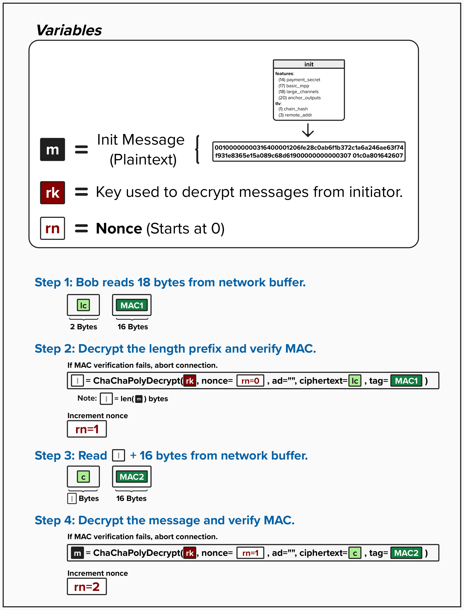

# Noise Protocol: Decrypting Messages

Boom, Bob received the `init` message from Alice, encrypted and safe from eavesdroppers!

Let's see how Bob goes about decrypting the message, using the cryptographic material he derived during the handshake phase.

  

### Step 1: Bob Reads 18 Bytes from Network Buffer

Bob will begin by reading exactly 18 bytes from the network buffer. Why *exactly* 18? Because we know the encrypted length prefix is 2 bytes, and its corresponding MAC (`MAC1`) is 16 bytes.

### Step 2: Decrypt the Length Prefix and Verify MAC

Next, Bob will use ChaCha20-Poly1305 AEAD decryption to decrypt the ciphertext and retrieve the plaintext length `l`.

To decrypt the length, Bob will use the following:
- **rk**: Bob's **Receiving Key**, which was derived during the Noise handshake.
- **nonce**: Bob's **Receiving Nonce**, which starts at 0 after the handshake.
- **ad**: Associated data, which is empty in Lightning's message encryption.
- **ciphertext**: The 2-byte ciphertext `lc`.
- **MAC**: The 16-byte `MAC1` for the encrypted length.

The ChaCha20-Poly1305 algorithm will verify `MAC1` during decryption. If it doesn't match what is expected, Bob must immediately abort the connection. After this decryption, Bob increments his **Receiving Nonce**.

### Step 3: Read `l` + 16 Bytes from Network Buffer

Assuming the length ciphertext decrypts successfully, Bob is now equipped with the message length `l` that he needs to read from the network buffer.

He will then proceed to read the next `l + 16` bytes, where the first `l` bytes are the encrypted message `c` and the next 16 bytes are `MAC2`.

### Step 4: Decrypt the Message and Verify MAC

Finally, Bob will decrypt the message payload `c` using ChaCha20-Poly1305 again. Since the nonce was incremented after decrypting the length in Step 2, Bob now uses the updated nonce value, matching the nonce that Alice used to encrypt the message.

Just like in Step 2, `MAC2` is verified during decryption. If verification fails, Bob aborts the connection immediately.

After each decryption, Bob increments his **Receiving Nonce**, ensuring no nonce is ever reused with the same key.

<code-intro heading="Coding Exercise: Implement Transport Decryption" exercises="exercise-decrypt"></code-intro>