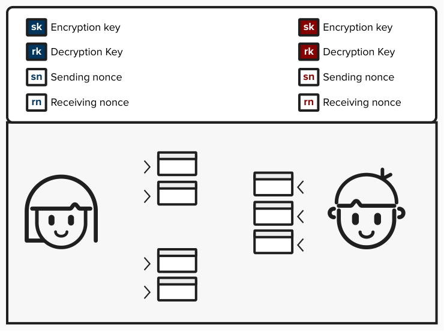
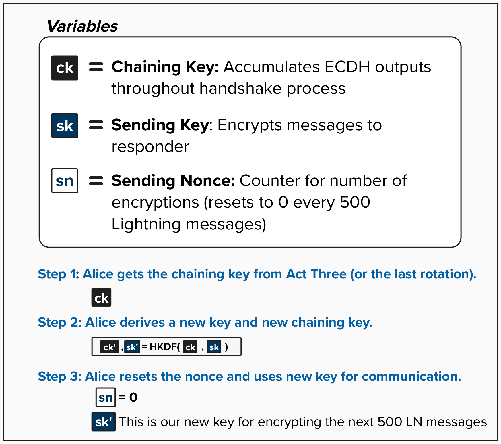

# Noise Protocol: Key Rotation

Let's imagine Alice and Bob open a Lightning channel that becomes well-connected in the network. They've found the secret sauce that makes for a profitable Lightning node!

As their channel routes many payments, Alice and Bob will send numerous messages back and forth to coordinate these operations.

  

#### Question: Let's make sure you were paying attention! What happens if Alice and Bob never change their encryption keys?

  
Answer

If Alice and Bob never *change - sometimes called "rotate" - their keys* during the course of their communication, they have no **forward secrecy**. Forward secrecy means that, if a key is ever compromised **today**, those keys cannot be used to decrypt messages from the **past**.

In the context of Lightning, it should be clear why this would be pretty bad. All of the network communication and payment traffic would be visible by the attacker! 

To prevent this, [BOLT 8](https://github.com/lightning/bolts/blob/master/08-transport.md#lightning-message-key-rotation) describes a mechanism for rotating keys every 1,000 uses (i.e. 500 messages). This ensures that any key leakage is limited to a smaller window of exposure.

It's worth noting that Lightning doesn't use the Noise Protocol's built-in `Rekey()` function. Instead, Lightning defines its own key rotation mechanism in BOLT 8, which uses HKDF, resets the nonce counter, and mandates rotation every 1,000 encryptions.

Now that we've developed an intuition for why Alice and Bob need to rotate their keys, let's see how it's done.

  

### Separate Chaining Keys for Sending and Receiving

Recall that, after the handshake completed in Act 3, Alice derived her Sending Key (`sk`) and Receiving Key (`rk`) from the final Chaining Key (`ck`). What we didn't mention earlier is that Alice also stores **two separate Chaining Keys** going forward — one for sending and one for receiving:

- **Send Chaining Key (`sck`)**: Used as a salt input when rotating the Sending Key.
- **Receive Chaining Key (`rck`)**: Used as a salt input when rotating the Receiving Key.

Initially, both `sck` and `rck` are set to the same value — the final Chaining Key from Act 3. However, since sending and receiving keys rotate independently (and at different times), `sck` and `rck` will **diverge after the first rotation**.

### Step 1: Alice Gets the Send Chaining Key

First, Alice will get the **Send Chaining Key** (`sck`). If this is the first rotation, `sck` is the Chaining Key from Act 3 — the one that was created by accumulating all of the ECDH outputs throughout the handshake process. If Alice has already rotated before, `sck` is the updated Chaining Key from the last sending key rotation.

  
Click here for a reminder of the steps Alice performed in Act 3

  

### Step 2: Alice Derives a New Sending Key and New Send Chaining Key

Next, Alice will input **two values** into the HMAC-based Key Derivation Function (HKDF):

- **Salt**: The current Send Chaining Key (`sck`)
- **Input Key Material (IKM)**: The current Sending Key (`sk`)

The formula is: `sck', sk' = HKDF(sck, sk)`

The HKDF function produces two 32-byte outputs:
- `sck'` (the new Send Chaining Key) — which will be used as the salt in the *next* rotation.
- `sk'` (the new Sending Key) — which Alice will use to encrypt her next 500 messages.

> Note that the IKM here is the **current encryption key** (`sk`), not an ECDH shared secret (like during the handshake) or an empty input (like during the final key derivation in Act 3). Each context uses HKDF with different input key material.

### Step 3: Alice Resets the Nonce and Uses New Key for Communication

Finally, Alice will reset her sending nonce (`sn`) to `0`, giving her a fresh nonce space for the next 500 Lightning messages. She then proceeds to encrypt her message using the new Sending Key `sk'`.

### What About the Receiving Side?

The exact same rotation logic applies to the **Receiving Key** (`rk`) and **Receive Chaining Key** (`rck`). When Bob's sending nonce reaches 1,000 (meaning Alice's receiving nonce `rn` also reaches 1,000), Alice will rotate her Receiving Key before decrypting the next message.

After rotation, Alice resets her receiving nonce (`rn`) to `0`. The sending and receiving rotations are completely independent - one can rotate without the other, depending on the relative volume of messages being sent versus received.