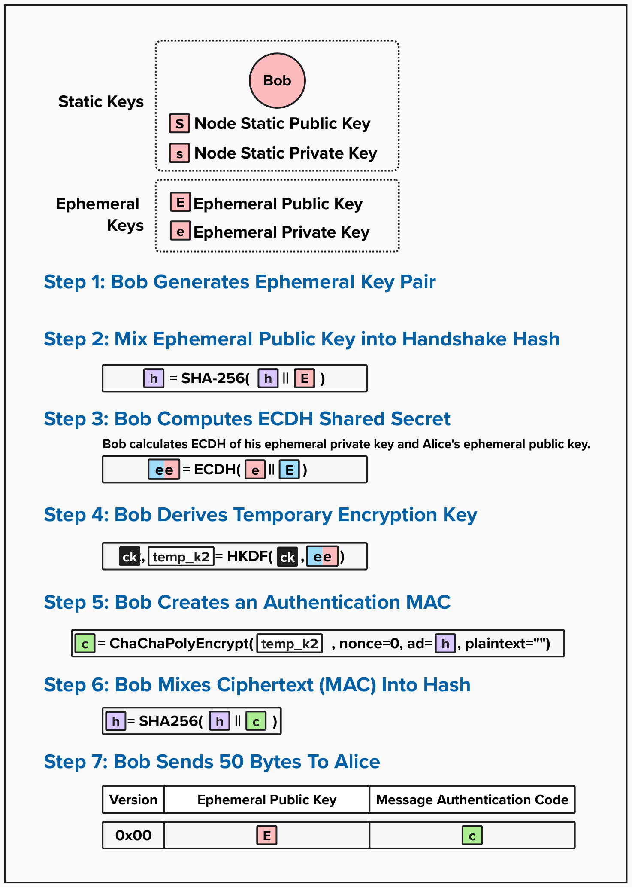
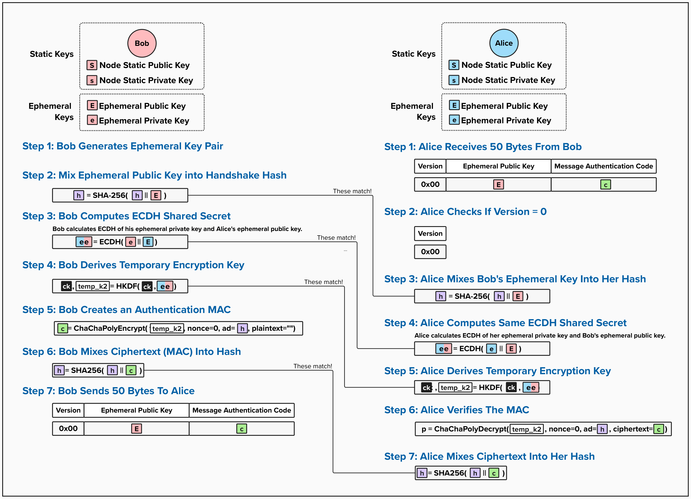

# Noise Protocol: Act 2

So far, Alice has proven to Bob that she knows his identity by sending a Message Authentication Code (MAC). This MAC was created using a **Temporary Key** (`temp_k1`) derived from the `es` shared secret, which itself was computed using Bob's **Static Public Key** (`s`). Additionally, since this MAC included the **Handshake Hash** (`h`) as associated data, Bob was able to verify that he and Alice are using the same Noise variant. Pretty cool that they were able to do all that with just math!

Now that Bob knows Alice means business, it's time for him to join in on the fun by creating his own Ephemeral Key Pair and sending it back to Alice! This is a crucial part of the Noise Protocol, as it ensures that the encryption keys for each Noise connection are unique, with each party contributing fresh entropy.

For instance, imagine if Alice and Bob's shared secret was based only on their Static Public Keys. Then, their shared secret would not be unique to this specific connection! If they disconnect and reconnect 1,000 times, they would have the same shared secret (and, thus, encryption keys) every time!

## Act 2: Bob's Point-of-View

  

### Step 1: Bob Generates Ephemeral Key Pair
First, Bob will generate his own **Ephemeral Key Pair**. This key pair is unique to this Noise connection instance. If Bob were to disconnect and reconnect to Alice, he would generate an entirely new **Ephemeral Key Pair**, ensuring that each connection uses distinct and random encryption keys.

### Step 2: Bob Mixes Ephemeral Public Key Into Handshake Hash
Next, Bob will mix his **Ephemeral Public Key** into the **Handshake Hash**. Remember, the **Handshake Hash** acts as a **transcript**, recording all important steps in the handshake process.

### Step 3: Bob Computes ECDH Shared Secret
Next, Bob will derive a shared secret, using his **Ephemeral Private Key** and Alice's **Ephemeral Public Key**. By doing this, Bob ensures that the entropy used to create encryption keys does not depend solely on either party's **Static Key Pair**. So, even if his **Static Keys** are compromised, an attacker would still be unable to derive the encryption keys for this session.

### Step 4: Bob Derives Temporary Key
Bob will then derive a new **Temporary Key** (`temp_k2`) and update his **Chaining Key** so that it now contains accumulated key material from ECDH operations in Act 1 and Act 2. Similar to `temp_k1`, `temp_k2` will be used as a one-time key to generate a MAC for Bob's communication to Alice.

### Step 5: Bob Creates an Authentication MAC
Once Bob has his one-time **Temporary Key**, he will generate a MAC for his message to Alice. Remember, Bob's goal for Act 2 is to send Alice his **Ephemeral Public Key**, and the MAC serves as a way for Alice to verify that Bob computed the same shared secrets and that both parties have a synchronized handshake state.

### Step 6: Bob Mixes Ciphertext (MAC) Into Hash
Bob will mix the MAC into the **Handshake Hash**, ensuring the hash reflects all of Bob's cryptographic operations for Act 2.

### Step 7: Bob Sends 50 Bytes To Alice
Finally, Bob will send Alice a 50-byte message with the following structure:
- **Byte 1**: The first byte will be the version. As of now, the only valid version is `0`. If the version is anything other than this, Alice will reject the connection.
- **Bytes 2-34**: The next 33 bytes will be Bob's **Ephemeral Public Key** (in Bitcoin's compressed format). This is not encrypted, as Alice will need to use this to calculate the ECDH shared secret. Since Bob's **Ephemeral Public Key** is not linked to his Lightning node's identity, transmitting this in plain text does not reveal his identity.
- **Bytes 35-50**: The last 16 bytes are the MAC produced by the ChaCha20-Poly1305 algorithm.

## Act 2: Alice's Point-of-View

  

Once Alice receives Bob's message, her primary goal is to verify that Bob successfully derived the same shared secrets and that their handshake states are synchronized. Let's see how it's done!

### Step 1: Alice Receives 50 Bytes From Bob
Just like Bob did in Act 1, Alice will first read exactly 50 bytes from the network buffer and parse the message into the following three components:
- **Version** (1 byte): The handshake version number.
- **Ephemeral Public Key** (33 bytes): Bob's **Ephemeral Public Key**.
- **Message Authentication Code** (16 bytes): The MAC that Bob created with `temp_k2` and the **Handshake Hash** as associated data.

### Step 2: Alice Checks If Version = 0
Before processing the message further, Alice will validate that the version byte equals `0x00`. If it's not `0x00`, Alice will abort the connection!

### Step 3: Alice Mixes Bob's Ephemeral Key Into Her Hash
Alice will then mix Bob's **Ephemeral Public Key** into her **Handshake Hash**. At this point, her hash should exactly match Bob's hash from his Step 2. As before, Alice will continue to update her handshake hash to stay synchronized with Bob's.

### Step 4: Alice Computes Same ECDH Shared Secret
Next, Alice will take her **Ephemeral Private Key** and Bob's **Ephemeral Public Key** and compute the **ephemeral-ephemeral shared secret** using ECDH. Due to the properties of ECDH, the result will be the exact same shared secret that Bob produced in his Step 3.

While this is the second ECDH Alice and Bob have performed, it's quite special because it doesn't involve either party's **Static Keys**. Therefore, even if both Alice's and Bob's **Static Keys** are compromised in the future, all communication encrypted in this Noise session will remain secure because both ephemeral private keys will be destroyed after the handshake completes. We'll revisit this later!

### Step 5: Alice Derives Temporary Key
Alice will then derive **Temporary Key 2** (`temp_k2`) and update her **Chaining Key** (`ck`). The **Temporary Key**, `temp_k2`, will allow her to verify the MAC that Bob sent, while the **Chaining Key** `ck` is continuing to "chain" together shared secrets from each ECDH operation, thus incorporating entropy from each ECDH operation into the **Chaining Key**.

### Step 6: Alice Verifies The MAC
Once Alice has `temp_k2`, the ciphertext (`c`) that Bob sent in his message, and an updated **Handshake Hash** (`h`), she can verify the MAC using the ChaCha20-Poly1305 cipher.

If the MAC is invalid, Alice will immediately terminate the connection.

### Step 7: Alice Mixes Ciphertext Into Her Hash
Finally, Alice will mix the ciphertext into her hash, synchronizing her handshake hash with Bob's. With this step complete, both Alice and Bob now have:
- Two completed ECDH operations (`es` and `ee`) mixed into their Chaining Keys.
- Synchronized handshake hashes.
- Forward secrecy from the ephemeral-ephemeral exchange.

Alice is now ready to proceed to Act 3, where she will reveal her static public key to Bob in encrypted form!

## Act 2 Summary
With that, Act 2 is complete! Bob has confirmed to Alice that he successfully validated her Act 1 message, and both parties have now completed the ephemeral-ephemeral ECDH exchange. This provides **forward secrecy** - even if both Alice's and Bob's static keys are compromised in the future, this session will remain secure.

At this point, Alice and Bob have accumulated two shared secrets (`es` and `ee`) into their **Chaining Keys**, and both parties have contributed fresh randomness to the session. Up next, we'll see Act 3, where Alice finally reveals her identity to Bob in encrypted form, completing the authentication handshake!

<checkpoint id="act2-both-ephemeral"></checkpoint>

<code-intro heading="Coding Exercises: Implement Act 2" exercises="exercise-act2-responder,exercise-act2-initiator"></code-intro>

</code-section>