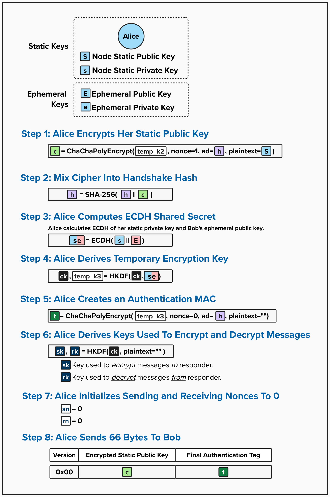
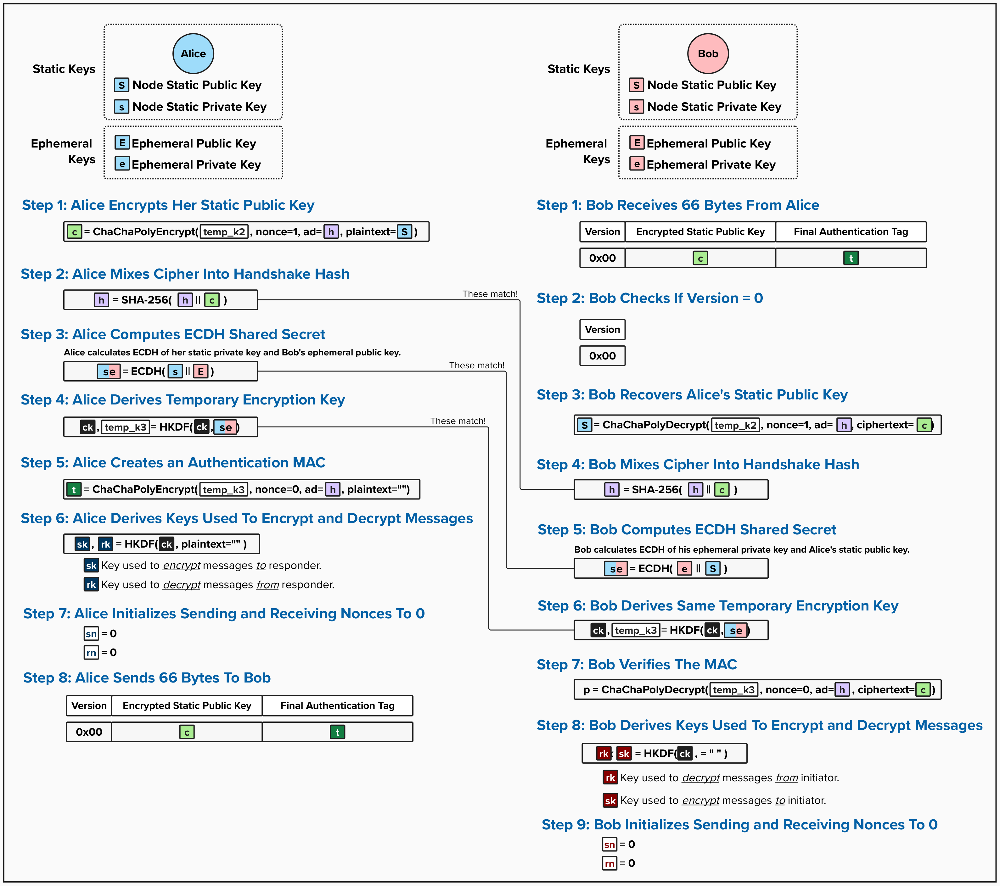

# Noise Protocol: Act 3

We've reached the final act of the handshake process! At this point, Alice and Bob have exchanged ephemeral public keys and completed two ECDH operations, producing `es` and `ee`, which are now accumulated in their Chaining Keys. These operations enable both parties to contribute entropy towards a unique shared secret for their secure communication channel.

However, Bob still doesn't know who Alice is! Since they are using the `XK` handshake pattern, Alice needs to authenticate herself by transmitting her Static Public Key. However, unlike Act 1 and Act 2, Alice will transmit an **encrypted** version of her Static Public Key. This is the "X" in XK - Alice's identity is transmitted in encrypted form, hidden from eavesdroppers.

In Act 3, Alice will:
1. **Encrypt her Static Public Key** using the key material accumulated from Acts 1 and 2.
2. **Perform the third and final ECDH operation** (`se` = static-ephemeral) using her Static Private Key and Bob's Ephemeral Public Key. As we'll see, this enables Bob to authenticate Alice!
3. **Create a final authentication MAC** to ensure the integrity of her message.
4. **Send everything to Bob** in a 66-byte message.

Once Bob validates this final message and Act 3 is complete, both parties will have derived the final transport encryption keys from their accumulated Chaining Key and can begin sending Lightning Network messages! 

## Act 3: Alice's Point-of-View

  

### Step 1: Alice Encrypts Her Static Public Key

Alice will begin Act 3 by encrypting her Static Public Key. To do this, she will use the ChaCha20-Poly1305 algorithm with `temp_k2` (the Temporary Key from Act 2), nonce=1, and the handshake hash as associated data.

#### Question: Do you know why Alice uses 1 as the nonce value?

  
Answer

Bob used `temp_k2` with nonce `0` in Act 2 to create his authentication MAC! Now Alice needs to use `temp_k2` to encrypt her static public key, but she can't use nonce `0` again. If you remember from the Cryptographic Primitives overview, using the same key with the same nonce for multiple messages leaks information about the resulting keystream and opens Alice up to various attacks. By using nonce = `1`, Alice ensures the keystream remains pseudorandom and secure.

### Step 2: Alice Mixes Cipher Into Handshake Hash

Next, Alice will mix the ciphertext from Step 1 into her handshake hash: `h = SHA256(h || c)`. Remember, the handshake hash acts as a "running transcript" of everything that has happened so far, enabling Alice and Bob to independently verify they are following the same protocol and cryptographic operations in sync.

### Step 3: Alice Computes ECDH Shared Secret

Alice will then perform the final ECDH operation using her Static Private Key and Bob's Ephemeral Public Key. 

#### Question: Do you see how this enables Alice to prove her identity to Bob?

  
Answer

If it's not yet clear, consider how Alice and Bob derive their respective ECDH operations.

1. **Alice computes**: `se = ECDH(alice_static_priv, bob_ephemeral_pub)`
 - Alice uses her Static Private Key

2. **Bob will compute**: `se = ECDH(bob_ephemeral_priv, alice_static_pub)` 
 - Bob uses Alice's Static Public Key

Due to the properties of ECDH, these will produce the same shared secret *only* if Alice actually knows the Static Private Key to her Static Public Key. Therefore, if they compute the same `se` shared secret, then Bob knows Alice (or someone who knows her Static Private Key) is truly communicating with him.

### Step 4: Alice Derives Temporary Key

Next, Alice will derive the final Temporary Key, `temp_k3`, and update her Chaining Key, `ck`: `ck, temp_k3 = HKDF(ck, se)`. Now, Alice's Chaining Key contains accumulated key material from all three ECDH operations (es, ee, and se).

### Step 5: Alice Creates an Authentication MAC

Alice will then create a final authentication MAC by encrypting an empty plaintext with `temp_k3`, nonce=0, and the handshake hash as associated data. This MAC will serve as proof that Alice derived all three ECDH operations and that her handshake state is synchronized with Bob.

### Step 6: Alice Derives Keys Used To Encrypt and Decrypt Messages

Alice is nearing the end of the handshake phase! It's time to prepare to send messages.

To do this, Alice will derive two new encryption keys, using her Chaining Key: `sk, rk = HKDF(ck, "")`, where `""` is a zero-length plaintext. These are the *first* keys Alice and Bob will use for their Lightning Network messages:
- `sk` (Sending Key): Alice uses this to *encrypt* messages she sends to Bob.
- `rk` (Receiving Key): Alice uses this to *decrypt* messages she receives from Bob.

### Step 7: Alice Initializes Sending and Receiving Nonces To 0

Next, Alice will initialize the following nonce counters to 0:
- `sn` (Sending Nonce): This nonce will be used to ensure each encryption using `sk` produces a pseudorandom keystream.
- `rn` (Receiving Nonce): This nonce will be used to ensure Alice can correctly decrypt each message that is encrypted using `rk`.

As we'll see shortly, these nonces will be incremented with each message encrypted or decrypted during the communication session, ensuring that the same key is never used with the same nonce twice.

### Step 8: Alice Sends 66 Bytes To Bob

Finally, Alice sends Bob a 66-byte message with the following structure:
- **Byte 1**: Version (0x00)
- **Bytes 2-50**: Alice's encrypted Static Public Key. The encryption using ChaCha20-Poly1305 produces 49 bytes of output: 33 bytes of encrypted public key data plus a 16-byte MAC.
- **Bytes 51-66**: The final MAC (16 bytes from Step 5)

## Act 3: Bob's Point-of-View

Now let's see how Bob processes Alice's final message and completes the handshake. As we review each step, remember that Bob's primary cryptographic goals for Act 3 are to:
1. **Decrypt Alice's Static Public Key**.
2. **Verify that Alice possess the private key for her Static Public Key** via the `se` ECDH operation.
3. **Derive transport encryption keys** - the same as Alice computed in Act 3.

> PRO TIP! The diagram is probably a little hard to see. Try zooming in!

  

### Step 1: Bob Receives 66 Bytes From Alice

First, Bob will read exactly 66 bytes from the network buffer and parse the message into three components:
- **Version** (1 byte): The handshake version number.
- **Encrypted Static Public Key** (49 bytes): Alice's Static Public Key encrypted with `temp_k2` (33 bytes of encrypted data + 16 bytes MAC).
- **Final MAC** (16 bytes): The MAC that Alice created with `temp_k3`

### Step 2: Bob Checks If Version = 0

Before processing the message further, Bob will validate that the version byte equals `0x00`. This ensures both parties are using the same handshake protocol version. If it's not `0x00`, Bob will abort the connection.

### Step 3: Bob Recovers Alice's Static Public Key

Next, Bob will decrypt Alice's Static Public Key using ChaCha20-Poly1305 with `temp_k2` (which he derived in Act 2), nonce=1, and his handshake hash as associated data. Cryptographically speaking, this is now the first time Bob knows who he is ***apparently*** talking to - Alice!

We say "apparently" above because Bob has not authenticated Alice yet, so he can't be sure he is actually talking to Alice just yet. We'll get to that shortly!

### Step 4: Bob Mixes Cipher into Handshake Hash

Bob will then mix the encrypted static public key ciphertext into his handshake hash: `h = SHA256(h || c)`, keeping his handshake state synchronized with Alice. This is important, as, in a few steps, Bob will need to verify the final MAC provided by Alice in her message, which includes the handshake hash as associated data.

### Step 5: Bob Computes ECDH Shared Secret

Here is where the magic happens! Now, Bob will perform his third and final ECDH operation using his Ephemeral Private Key and Alice's Static Public Key: `se = ECDH(bob_ephemeral_priv, alice_static_pub)`.

If Alice truly knows the private key to her Static Public Key, then Bob and Alice's shared secrets from this ECDH operation will be the same. However, at this point, Bob does not know that yet - he needs to verify the MAC to do that!

### Step 6: Bob Derives Same Temporary Key

Next, Bob will use the HKDF function to derive the final Temporary Key and update his Chaining Key: `ck, temp_k3 = HKDF(ck, se)`.

### Step 7: Bob Verifies The MAC

Here is where the authentication happens! Bob will then attempt to decrypt the final MAC using ChaCha20-Poly1305 with `temp_k3`, nonce=0, his handshake hash as associated data, and the final MAC as ciphertext.

If the MAC is valid, the decrypt function will succeed and return a zero-length plaintext. This tells Bob that:
1. Alice possesses the private key for her Static Public Key. Otherwise, their `se` would be different, which would also cause `ck` and `temp_k3` to be different, and the MAC would not verify.
2. Both parties have synchronized handshake state. If they didn't, the handshake hash, which is passed as associated data, would be different and the MAC would not verify.

If the MAC is invalid, the function will fail with an authentication error, and Bob will immediately terminate the connection.

### Step 8: Bob Derives Keys Used To Encrypt and Decrypt Messages

If the MAC verifies, then the handshake is nearly complete! Next, Bob just needs to derive the final transport encryption keys from his Chaining Key: `rk, sk = HKDF(ck, "")`, where `""` is a zero-length input. Similar to Alice, these are the keys that Bob will use to encrypt and decrypt his messages to and from Alice:
- **rk** (Receiving Key): Bob uses this to *decrypt* messages he receives from Alice
- **sk** (Sending Key): Bob uses this to *encrypt* messages he sends to Alice

Note that Bob's "receiving key" is Alice's "sending key" and vice versa. For instance, look at how these keys are calculated:

1. **Alice computes**: `sk, rk = HKDF(ck, "")`
2. **Bob computes**: `rk, sk = HKDF(ck, "")`

As long as `ck` is the same - which it would have to be to validate the MAC in Step 7 - then the HKDF function produces the exact same two keys for Alice and Bob! The only difference is that Alice and Bob assign them to different variable names to ensure they have **complementary keys** for encryption and decryption. In other words, the first key returned from HKDF will be used by Alice to *encrypt* messages being sent to Bob, and Bob will use **the exact same key** (which he calls `rk`) to *decrypt* messages coming from Alice. The second key works in reverse - Bob encrypts with it, Alice decrypts with it. Neat, eh!

### Step 9: Bob Initializes Sending and Receiving Nonces To 0

Now, Bob will once again follow in Alice's footsteps and initialize his nonce counters to 0: `sn = 0` (sending nonce) and `rn = 0` (receiving nonce). These nonces will be incremented with each message encrypted or decrypted during the Lightning session, ensuring that the same key is never used with the same nonce twice.

## Act 3 Summary

With that, Act 3 and the entire Noise handshake is complete! Alice has revealed her identity to Bob in encrypted form, and both parties have derived the same transport encryption keys from their accumulated Chaining Key.

Alice and Bob accomplished a lot! Below is a quick review:
- Alice's identity was transmitted encrypted, hidden from eavesdroppers (this is the "X" in XK).
- The third ECDH operation (`se`) proved Alice possesses her Static Private Key.
- All three ECDH operations (`es`, `ee`, `se`) are now mixed into the Chaining Key.
- Alice and Bob derived identical transport encryption keys (`sk` and `rk`).
- Mutual authentication is complete with forward secrecy from all three DHs.