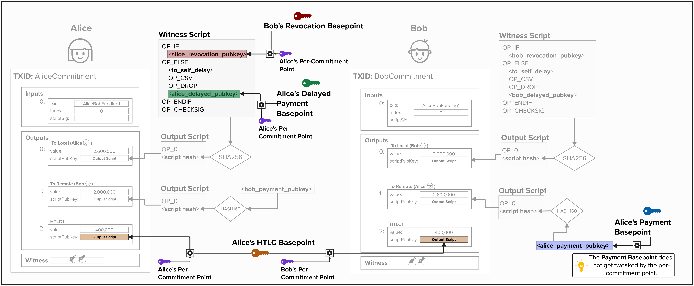

# Lightning Wallet
Before we begin our journey into Lightning Network transactions, we'll need to build a **wallet** that can provide us with all of the cryptographic material (ex: public and private keys) we'll need! As we'll soon learn, the Lightning protocol utilizes many different keys, so we'll need to create a specific wallet for our Lightning channels. If you'd like a quick refresher on elliptic curve cryptography and what a public/private key is, [**Learn Me a Bitcoin**](https://learnmeabitcoin.com/technical/cryptography/elliptic-curve/) provides an excellent resource.

Over the next few chapters, we'll build a key management system that derives all of these keys deterministically from a single seed. Everything we build here will be used directly when we start constructing real channel transactions, including the funding transaction, commitment transactions, and more. This section is a little like eating your vegetables; it may not be your favorite thing to do, but it's a required prerequisite to gain a strong and intuitive understanding of how Lightning works.

## Starting With The End In Mind
Let's start with a brief spoiler! At its core, the Lightning Network is a protocol that defines how multiple parties can *update* bitcoin transactions such that bitcoin is trustlessly transferred between and across parties. These transactions have multiple spending paths, each representing a specific condition under which bitcoin can be spent. Crucially, each spending path will utilize one or more unique public keys.

The diagram below should help provide some intuition for this concept. If the diagram doesn't make sense to you, don't worry. At this point in the course, we haven't reviewed anything yet! For now, the key takeaway is that the bitcoin transactions have multiple spending paths with multiple public keys. For example, imagine Alice has a Lightning channel with Bob. Alice, on the left side in the below diagram, will have two outputs on her bitcoin transaction. One output is simply locked to a **Pay-To-Witness-Public-Key-Hash** script. The other output is locked to a **Pay-To-Witness-Script-Hash** script, which has two spending paths. Each spending path has its own unique public key embedded in it. If you have good attention to detail, you'll notice that both Alice and Bob are providing public keys in the diagram below. We'll learn more about all of these nuances in a moment!

The most important thing to take away from this diagram is the following:
- We'll need **different** public keys - one for each spending path.
- *Most* of the public keys that are placed in each spending path are a **combination** of two public keys: a **basepoint** and a **per commitment point**. We'll cover both of these shortly.

> **Pro Tip:** There will be a LOT of diagrams throughout this course. They may be hard to see at first, but if you zoom in, they should render quite nicely!

  

Below is a list of the **basepoints** and **basepoint secrets** used in the Lightning Network. A "basepoint" is simply a bitcoin public key (a point on the secp256k1 elliptic curve). However, it's called a "basepoint" in the protocol because the public key is, usually, not used directly in a bitcoin transaction. Instead, it's combined with other public keys, creating a unique public key for each transaction.

Since we haven't learned how Lightning works yet, it's hard to discern what each of these keys is used for. Therefore, for the moment, we'll just list each data structure. As we begin to program our Lightning channels, we'll learn *much* more about each and its specific purpose.
  - **Revocation Basepoint Secret**: Secret Key
  - **Revocation Basepoint**: Public Key
  - **Payment Basepoint Secret**: Secret Key
  - **Payment Basepoint**: Public Key
  - **Delayed Payment Secret**: Secret Key
  - **Delayed Payment**: Public Key
  - **HTLC Basepoint Secret**: Secret Key
  - **HTLC Basepoint**: Public Key
  - **Commitment Seed**: The commitment seed is a 256-bit scalar used to generate a series of secrets **for each state**. As we'll see, these secrets will be combined with the above basepoints/secrets to generate the private and public keys used in each Lightning transaction's output script.

#### Question: Now that we've reviewed the various types of public and private keys we'll need to program our Lightning implementation, can you think of an effective way to organize these keys?

  
Answer

The naive approach would be to generate a new random private key for each key type (Revocation, Payment, Delayed Payment, HTLC, and Commitment Seed). But that would mean we need to back up five separate secrets *per channel*. That doesn't sound efficient or safe!

A better option is to leverage **BIP32 hierarchical deterministic (HD) key derivation**, whereby we can use a single seed and deterministically generate a series of *child* public and private keys from that seed. This is much more efficient and safe, as we only need to safely manage one seed.

Next, we'll explore using BIP32 to derive all of the keys we'll need to implement our Lightning channel.

